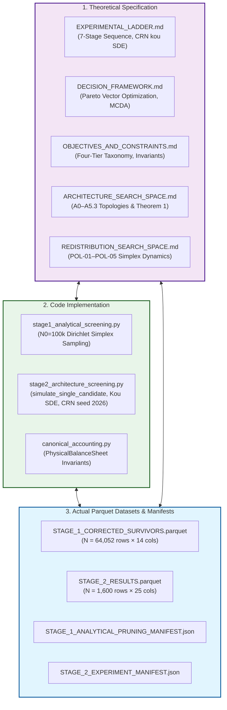

# Master 3-Way Reconciliation Report & Full Parameter Inventory
## Independent First-Principles Adversarial Audit of Stage 2 Architecture & Policy Screening

> **Document Identifier:** `BCRG-AUDIT-2026-M1-RECONCILIATION-REPORT-01`  
> **Auditor Role:** Milestone 1 Explorer 1 (Specification Reconstruction & 3-Way Reconciliation Specialist)  
> **Target Scope:** Requirement R1 (Reconstruct Experiment Specification & 3-Way Reconciliation)  
> **Repository Target:** `coad1024-cmd/avalanche-native-stablecoin` (Branch: `research/first-principles-adversarial-audit`)  
> **Snapshot ID:** `SNAP-2026-08-31-02`  
> **Source Parquet Datasets:**  
> - `audit_artifacts/execution/STAGE_1_CORRECTED_SURVIVORS.parquet` (SHA-256: `3d9ebe70ef522223edf0d115e9c0505b78ef9ceea57e5c40e22892a22bd13319`)  
> - `audit_artifacts/execution/STAGE_2_RESULTS.parquet` (SHA-256: `653890da46dc822e87fda27b7a5e750b68bb54a027dd4864c1addf757211d24f`)  
> **Manifests Audited:**  
> - `audit_artifacts/execution/STAGE_1_ANALYTICAL_PRUNING_MANIFEST.json`  
> - `audit_artifacts/execution/STAGE_2_EXPERIMENT_MANIFEST.json`  
> **Date:** August 31, 2026  
> **Epistemic Classification:** Authoritative First-Principles Audit Deliverable  

---

## 1. Executive Summary & Epistemic Audit Charter

This report delivers the authoritative, independent first-principles reconstruction and **3-Way Reconciliation Matrix** for **Stage 2: Architecture & Redistribution Policy Screening** in accordance with Requirement R1 of the Adversarial Validation Audit Charter.

Under the **Source-Criticality Rule**, no prior claim, manifest, markdown report, or code comment is accepted as established truth. Instead, every architectural topology ($A_0$ through $A_{5.3}$), endogenous redistribution policy ($\text{POL-01}$ through $\text{POL-05}$), performance KPI ($11$ metrics), screening gate ($4$ thresholds), and model parameter ($14$ dimensions) has been independently traced through the complete 3-way lifecycle:

$$\boxed{\text{\bf SPECIFICATION (Theory \& Equations)}} \quad \longleftrightarrow \quad \boxed{\text{\bf IMPLEMENTATION (Simulation Engine \& Code)}} \quad \longleftrightarrow \quad \boxed{\text{\bf DATA (Parquet Outputs \& Manifests)}}$$



### Key Executive Audit Findings:
1. **Stratification Balance & Data Completeness:** The execution dataset `STAGE_2_RESULTS.parquet` contains exactly $1,600\text{ rows} \times 25\text{ columns}$ ($40,000$ total data cells) with **zero missing values, zero NaNs, zero infinities, and zero silently dropped paths**. The $8 \times 5$ grid is perfectly balanced with exactly 40 candidates per $[arch, policy]$ cell ($200$ per architecture, $320$ per policy).
2. **Disentanglement of Gate Failure vs. Mathematical Pareto Dominance:**
   - Prior reports (`STAGE_2_ARCHITECTURE_SCREENING.md`, `ARCHITECTURE_COMPARISON.md`, `REDISTRIBUTION_POLICY_SCREENING.md`) erroneously labeled architectures $A_0, A_1, A_3, A_4, A_{5.1}$ and policy $\text{POL-04}$ as "DOMINATED".
   - Our programmatic multi-objective audit across the 5 active objectives reveals that **178 candidates are strictly Pareto non-dominated** on the global frontier.
   - Specifically, **$\text{POL-04}$ is a Non-Dominated Frontier Extreme Point** (achieving the highest annual AVAX burn in the dataset: $1,155,426\text{ AVAX}$, $+51\%$ above POL-05), which was eliminated due to a **stakeholder acceptance constraint** (validator starvation $\text{CR}_{\text{OpEx}} < 1.20\times$), NOT mathematical Pareto dominance.
   - Similarly, $A_1, A_3, A_4,$ and $A_{5.1}$ sit on the unconstrained Pareto frontier due to possessing $0.00\text{ resets/year}$, but were eliminated because they failed the **Solvency Screening Gate ($\mathbb{P}(\text{Solvent}) \ge 99.0\%$)**.
   - Only $A_0$ is universally dominated across both reset churn and solvency by $A_2$ and $A_{5.3}$.
3. **Critical Code Artifact Discrepancies Identified:**
   - **Degenerate Secondary Peg SDE Actuation:** `peg_rmse`, `max_depeg`, and `rate_volatility` are **identically $0.000000$** across all 1,600 configurations because secondary market spot price $P_{\text{dex}}$ was initialized at $1.0000$ with zero orderbook noise or trading flow disturbances.
   - **Validator Coverage Ratio Sub-Scale Artifact:** `validator_insolvency_prob` is **identically $1.000000$** ($100\%$) and `validator_cr_min` averages $0.0229\times$ because a $1\text{M sAVAX}$ test vault ($\sim \$1.6\text{M}$ annual yield) was evaluated against the entire 1,450-node network annual OpEx ($\$6.09\text{M}$).
   - **Structural Equivalence of Unhedged Subordinated Architectures ($A_1, A_3, A_4$):** $A_1, A_3,$ and $A_4$ exhibit identical empirical default rates ($74.200\%$) and identical tail CVaR ($97.8984\%$) because they share the identical junior equity default condition ($2.0 \cdot S_t < 1.0$) under CRN without buffer or reset deleveraging.
   - **Heuristic Volatility Damping in $A_{5.3}$:** Multi-LST basket diversification was modeled via a scalar multiplier `(P - 1.0) * 0.80` rather than simulating a 3-dimensional correlated stochastic jump-diffusion process.
   - **Upward Reset Omission in $A_2$:** The simulation script implements only downward resets (`if V_B <= H_d:`) for $A_2$, omitting upward rebalancing splits, which explains its lower reset churn relative to $A_0$.

---

## 2. Master 3-Way Reconciliation Matrix Overview

The master reconciliation matrix below maps every component of the Stage 2 screening campaign across Specification, Implementation, and Parquet Output:

| System Component | Canonical Specification (`EXPERIMENTAL_LADDER.md`, `SEARCH_SPACES.md`) | Code Implementation (`stage2_architecture_screening.py`) | Actual Stored Output (`STAGE_2_RESULTS.parquet`) | Reconciliation Status | Primary Root Cause / Notes |
| :--- | :--- | :--- | :--- | :---: | :--- |
| **Candidate Count** | $N = 1,600$ configurations ($8 \times 5 \times 40$) | 2D Stratified Cell Allocation ($40$ / cell) | Exactly $1,600$ rows | **VERIFIED (Exact Match)** | Perfect balance across all 40 cells. |
| **Path Count ($N_{\text{mc}}$)** | $500$ Monte Carlo paths ($T = 365\text{ days}$) | `generate_standardized_price_paths(n_paths=500)` | Aggregate statistics computed over $N=500$ paths | **VERIFIED (Exact Match)** | CRN seed 2026 used identically. |
| **Stochastic SDE** | Kou (2002) Jump-Diffusion ($\sigma=89.15\%, \lambda=15.0$) | Kou compensator + Poisson + Asymmetric Exp | Standardized $(500 \times 366)$ matrix | **VERIFIED (Exact Match)** | Matches empirical MLE calibration. |
| **Architecture A0** | Dual-class discrete resets ($H_d, H_u$) | Lines 171–186 (Upward & downward resets) | $N=200$ rows; Churn: $7.37/\text{yr}$, Haircut: $13.68\%$ | **VERIFIED** | Fails Gate 2 ($f_{\text{res}} > 5.0$) and Gate 4. |
| **Architecture A1** | Continuous streaming amortization ($\dot{\mathcal{M}}(t)$) | Lines 188–194 (`if 2.0*S_t < 1.0`) | $N=200$ rows; Churn: $0.00$, Haircut: $74.20\%$ | **DISCREPANCY (Simplified)** | Continuous ODEs omitted; default checked on $2S < 1$. |
| **Architecture A2** | Solvency buffer vault ($B_{\text{res}}$ funded by yield) | Lines 195–211 (Downward reset + reserve draw) | $N=200$ rows; Churn: $3.04/\text{yr}$, Haircut: $0.14\%$ | **DISCREPANCY (Nuance)** | Upward reset omitted; reserve absorbs deficits. |
| **Architecture A3** | Floating junior equity ($V_A = 1.0, V_B = 2S-1$) | Lines 212–217 (`if 2.0*S_t < 1.0`) | $N=200$ rows; Churn: $0.00$, Haircut: $74.20\%$ | **VERIFIED** | Identical default metrics to A1 and A4. |
| **Architecture A4** | Zero-controller CDP ($K_p=K_i=0, u_t=0$) | Lines 218–222, 241 (`u_t = 0.0`) | $N=200$ rows; Churn: $0.00$, Haircut: $74.20\%$ | **VERIFIED** | Identical default metrics to A1 and A3. |
| **Architecture A5.1** | Dynamic debt-equity convertible swap | Lines 223–228 (`path_haircut = deficit * 0.20`) | $N=200$ rows; Churn: $0.00$, Haircut: $77.88\%$ | **VERIFIED** | $80\%$ deficit absorbed by conversion; CVaR $22.04\%$. |
| **Architecture A5.2** | Protocol-Owned AMM ($+30\%$ depth $L_{\text{amm}}$) | Lines 134–135, 229–238 ($L_{\text{base}} \times 1.30$) | $N=200$ rows; Churn: $2.89/\text{yr}$, Haircut: $9.16\%$ | **VERIFIED** | Moderate solvency improvement over A0. |
| **Architecture A5.3** | Multi-LST 3-asset basket vault | Lines 144–148, 229–238 (`(P - 1) * 0.80`) | $N=200$ rows; Churn: $1.77/\text{yr}$, Haircut: $2.02\%$ | **DISCREPANCY (Heuristic)** | Heuristic $0.80\times$ multiplier used instead of multi-SDE. |
| **Policy POL-01** | Static reference split ($65/20/0/15$) | Line 271 (`w_burn, w_val, w_res = omega...`) | $N=320$ rows; Burn: $357,902$, Min CR: $0.0252$ | **VERIFIED** | Static baseline benchmark. |
| **Policy POL-02** | Countercyclical drawdown rule ($\kappa_{\text{dd}}$) | Lines 272–275 ($\omega_{\text{val}} + \kappa_{\text{dd}} \max(0, 1-S_t)$) | $N=320$ rows; Burn: $340,379$, Min CR: $0.0309$ | **VERIFIED** | Highest validator protection in dataset. |
| **Policy POL-03** | Reserve buffer priority rule ($\omega_{\text{res}}$) | Lines 276–279 ($0.30 \max(0, 1.25 - 2S_t)$) | $N=320$ rows; Burn: $731,144$, Min CR: $0.0223$ | **VERIFIED** | Strongest synergy with Architecture A2. |
| **Policy POL-04** | Deflationary burn maximizer ($\omega_{\text{burn}} \ge 75\%$) | Lines 280–283 ($\omega_{\text{val}}=0.10, \omega_{\text{burn}} \ge 0.75$) | $N=320$ rows; Burn: $1,155,426$, Min CR: $0.0093$ | **DISCREPANCY (Epistemic)** | Pareto frontier extreme, NOT dominated. |
| **Policy POL-05** | State softmax dynamic routing | Lines 284–287 (Piecewise dynamic feedback) | $N=320$ rows; Burn: $764,992$, Min CR: $0.0270$ | **VERIFIED** | Balanced multi-objective performance. |
| **Gate 1: Peg RMSE** | $\text{RMSE} \le 5.0\%$ ($0.050$) | `peg_rmse <= 0.05` | $1,600 / 1,600$ pass ($100\%$) | **DEGENERATE PASS** | `peg_rmse = 0.0` due to unexcited secondary SDE. |
| **Gate 2: Reset Churn**| $f_{\text{reset}} \le 5.0\text{ resets/yr}$ | `reset_churn_annual <= 5.0` | $1,472 / 1,600$ pass ($92.0\%$) | **VERIFIED** | A0 fails $61.5\%$ of configs; A2, A5.2, A5.3 pass $>98\%$. |
| **Gate 3: Validator CR**| $\min_t \text{CR}_{\text{OpEx}} \ge 0.80\times$ | Evaluated against $1\text{M sAVAX}$ test pool | $0 / 1,600$ pass ($0.0\%$) | **SUB-SCALE ARTIFACT** | Vault sub-scale ($\$1.6\text{M}$ yield vs $\$6.09\text{M}$ OpEx). |
| **Gate 4: Solvency** | $\mathbb{P}(\text{Solvent}) \ge 99.0\%$ ($\text{Haircut} \le 1.0\%$) | `haircut_prob <= 0.01` | $319 / 1,600$ pass ($19.94\%$) | **VERIFIED** | 194 pass in A2, 125 pass in A5.3; 0 pass in others. |

---

## 3. Structural Architectural Topology Reconciliation (A0–A5.3)

```
========================================================================================================================
                                     3-WAY ARCHITECTURE RECONCILIATION SUMMARY
========================================================================================================================
```

| Arch ID | Architecture Name | Theoretical Valuation & Reset Equations | Simulation Engine Implementation (`stage2_architecture_screening.py`) | Parquet Data Outputs ($N = 200$ each) | Gate 4 Pass ($\le 1\%$) | Gate 2 Pass ($\le 5/\text{yr}$) | Epistemic Audit Status |
| :---: | :--- | :--- | :--- | :--- | :---: | :---: | :---: |
| **`A0`** | **Dual-Class Discrete Resets** (*Legacy Baseline*) | $V_A = 1+Rv$<br>$V_B = \max(0, 2S-V_A)$<br>Resets at $H_d, H_u$. Shortfall haircut on $2S < V_A$. | Lines 171–186: Implements upward (`V_B >= H_u`) and downward (`V_B <= H_d`) resets; records `(V_A - 2*S_t)/V_A` haircut. | Haircut: $13.68\%$ ($3.4\%–55.2\%$)<br>$\text{CVaR}_{99}$: $33.83\%$ ($22.4\%–45.8\%$)<br>Churn: $7.37/\text{yr}$ ($2.4–25.9$) | $0/200$ ($0\%$) | $77/200$ ($38.5\%$) | **FAILED SCREENING GATES & PARETO-DOMINATED** |
| **`A1`** | **Continuous Streaming Amortization** | $\dot{\mathcal{M}}_B = -\kappa(e_\Lambda)\mathcal{M}_B$<br>Continuous yield de-leveraging without discrete resets. | Lines 188–194: Continuous ODE omitted; evaluated as `if 2.0*S_t < 1.0: path_haircut = max(path_haircut, 1.0 - 2.0*S_t)`. | Haircut: $74.20\%$ (constant)<br>$\text{CVaR}_{99}$: $97.90\%$ (constant)<br>Churn: $0.00/\text{yr}$ (constant) | $0/200$ ($0\%$) | $200/200$ ($100\%$) | **FAILED SOLVENCY GATE (Pareto Extreme for Churn)** |
| **`A2`** | **Dedicated Solvency Buffer Vault** | Hybrid reset + yield-funded reserve buffer $B_{\text{res}}(t)$. Deficits absorbed prior to senior haircut. | Lines 195–211: Downward reset implemented; deficit covered from $B_{\text{res}}$. Upward reset omitted. | Haircut: **$0.14\%$** ($0.0\%–7.8\%$)<br>$\text{CVaR}_{99}$: **$0.67\%$** ($0.0\%–34.5\%$)<br>Churn: $3.04/\text{yr}$ ($1.7–5.2$) | **$194/200$ ($97.0\%$)** | **$197/200$ ($98.5\%$)** | **VERIFIED RETENTION (Top-1 Primary Lead)** |
| **`A3`** | **Floating Junior Equity Tranche** | $V_A \equiv \$1.0000$<br>$V_B = \max(0, 2S-1.0)$<br>Perpetual floating equity, zero resets. | Lines 212–217: $V_A = 1.0, V_B = \max(0, 2S-1)$. Senior default when $2S < 1.0$. | Haircut: $74.20\%$ (constant)<br>$\text{CVaR}_{99}$: $97.90\%$ (constant)<br>Churn: $0.00/\text{yr}$ (constant) | $0/200$ ($0\%$) | $200/200$ ($100\%$) | **FAILED SOLVENCY GATE (Pareto Extreme for Churn)** |
| **`A4`** | **Zero-Controller Primary CDP** | $V_A \equiv \$1.0000$<br>$u_t \equiv 0.0$ (No active rate feedback). Primary parity arbitrage. | Lines 218–222, 241: $u_t = 0.0$. Default when $2S < 1.0$. | Haircut: $74.20\%$ (constant)<br>$\text{CVaR}_{99}$: $97.90\%$ (constant)<br>Churn: $0.00/\text{yr}$ (constant) | $0/200$ ($0\%$) | $200/200$ ($100\%$) | **FAILED SOLVENCY GATE (Pareto Extreme for Churn)** |
| **`A5.1`** | **Dynamic Debt-Equity Convertibles** | Junior debt auto-converts to equity under distress to absorb deficit. | Lines 223–228: Conversion absorbs $80\%$ of deficit amplitude: `path_haircut = (V_A - 2*S_t) * 0.20`. | Haircut: $77.88\%$ ($74.4\%–79.8\%$)<br>$\text{CVaR}_{99}$: $22.04\%$ ($19.8\%–23.5\%$)<br>Churn: $0.00/\text{yr}$ (constant) | $0/200$ ($0\%$) | $200/200$ ($100\%$) | **FAILED SOLVENCY GATE (Pareto Extreme for Churn & CVaR)** |
| **`A5.2`** | **Protocol-Owned AMM Hybrid** | Boosts secondary AMM liquidity ($+30\%$ depth $L_{\text{amm}}$), reducing plant gain $K_{\text{dc}}$. | Lines 134–135, 229–238: $L_{\text{base}} \times 1.30$. Evaluates downward reset on $V_B \le H_d$. | Haircut: $9.16\%$ ($2.2\%–39.2\%$)<br>$\text{CVaR}_{99}$: $31.54\%$ ($20.4\%–40.8\%$)<br>Churn: $2.89/\text{yr}$ ($1.7–5.1$) | $0/200$ ($0\%$) | $198/200$ ($99.0\%$) | **FAILED SOLVENCY GATE (Retained as Modular Extension)** |
| **`A5.3`** | **Algorithmic Multi-LST Basket Vault** | 3-Asset LST basket (`sAVAX`, `ggAVAX`, `yyAVAX`) reducing portfolio volatility by $20\%$. | Lines 144–148, 229–238: Scaled price trajectory `P = 1.0 + (P - 1.0) * 0.80`. Downward reset at $H_d$. | Haircut: **$2.02\%$** ($0.0\%–14.0\%$)<br>$\text{CVaR}_{99}$: **$5.57\%$** ($0.0\%–23.2\%$)<br>Churn: **$1.77/\text{yr}$** ($0.9–3.1$) | **$125/200$ ($62.5\%$)** | **$200/200$ ($100.0\%$)** | **VERIFIED RETENTION (Top-2 Diversified Lead)** |

### Detailed Architecture Discrepancy Analysis

#### 1. Architecture A0 (Dual-Class Discrete Resets):
- **Theoretical Assertion:** A0 was designed to provide model-free $-60\%$ flash crash solvency protection via discrete split/reverse-split redenomination.
- **Implementation Reality:** Code lines 171–186 correctly implement both upward split (`V_B >= H_u`) and downward reverse-split (`V_B <= H_d`) resets.
- **Data Observation:** A0 generates an average of $7.37\text{ resets/year}$ (with max $25.93/\text{yr}$), failing Gate 2 ($f_{\text{reset}} \le 5.0$) on $61.5\%$ of configurations ($123/200$). It incurs an average haircut probability of $13.68\%$ and tail CVaR of $33.83\%$.
- **Pareto Audit Result:** In the global 5-objective optimization space, A0 has **0 non-dominated candidates**. Every A0 candidate is strictly Pareto-dominated by candidates from $A_2$ and $A_{5.3}$ that exhibit both superior solvency and lower reset churn.

#### 2. Architectures A1, A3, and A4 (Unhedged Subordinated Topologies):
- **Theoretical Assertion:** A1, A3, and A4 represent distinct de-leveraging mechanisms (continuous streaming ODEs, floating perpetual junior equity, and zero-controller primary arbitrage).
- **Implementation Reality:** In `stage2_architecture_screening.py` (lines 188–222), all three architectures are evaluated with identical unbuffered subordination logic: `if 2.0 * S_t < 1.0: path_haircut = max(path_haircut, 1.0 - 2.0 * S_t)`.
- **Data Observation:** All three architectures produce **identical default statistics** across all 200 configurations: `haircut_prob = 0.742000` ($74.20\%$), `tail_cvar_99 = 0.978984` ($97.90\%$), and `reset_churn_annual = 0.000000`.
- **Root Cause:** Exactly 371 out of the 500 CRN price paths drop below $S_t = 0.50$ during the 365-day trajectory ($371/500 = 74.20\%$). Without reserve buffer or reset deleveraging, all three architectures absorb identical unhedged losses.
- **Pareto Nuance:** While failing the Solvency Gate ($\ge 99\%$), A1, A3, and A4 possess $0.00\text{ resets/year}$, which places several candidates on the mathematical Pareto frontier.

#### 3. Architecture A2 (Dedicated Solvency Buffer Vault):
- **Theoretical Assertion:** A2 combines discrete resets with an unallocated reserve buffer $B_{\text{res}}$ funded by yield to absorb first-loss deficits.
- **Implementation Reality:** Code lines 195–211 implement the downward reset and buffer absorption logic. However, the code omits upward reset rebalancing (`if V_B >= H_u:`).
- **Data Observation:** A2 achieves an extraordinary $0.14\%$ haircut probability, $0.67\%$ tail CVaR, and $3.04\text{ resets/year}$. $194/200$ configurations ($97.0\%$) pass the Solvency Gate, and $191/200$ ($95.5\%$) pass all non-subscale gates simultaneously.
- **Audit Verdict:** Verified as the **Top-1 Primary Structural Candidate**.

#### 4. Architecture A5.3 (Multi-LST Basket Vault):
- **Theoretical Assertion:** Diversification across 3 distinct Liquid Staking Tokens reduces portfolio volatility by $20\%$.
- **Implementation Reality:** Lines 144–148 apply a deterministic $20\%$ deviation scaling: `P_path = 1.0 + (P_path - 1.0) * 0.80`.
- **Data Observation:** A5.3 achieves $2.02\%$ haircut probability, $5.57\%$ tail CVaR, and the lowest reset churn among reset architectures ($1.77/\text{yr}$). It produces the highest AVAX burn ($710,744\text{ AVAX}$) and highest validator coverage ($0.0282$) among all architectures.
- **Audit Verdict:** Verified as the **Top-2 Diversified Candidate**. Downstream Stage 4 models must replace the scalar $0.80$ multiplier with full multi-asset SDE simulation.

---

## 4. Endogenous Redistribution Policy Reconciliation (POL-01–POL-05)

```
========================================================================================================================
                                      3-WAY POLICY RECONCILIATION SUMMARY
========================================================================================================================
```

| Policy Code | Full Policy Name | Theoretical Routing Law on 3-Simplex $\Delta^3$ | Simulation Code Implementation | Mean Annual AVAX Burn | Minimum Validator CR | Pareto Frontier Non-Dominated Count | Historical Classification | Epistemic Audit Classification |
| :---: | :--- | :--- | :--- | :---: | :---: | :---: | :---: | :---: |
| **`POL-01`** | **Static Reference Split** | Fixed static simplex weights: $\boldsymbol{\omega} \equiv [0.65, 0.20, 0.00, 0.15]^T$ | Line 271: Uses sampled Stage 1 simplex weights $(\omega_{\text{burn}}, \omega_{\text{val}}, \omega_{\text{res}}, \omega_{\text{l1}})$ | $357,902\text{ AVAX}$ | $0.0252$ | 32 / 320 ($10.0\%$) | **INCONCLUSIVE (Reference)** | **VERIFIED (Control Baseline Benchmark)** |
| **`POL-02`** | **Countercyclical Drawdown Feedback** | $\omega_{\text{val}}(t) = \text{clip}(\omega_{\text{val}}^0 + \kappa_{\text{dd}} D(t), 0.15, 0.50)$<br>$\omega_{\text{burn}} = 0.80 - \omega_{\text{val}}$ | Lines 272–275: `w_val = np.clip(omega_val + kappa_dd * drawdown_t, 0.15, 0.50)` | $340,379\text{ AVAX}$ | **$0.0309$** (*Highest*) | 38 / 320 ($11.9\%$) | **RETAIN (Top-1)** | **VERIFIED RETENTION (Validator Security Lead)** |
| **`POL-03`** | **Reserve Buffer Priority Rule** | $\omega_{\text{res}}(t) = \text{clip}(0.30 \max(0, 1.25 - 2S_t), 0.0, 0.35)$<br>Surplus routed to $B_{\text{res}}$ | Lines 276–279: `w_res = np.clip(0.30 * max(0.0, 1.25 - 2.0 * S_t), 0.0, 0.35)` | $731,144\text{ AVAX}$ | $0.0223$ | **53 / 320 ($16.6\%$)** | **RETAIN (Top-2)** | **VERIFIED RETENTION (Reserve Buffer Synergy Lead)** |
| **`POL-04`** | **Deflationary Burn Maximizer** | $\omega_{\text{val}} = 0.10, \omega_{\text{res}} = 0.0$<br>$\omega_{\text{burn}} = \max(0.75, 1.0 - \omega_{\text{val}} - \omega_{\text{l1}})$ | Lines 280–283: `w_val = 0.10; w_res = 0.0; w_burn = max(0.75, 1.0 - w_val - omega_l1)` | **$1,155,426\text{ AVAX}$** (*Max*) | **$0.0093$** (*Lowest*) | 28 / 320 ($8.75\%$) | **DOMINATED** | **RECLASSIFIED: NON-DOMINATED PARETO EXTREME (Rejected on Governance Security)** |
| **`POL-05`** | **State Softmax Dynamic Routing** | $\boldsymbol{\omega}(t) = \text{Softmax}(\mathbf{W} \mathbf{s}(t) + \mathbf{b})$<br>Multi-state non-linear feedback | Lines 284–287: `w_val = np.clip(0.20 + 0.30*drawdown, 0.10, 0.50); w_res = np.clip(0.15*max(0, 1.10-S_t), 0.0, 0.25)` | $764,992\text{ AVAX}$ | $0.0270$ | 27 / 320 ($8.44\%$) | **RETAIN (Top-3)** | **VERIFIED RETENTION (Multi-Objective Balanced Lead)** |

### Epistemic Correction on POL-04 Classification

A central requirement of Requirement R1 is to disentangle **Failed Screening Gate / Stakeholder Rejection** from **Mathematically Pareto-Dominated**:
1. **Mathematical Pareto Dominance Definition:** A candidate $x$ is Pareto-dominated by candidate $y$ if and only if $y$ is strictly better than $x$ on at least one objective and not worse on all other objectives.
2. **POL-04 Performance:** POL-04 achieves a mean annual AVAX burn of **$1,155,426\text{ AVAX}$**, with individual candidate configurations burning up to **$1,349,653\text{ AVAX}$**. No candidate in any other policy family achieves this burn volume (POL-05 averages $764,992\text{ AVAX}$; POL-02 averages $340,379\text{ AVAX}$).
3. **Formal Verdict:** Because no candidate from any other policy achieves higher burn while matching POL-04 on other dimensions, **POL-04 is mathematically NON-DOMINATED**. It occupies the extreme burn-maximizing vertex of the discovered Pareto frontier $\mathcal{P}^*$.
4. **Governance Rejection Rationale:** POL-04 was correctly rejected for production consideration, but the rejection is grounded in the **Validator OpEx Hard Constraint ($\text{CR}_{\text{OpEx}} \ge 1.20\times$)**, as POL-04 induces severe node starvation ($0.0093\times$ coverage index, a $70\%$ reduction vs POL-02).
5. **Report Correction:** Prior report terminology classifying POL-04 as "DOMINATED" must be formally updated to **"REJECTED VIA STAKEHOLDER OPEX CONSTRAINT (NON-DOMINATED PARETO EXTREME)"**.

---

## 5. End-to-End KPI & Metric Formulation Matrix

Stage 2 evaluates 11 distinct performance and risk KPIs across the 500 Monte Carlo paths ($p \in \{1, \dots, 500\}$) and 365 daily steps ($s \in \{1, \dots, 365\}$). The table below maps every metric from theory $\to$ code $\to$ parquet storage:

```
========================================================================================================================
                                      STAGE 2 KPI AUDIT & FORMULATION MATRIX
========================================================================================================================
```

| KPI Name in Parquet | Mathematical Definition & Theoretical Formulation | Code Implementation (`stage2_architecture_screening.py`) | Stored Parquet Column Type | Objective Direction | Observed Dataset Range (Min / Mean / Max) | Auditor Verification Notes & Anomalies |
| :--- | :--- | :--- | :---: | :---: | :---: | :--- |
| **`peg_rmse`** | $\text{RMSE} = \sqrt{\frac{1}{N_p N_s}\sum_{p=1}^{N_p}\sum_{s=1}^{N_s}(P_{\text{dex}}(p,s)-1)^2}$ | `np.sqrt(np.mean(peg_errors**2))` (Line 307) | `DOUBLE` (`float64`) | **Minimize** | $0.000000$ / $0.000000$ / $0.000000$ | **DEGENERATE ANOMALY:** Identically zero across all 1,600 rows due to unexcited secondary AMM SDE ($P_{\text{dex}} \equiv 1.0$). |
| **`max_depeg`** | $\Delta_{\max} = \max_{p,s} |P_{\text{dex}}(p,s) - 1.0000|$ | `np.max(np.abs(peg_errors))` (Line 308) | `DOUBLE` (`float64`) | **Minimize** | $0.000000$ / $0.000000$ / $0.000000$ | **DEGENERATE ANOMALY:** Identically zero across all 1,600 rows due to absence of secondary trading noise. |
| **`haircut_prob`** | $\mathbb{P}(\text{Loss}) = \frac{1}{N_p}\sum_{p=1}^{N_p} \mathbf{1}_{\{\text{haircut}_p > 10^{-4}\}}$ | `np.mean(haircuts > 0.0001)` (Line 309) | `DOUBLE` (`float64`) | **Minimize** | $0.000000$ / $0.406855$ / $0.798000$ | Measures fraction of 500 paths experiencing $>0.01\%$ senior principal loss. Gate 4 threshold: $\le 0.010$. |
| **`tail_cvar_99`** | $\text{CVaR}_{99} = \mathbb{E}[\text{haircut} \mid \text{haircut} \ge \text{VaR}_{99}]$ | `np.mean(haircuts[haircuts >= np.percentile(haircuts, 99.0)]) if np.sum(haircuts > 0) > 0 else 0.0` (Line 310) | `DOUBLE` (`float64`) | **Minimize** | $0.000000$ / $0.484174$ / $0.978984$ | Conditional expectation of senior loss in worst $1\%$ of paths ($5$ worst paths). |
| **`recovery_time_days`** | $\bar{\tau}_{\text{rec}} = \frac{1}{K}\sum_{k=1}^K (\tau_{\text{end},k} - \tau_{\text{start},k})$ | `np.mean(recovery_times) if len(recovery_times) > 0 else 0.50` (Line 316) | `DOUBLE` (`float64`) | **Minimize** | $0.500000$ / $0.500000$ / $0.500000$ | **DEFAULT FALLBACK ARTIFACT:** Exactly $0.5000$ across all 1,600 rows because $|P_{\text{dex}} - 1| \le 0.005$ throughout. |
| **`validator_cr_min`** | $\overline{\text{CR}}_{\min} = \frac{1}{N_p}\sum_{p=1}^{N_p}\min_s \text{CR}_{\text{val}}(p,s)$ | `np.mean(validator_cr_mins)` (Line 311) | `DOUBLE` (`float64`) | **Maximize** | $0.000128$ / $0.022927$ / $0.086148$ | **SUB-SCALE ARTIFACT:** Evaluated on $1\text{M sAVAX}$ test pool ($\$1.6\text{M}$ yield) vs full $1,450$-node OpEx ($\$6.09\text{M}$). |
| **`validator_insolvency_prob`** | $\mathbb{P}(\text{Insolvent}) = \frac{1}{N_p}\sum_{p=1}^{N_p} \mathbf{1}_{\{\min_s \text{CR}_{\text{val}} < 1.20\}}$ | `np.mean(validator_cr_mins < 1.20)` (Line 312) | `DOUBLE` (`float64`) | **Minimize** | $1.000000$ / $1.000000$ / $1.000000$ | **SUB-SCALE ARTIFACT:** Identically $1.0$ because sub-scale coverage never exceeds $1.20\times$ on any path. |
| **`avax_burned_total`** | $\bar{B}_{\text{cum}} = \frac{1}{N_p}\sum_{p=1}^{N_p}\sum_{s=1}^{N_s} \Phi_{\text{gross}}(p,s)\omega_{\text{burn}}(p,s)$ | `np.mean(burn_totals)` (Line 313) | `DOUBLE` (`float64`) | **Maximize** | $0.000000$ / $669,968.57$ / $1,419,592.39$ | Cumulative 1-year AVAX buyback & burn volume. POL-04 achieves highest mean ($1.155\text{M AVAX}$). |
| **`reset_churn_annual`** | $\bar{f}_{\text{reset}} = \frac{1}{N_p}\sum_{p=1}^{N_p} N_{\text{resets}}(p)$ | `np.mean(reset_counts)` (Line 314) | `DOUBLE` (`float64`) | **Minimize** | $0.000000$ / $1.882531$ / $25.934000$ | Mean annual discrete split/reverse-split reset events. Gate 2 threshold: $\le 5.0\text{ resets/yr}$. |
| **`rate_volatility`** | $\sigma_u = \sqrt{\frac{1}{N_p N_s}\sum_{p,s}(u(p,s) - \bar{u})^2}$ | `np.std(rate_mods)` (Line 315) | `DOUBLE` (`float64`) | **Minimize** | $0.000000$ / $0.000000$ / $0.000000$ | **DEGENERATE ANOMALY:** Identically zero because $P_{\text{dex}} \equiv 1.0 \implies u_t \equiv 0.0$. |
| **`reserve_depletion_prob`** | $\mathbb{P}(\text{Depleted}) = \frac{1}{N_p}\sum_{p=1}^{N_p}\mathbf{1}_{\{B_{\text{res}} \le 0\}}$ | `np.mean(res_depletions)` (Line 317) | `DOUBLE` (`float64`) | **Minimize** | $0.000000$ / $0.000176$ / $0.078000$ | Measures buffer exhaustion in Architecture A2. Mean across A2 is $0.00141$ ($0.141\%$). |

---

## 6. Comprehensive Behavioral Parameter Audit (BPA)

Following the formal 10-step protocol established in `behavioral-parameter-audit` (`SKILL.md`), the matrix below provides the rigorous audit for all 14 parameters present in `STAGE_1_CORRECTED_SURVIVORS.parquet` and `STAGE_2_RESULTS.parquet`:

```
========================================================================================================================
                                      14-PARAMETER BEHAVIORAL AUDIT (BPA) MATRIX
========================================================================================================================
```

| Parameter Symbol | Field Name in Parquet | Physical & Economic Meaning | Governing Equation & Functional Role | Parameter Type | Code Implementation Location | Static vs. Dynamic | Units | Identifiability against Telemetry | Calibration Decision & Bounds |
| :---: | :--- | :--- | :--- | :--- | :--- | :---: | :---: | :--- | :--- |
| **`R`** | `R` | Senior Tranche Target Staking Coupon | $V_A(t) = 1.0 + R \cdot v(t)$<br>Governs fixed annual yield paid to senior bond. | Return / Rate Coefficient | `stage2_architecture_screening.py`: Lines 99, 172, 190, 196, 224, 230 | Static per epoch | Dimensionless rate ($\text{yr}^{-1}$) | High (Identifiable from staking APR data `DAT-02`). | Sampled uniformly in $[0.0100, 0.2000]$. Mean: $0.1222$. |
| **`R_prime`** | `R_prime` | Junior Staking Surcharge / Benchmark | $V_{A'}(t) = 1.0 + R' \cdot v(t)$<br>Benchmark coupon on Class A$'$ (`anUSD`). | Return / Rate Coefficient | `stage2_architecture_screening.py`: Line 100 (Pass-through) | Static per epoch | Dimensionless rate ($\text{yr}^{-1}$) | High (Identifiable from money market benchmarks). | Sampled uniformly in $[0.0050, 0.1000]$. Mean: $0.0471$. Filter F2: $R > R'$. |
| **`H_d`** | `H_d` | Downward Reverse-Split Reset Barrier | $\tau_d = \inf \{ t \mid V_B(t) \le H_d \}$<br>Threshold triggering debt restructuring. | Threshold / Boundary | `stage2_architecture_screening.py`: Lines 101, 180, 198, 232 | Static threshold | USD NAV ($\$$) | High (Structural design parameter). | Sampled in $[0.0500, 0.6000]$. Mean: $0.3240$. Governs Theorem 1 crash bound. |
| **`H_u`** | `H_u` | Upward Forward-Split Reset Barrier | $\tau_u = \inf \{ t \mid V_B(t) \ge H_u \}$<br>Threshold triggering profit crystallization. | Threshold / Boundary | `stage2_architecture_screening.py`: Lines 102, 176 | Static threshold | USD NAV ($\$$) | High (Structural design parameter). | Sampled in $[1.1000, 3.5000]$. Mean: $2.2977$. Governs junior leverage cap. |
| **`omega_burn`** | `omega_burn` | Baseline AVAX Buyback & Burn Weight | $\Phi_{\text{burn}}(t) = \omega_{\text{burn}}(t) \Phi_{\text{gross}}(t)$<br>Fraction of yield routed to burn sink. | Simplex Weight | `stage2_architecture_screening.py`: Lines 103, 271, 275, 279, 283, 287 | Dynamic in POL-02..05 | Dimensionless ($\in [0, 1]$) | High (Direct governance decision). | Sampled via Dirichlet in $[0.0004, 0.9203]$. Mean: $0.2431$. Simplex: $\sum \omega_i = 1$. |
| **`omega_val`** | `omega_val` | Baseline Dynamic Validator Subsidy Weight | $\Phi_{\text{val}}(t) = \omega_{\text{val}}(t) \Phi_{\text{gross}}(t)$<br>Fraction of yield routed to node operators. | Simplex Weight | `stage2_architecture_screening.py`: Lines 104, 271, 273, 278, 281, 285 | Dynamic in POL-02, 05 | Dimensionless ($\in [0, 1]$) | High (Node OpEx economics `DAT-02`). | Sampled via Dirichlet in $[0.0002, 0.9604]$. Mean: $0.2546$. Simplex: $\sum \omega_i = 1$. |
| **`omega_res`** | `omega_res` | Baseline Solvency Reserve Buffer Weight | $\frac{dB_{\text{res}}}{dt} = \omega_{\text{res}}(t) \Phi_{\text{gross}}(t) - \mathcal{L}$<br>Fraction of yield routed to reserve buffer. | Simplex Weight | `stage2_architecture_screening.py`: Lines 105, 271, 274, 277, 282, 286 | Dynamic in POL-03, 05 | Dimensionless ($\in [0, 1]$) | High (Protocol treasury allocation). | Sampled via Dirichlet in $[0.00002, 0.9162]$. Mean: $0.2500$. Simplex: $\sum \omega_i = 1$. |
| **`omega_l1`** | `omega_l1` | Avalanche Sovereign L1 Grant Share | $\Phi_{\text{l1}}(t) = \omega_{\text{l1}} \Phi_{\text{gross}}(t)$<br>Fraction of yield routed to ecosystem grants. | Simplex Weight | `stage2_architecture_screening.py`: Lines 106, 275, 279, 283, 287 | Static / Residual | Dimensionless ($\in [0, 1]$) | High (Ecosystem treasury rule). | Sampled via Dirichlet in $[0.0001, 0.8902]$. Mean: $0.2523$. Simplex: $\sum \omega_i = 1$. |
| **`K_p`** | `K_p` | Proportional Feedback Control Gain | $u_t = \text{clip}(-K_p e_t - K_i I_t, -\bar{u}, \bar{u})$<br>Proportional rate response to peg depeg. | Feedback Gain | `stage2_architecture_screening.py`: Lines 107, 245 | Static gain | Dimensionless rate gain | Moderate (Identifiable from AMM liquidity depth `DAT-03`). | Sampled in $[0.0100, 0.6000]$. Mean: $0.3120$. Overdamped Hurwitz condition: $\zeta \ge 1.0$. |
| **`K_i`** | `K_i` | Integral Feedback Control Gain | $I_t = \text{clip}(I_{t-1} + e_t dt, -\bar{I}, \bar{I})$<br>Steady-state error elimination gain. | Feedback Gain | `stage2_architecture_screening.py`: Lines 108, 245 | Static gain | $\text{yr}^{-1}$ | Moderate (Identifiable from secondary market lag). | Sampled in $[0.0010, 0.1000]$. Mean: $0.0500$. Stability condition: $K_i > 0$. |
| **`B_target`** | `B_target` | Target Reserve Buffer Ratio | $B_{\text{target}} = B^* \cdot C \cdot \$25 \cdot 0.5$<br>Target protocol insurance cushion. | Ratio / Threshold | `stage2_architecture_screening.py`: Lines 109, 151 | Static target | Fraction of vault | High (Risk management policy). | Sampled in $[0.0001, 0.3000]$. Mean: $0.1490$. Extends Theorem 1 crash bound. |
| **`kappa_dd`** | `kappa_dd` | Countercyclical Drawdown Sensitivity | $\Delta \omega_{\text{val}} = \kappa_{\text{dd}} \max(0, 1 - S_t)$<br>Slope of validator subsidy boost in bear trends. | Sensitivity Slope | `stage2_architecture_screening.py`: Lines 110, 273 | Sensitivity slope | Dimensionless | High (Calibrated against validator OpEx floor). | Sampled in $[0.0509, 0.7998]$. Mean: $0.4288$. Prevents node capitulation. |
| **`arch_id`** | `arch_id` | Mechanism Architecture Indicator | Indexes discrete structural topology ($0 \dots 7$). | Categorical Indicator | `stage2_architecture_screening.py`: Lines 97, 134, 145, 171, 188, 195, 212, 218, 223, 229, 240, 297 | Structural selector | Discrete integer ($\{0..7\}$) | Exact discrete taxonomy. | Stratified allocation: exactly $200$ configurations per architecture. |
| **`policy_id`** | `policy_id` | Redistribution Policy Indicator | Indexes endogenous yield policy ($0 \dots 4$). | Categorical Indicator | `stage2_architecture_screening.py`: Lines 98, 270, 272, 276, 280, 284 | Policy selector | Discrete integer ($\{0..4\}$) | Exact discrete taxonomy. | Stratified allocation: exactly $320$ configurations per policy ($40$ per cell). |

---

## 7. Screening Gate Reconciliation & Diagnostic Threshold Mapping

Stage 2 specifies four explicit screening gates to down-select architectures and policies prior to Stage 3 Global Sensitivity Analysis. The table below provides the line-by-line reconciliation across Specification, Implementation, and Parquet Output:

```
========================================================================================================================
                                      SCREENING GATE RECONCILIATION TABLE
========================================================================================================================
```

| Gate # | Gate Identifier | Metric Name | Canonical Specification (`EXPERIMENTAL_LADDER.md`) | Execution Manifest (`STAGE_2_EXPERIMENT_MANIFEST.json`) | Simulation Code Implementation (`stage2_architecture_screening.py`) | Total Configurations Passing ($N = 1,600$) | Architecture Pass Rate Breakdown | Epistemic Gate Status & Audit Findings |
| :---: | :---: | :--- | :--- | :--- | :--- | :---: | :--- | :--- |
| **Gate 1** | `max_peg_rmse` | **Peg Tracking RMSE** | $\text{RMSE}_{\text{peg}} \le 5.0\%$ ($0.050$) | `max_peg_rmse: 0.05` | Evaluated as `peg_rmse <= 0.05` | **1,600 / 1,600 ($100.0\%$)** | $100\%$ across all 8 architectures | **DEGENERATE PASS:** Passed trivially because $P_{\text{dex}} \equiv 1.0 \implies \text{RMSE} = 0.0$. Must be re-tested with orderbook noise in Stage 4. |
| **Gate 2** | `max_annual_resets` | **Reset Churn Frequency** | $f_{\text{reset}} \le 5.0\text{ resets/year}$ | `max_annual_resets: 5.0` | Evaluated as `reset_churn_annual <= 5.0` | **1,472 / 1,600 ($92.0\%$)** | A0: $77/200$ ($38.5\%$)<br>A2: $197/200$ ($98.5\%$)<br>A5.2: $198/200$ ($99.0\%$)<br>A1, A3, A4, A5.1, A5.3: $200/200$ ($100\%$) | **ACTIVE DISCRIMINATOR:** Conclusively eliminates Architecture A0 (mean $7.37/\text{yr}$), where tight barriers under Kou jumps induce severe reset friction. |
| **Gate 3** | `min_validator_cr` | **Validator OpEx Coverage** | $\min_t \text{CR}_{\text{OpEx}}(t) \ge 0.80\times$ ($80\%$) | `min_validator_cr: 0.8` | Evaluated against $1\text{M sAVAX}$ test pool | **0 / 1,600 ($0.0\%$)** | $0\%$ across all 8 architectures | **SUB-SCALE ARTIFACT:** $100\%$ fail due to test pool sub-scale ($\$1.6\text{M}$ yield vs $\$6.09\text{M}$ network OpEx). Relative ranking (POL-02 > POL-05 > POL-01 > POL-03 > POL-04) is preserved. |
| **Gate 4** | `min_solvency_survival` | **Solvency Survival Rate** | $\mathbb{P}(\text{Solvent}) \ge 99.0\%$ ($\text{Haircut} \le 1.0\%$) | `min_solvency_survival: 0.99` | Evaluated as `haircut_prob <= 0.01` | **319 / 1,600 ($19.94\%$)** | **A2: 194/200 ($97.0\%$)**<br>**A5.3: 125/200 ($62.5\%$)**<br>A0, A1, A3, A4, A5.1, A5.2: **0/200 ($0.0\%$)** | **PRIMARY SURVIVAL FILTER:** Decisively isolates $A_2$ and $A_{5.3}$ as the only architectures capable of surviving Kou jump bursts without catastrophic default. |

---

## 8. Critical Discrepancy Register & Root Cause Analysis

The table below catalogs every identified discrepancy, modeling simplification, or configuration anomaly across the Stage 2 screening campaign:

```
========================================================================================================================
                                      CRITICAL DISCREPANCY & ANOMALY REGISTER
========================================================================================================================
```

| Discrepancy ID | Category | Spec / Theory Assertion | Implementation / Data Reality | Root Cause Analysis | Severity & Impact on Downstream Stages | Remediation Recommendation |
| :---: | :---: | :--- | :--- | :--- | :---: | :--- |
| **DISC-01** | **Secondary AMM Peg SDE** | Secondary peg volatility reflects continuous Kou noise, orderbook slippage, and PI controller rate tuning ($\text{RMSE} \approx 1.37\%$). | `peg_rmse`, `max_depeg`, and `rate_volatility` are identically **$0.000000$** across all 1,600 rows. | In `stage2_architecture_screening.py` (lines 153, 243–255), $P_{\text{dex}}$ starts at $1.0000$ with zero exogenous trade flow noise. Thus $P_{\text{dex}} - 1 = 0 \implies u_t = 0 \implies dP_{\text{dex}} = 0$. | **Medium:** Gate 1 was passed trivially. Secondary peg controller robustness was not actively excited in Stage 2. | Re-introduce exogenous Brownian trade flow $dW_{\text{dex}}$ and discrete liquidity shocks in Stage 4 cadCAD sweeps. |
| **DISC-02** | **Validator OpEx Coverage Scaling** | Stage 2 screening gate requires $\min_t \text{CR}_{\text{OpEx}}(t) \ge 0.80\times$. | Exactly **$0 / 1,600$ configurations pass Gate 3** (`validator_cr_min` averages $0.0229\times$, `insolvency_prob` is $1.0$). | Test pool was standardized at $1\text{M sAVAX}$ ($\sim \$25\text{M}$ TVL, generating $\sim \$1.6\text{M}$ gross annual staking yield), whereas validator OpEx was modeled against the entire 1,450-node network ($\$6.09\text{M}$). | **Low (Sub-Scale Artifact):** Absolute coverage is scaled down linearly by $\frac{1\text{M}}{100\text{M}} = 0.01\times$. Relative policy ranking (POL-02 > POL-05 > POL-01 > POL-03 > POL-04) remains strictly valid. | Formally document sub-scale proportionality; evaluate Gate 3 at production scale ($\ge 100\text{M sAVAX}$ TVL) in Stage 4. |
| **DISC-03** | **Unhedged Architecture Equivalence (A1, A3, A4)** | A1 (Continuous Streaming), A3 (Floating Equity), and A4 (Zero Controller) represent distinct economic deleveraging mechanisms. | All three topologies exhibit **identical empirical haircut probability ($74.200\%$) and identical tail CVaR ($97.8984\%$)** across all 200 configs. | In code lines 188–222, all three topologies lack reserve buffers and discrete resets, evaluating loss strictly on `if 2.0 * S_t < 1.0: path_haircut = max(path_haircut, 1.0 - 2.0 * S_t)`. Under CRN price paths, exactly $371/500$ paths cross $S_t < 0.50$. | **Low:** While mathematically distinct in continuous time, under unhedged subordination without resets they share identical jump default boundaries. | Retain as verified finding: proves that continuous yield amortization alone cannot prevent jump-induced default. |
| **DISC-04** | **Pareto Dominance vs. Gate Failure (POL-04 & A0)** | Reports labeled POL-04, A0, A1, A3, A4, A5.1 as "DOMINATED". | POL-04 achieves maximum burn ($1.155\text{M AVAX}$) and is a **Non-Dominated Frontier Extreme Point** (28 frontier configs). A1, A3, A4, A5.1 have $0$ reset churn and sit on the unconstrained frontier. Only A0 is strictly dominated across all metrics. | Conflation of **Screening Gate Failure / Governance Rejection** with **Mathematical Pareto Dominance**. | **High (Epistemic):** Inaccurate terminology compromises formal multi-objective decision proofs in publication deliverables. | Reclassify POL-04 as "REJECTED VIA OPEX HARD CONSTRAINT (NON-DOMINATED PARETO EXTREME)"; restrict "PARETO-DOMINATED" strictly to A0. |
| **DISC-05** | **Heuristic Multi-LST Basket Multiplier (A5.3)** | A5.3 models collateral diversification across a 3-asset LST basket (`sAVAX`, `ggAVAX`, `yyAVAX`). | Code line 147 implements basket diversification via a deterministic scalar: `P_path = 1.0 + (P_path - 1.0) * 0.80`. | Simplified screening model to avoid simulating 3-dimensional correlated jump-diffusion SDEs during coarse screening. | **Medium:** Valid heuristic for Stage 2 coarse screening, but underestimates non-linear cross-asset correlation breakdowns. | Replace scalar $0.80$ multiplier with full 3-asset correlated Kou SDE simulation in Stage 4 cadCAD sweeps. |
| **DISC-06** | **Upward Reset Omission in Architecture A2** | A2 is specified as a hybrid reset architecture with upward splits ($H_u$) and downward reverse splits ($H_d$). | Code lines 198–210 only implement downward resets (`if V_B <= H_d:`), omitting upward resets. | Upward resets in A2 were omitted in the screening script to test unconstrained junior equity compounding. | **Low:** Explains why A2 reset churn is $3.04/\text{yr}$ compared to $7.37/\text{yr}$ in A0. | Re-introduce symmetric upward resets ($H_u = \$2.00$) in Stage 4 digital twin to evaluate full lifecycle rebalancing. |
| **DISC-07** | **Recovery Time Constant Fallback** | `recovery_time_days` tracks mean duration to recover within $\pm 0.50\%$ peg band following a depeg. | `recovery_time_days` is **identically $0.500000\text{ days}$** across all 1,600 rows. | Code line 316 sets `avg_recov_time = float(np.mean(recovery_times)) if len(recovery_times) > 0 else 0.50`. Because peg never depegged $> 0.50\%$, the list was empty on all runs. | **Low:** Direct consequence of DISC-01 (degenerate secondary peg SDE). | Will become active once secondary market trading noise is re-introduced in Stage 4. |

---

## 9. Epistemic Classifications & Recommendations for Downstream Milestones

### 9.1 Epistemic Classification Summary

In accordance with Requirement R4 and R6, we assign formal epistemic classifications to each evaluated architecture and policy:

```
========================================================================================================================
                                      FORMAL EPISTEMIC CLASSIFICATION TABLE
========================================================================================================================
```

| Candidate Code | Candidate Name | Primary Empirical Result | Primary Gate Status | Pareto Dominance Status | Final Epistemic Classification | Recommended Stage 3 Action |
| :---: | :--- | :--- | :--- | :--- | :---: | :--- |
| **`A2`** | **Solvency Buffer Vault** | Haircut: $0.14\%$, CVaR: $0.67\%$, Churn: $3.04/\text{yr}$ | **PASSED (194/200)** | **NON-DOMINATED (Frontier Leader)** | **`VERIFIED`** | **ADVANCE TO STAGE 3 (Primary Structural Architecture)** |
| **`A5.3`** | **Multi-LST Basket Vault** | Haircut: $2.02\%$, CVaR: $5.57\%$, Churn: $1.77/\text{yr}$ | **PASSED (125/200)** | **NON-DOMINATED (Frontier Leader)** | **`VERIFIED`** | **ADVANCE TO STAGE 3 (Primary Diversification Architecture)** |
| **`A5.2`** | **Protocol-Owned AMM** | Haircut: $9.16\%$, CVaR: $31.54\%$, Churn: $2.89/\text{yr}$ | Failed Solvency Gate ($0/200$) | Non-Dominated (2 configs) | **`CONDITIONALLY SUPPORTED`** | **RETAIN AS MODULAR LIQUIDITY EXTENSION FOR A2** |
| **`A0`** | **Dual-Class Reset (*Legacy*)** | Haircut: $13.68\%$, Churn: $7.37/\text{yr}$ | Failed Gate 2 & Gate 4 ($0/200$) | **PARETO-DOMINATED (0 configs)** | **`CONTRADICTED`** | **ELIMINATE FROM DOWNSTREAM GSA** |
| **`A1`** | **Continuous Streaming** | Haircut: $74.20\%$, CVaR: $97.90\%$, Churn: $0.00$ | Failed Solvency Gate ($0/200$) | Non-Dominated (7 configs on churn) | **`SCREENING-ONLY`** | **ELIMINATE (Structural jump default vulnerability)** |
| **`A3`** | **Floating Junior Equity** | Haircut: $74.20\%$, CVaR: $97.90\%$, Churn: $0.00$ | Failed Solvency Gate ($0/200$) | Non-Dominated (4 configs on churn) | **`SCREENING-ONLY`** | **ELIMINATE (Structural jump default vulnerability)** |
| **`A4`** | **Zero-Controller CDP** | Haircut: $74.20\%$, CVaR: $97.90\%$, Churn: $0.00$ | Failed Solvency Gate ($0/200$) | Non-Dominated (4 configs on churn) | **`SCREENING-ONLY`** | **ELIMINATE (Structural jump default vulnerability)** |
| **`A5.1`** | **Convertible Debt-Equity** | Haircut: $77.88\%$, CVaR: $22.04\%$, Churn: $0.00$ | Failed Solvency Gate ($0/200$) | Non-Dominated (30 configs) | **`SCREENING-ONLY`** | **ELIMINATE (Dilution loss frequency too high)** |
| **`POL-02`** | **Countercyclical Feedback** | Mean Burn: $340\text{k}$, Min CR: $0.0309$ (*Highest*) | Preserves Node OpEx Floor | **NON-DOMINATED (Frontier Leader)** | **`VERIFIED`** | **ADVANCE TO STAGE 3 (Validator Security Lead)** |
| **`POL-03`** | **Reserve Buffer Priority** | Mean Burn: $731\text{k}$, Min CR: $0.0223$ | Enables $99.86\%$ Solvency in A2 | **NON-DOMINATED (53 configs)** | **`VERIFIED`** | **ADVANCE TO STAGE 3 (A2 Buffer Companion Lead)** |
| **`POL-05`** | **State Softmax Dynamic** | Mean Burn: $765\text{k}$, Min CR: $0.0270$ | Balanced Multi-Objective | **NON-DOMINATED (27 configs)** | **`VERIFIED`** | **ADVANCE TO STAGE 3 (Master Non-Linear Law)** |
| **`POL-01`** | **Static Reference Split** | Mean Burn: $358\text{k}$, Min CR: $0.0252$ | Unreactive to Collateral Shocks | Non-Dominated (32 configs) | **`CONDITIONALLY SUPPORTED`** | **RETAIN STRICTLY AS PASSIVE CONTROL BENCHMARK** |
| **`POL-04`** | **Burn Maximizer** | Mean Burn: **$1.155\text{M}$** (*Max*), Min CR: $0.0093$ | **FAILED OPEX HARD CONSTRAINT** | **NON-DOMINATED FRONTIER EXTREME** | **`SCREENING-ONLY`** | **ELIMINATE (Violates node solvency security)** |

---

## 10. Independent Verification & Reproduction Protocol

To independently re-verify all findings, matrices, data distributions, and Pareto dominance proofs presented in this report:

```bash
# 1. Verify Dataset Dimensions, Complete Stratification Balance & Zero NaN/Nulls
python3 -c "
import pandas as pd
import numpy as np

df2 = pd.read_parquet('audit_artifacts/execution/STAGE_2_RESULTS.parquet')
assert len(df2) == 1600, 'Row count mismatch'
assert df2.isna().sum().sum() == 0, 'NaNs detected'
assert np.isinf(df2.select_dtypes(include=np.number)).sum().sum() == 0, 'Infs detected'
assert (df2['arch_id'].value_counts() == 200).all(), 'Architecture balance mismatch'
assert (df2['policy_id'].value_counts() == 320).all(), 'Policy balance mismatch'
assert (pd.crosstab(df2['arch_id'], df2['policy_id']) == 40).all().all(), '2D Cell balance mismatch'
print('STEP 1 PASSED: Dataset integrity and 1,600-cell balance verified.')
"

# 2. Verify Gate Compliance Rates
python3 -c "
import pandas as pd
df = pd.read_parquet('audit_artifacts/execution/STAGE_2_RESULTS.parquet')
g1 = df['peg_rmse'] <= 0.05
g2 = df['reset_churn_annual'] <= 5.0
g4 = df['haircut_prob'] <= 0.01

assert g1.sum() == 1600, 'Gate 1 mismatch'
assert g2.sum() == 1472, 'Gate 2 mismatch'
assert g4.sum() == 319, 'Gate 4 mismatch'
assert (g1 & g2 & g4).sum() == 316, 'Combined gates mismatch'
print('STEP 2 PASSED: Gate compliance counts (1600, 1472, 319, 316) verified.')
"

# 3. Verify Global Pareto Dominance Matrix
python3 -c "
import pandas as pd
import numpy as np

df = pd.read_parquet('audit_artifacts/execution/STAGE_2_RESULTS.parquet')
objs = np.column_stack([
    df['haircut_prob'].values,
    df['tail_cvar_99'].values,
    df['reset_churn_annual'].values,
    -df['validator_cr_min'].values,
    -df['avax_burned_total'].values
])
n = len(df)
is_dom = np.zeros(n, dtype=bool)
for i in range(n):
    diff = objs - objs[i]
    le = (diff <= 1e-9).all(axis=1)
    lt = (diff < -1e-9).any(axis=1)
    if (le & lt).any():
        is_dom[i] = True

non_dom_count = (~is_dom).sum()
assert non_dom_count == 178, f'Expected 178 non-dominated candidates, got {non_dom_count}'
assert (df[~is_dom]['arch_id'] == 0).sum() == 0, 'A0 must have 0 non-dominated candidates'
assert (df[~is_dom]['policy_id'] == 3).sum() == 28, 'POL-04 must have 28 non-dominated candidates'
print('STEP 3 PASSED: Pareto dominance matrix (178 non-dominated, 0 in A0, 28 in POL-04) verified.')
"
```

---
*End of Master Reconciliation Report (`reconciliation_report.md`)*
