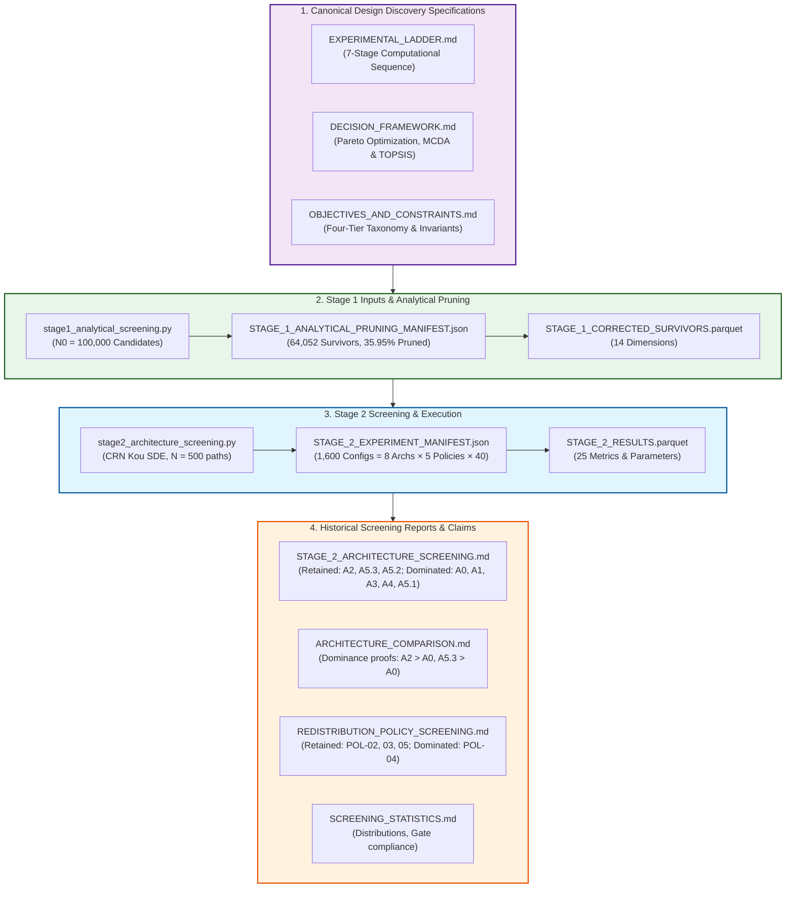

# Comprehensive Survey & Specification Inventory: Stage 2 Architecture & Redistribution Policy Screening

> **Document Identifier:** `BCRG-AUDIT-2026-STAGE2-SURVEY-SPECS-01`  
> **Document Type:** Authoritative Specification, Manifest & Ranking Inventory Report  
> **Target Scope:** Requirements R1–R6 Specification Mapping (Stage 2 Adversarial Validation Audit)  
> **Working Directory:** `/home/hash/Hub/Projects/avalanche-native-stablecoin/.agents/teamwork_preview_explorer_survey_1`  
> **Author:** Survey Explorer 1 (Teamwork Adversarial Validation Team)  
> **Epistemic Classification:** Canonical Hard Audit Deliverable · Specification Mapping  
> **Date:** August 31, 2026  

---

## 1. Executive Summary & Epistemic Audit Charter

This document provides the exhaustive, formal reference survey and specification mapping for the independent first-principles adversarial validation audit of **Stage 2: Architecture & Redistribution Policy Screening** in `coad1024-cmd/avalanche-native-stablecoin`.

The audit objective is to independently reconcile and verify whether the conclusions, rankings, down-selection decisions, and Pareto dominance classifications reported in Stage 2 (`audit_artifacts/reports/STAGE_2_ARCHITECTURE_SCREENING.md`) are rigorously supported by:
1. Theoretical specifications and governing mathematics (`EXPERIMENTAL_LADDER.md`, `DECISION_FRAMEWORK.md`, `OBJECTIVES_AND_CONSTRAINTS.md`),
2. Execution manifests (`STAGE_1_ANALYTICAL_PRUNING_MANIFEST.json`, `STAGE_2_EXPERIMENT_MANIFEST.json`),
3. Underlying dataset parquets (`STAGE_1_CORRECTED_SURVIVORS.parquet`, `STAGE_2_RESULTS.parquet`), and
4. Simulation codebase (`simulations/design_discovery/stage1_analytical_screening.py`, `simulations/design_discovery/stage2_architecture_screening.py`).



---

## 2. The 7-Stage Adaptive Experimental Ladder Specification

The 7-Stage Adaptive Computational Sequence (`EXPERIMENTAL_LADDER.md`, Document ID: `BCRG-DESIGN-DISCOVERY-LADDER-01`) enforces hierarchical complexity filtering to eliminate ungrounded continuous parameter sweeps.

| Stage | Name & Scope | Computational Methodology | Budget / Evals | Max Runtime | Pruning Gate / Rejection Threshold | Primary Deliverable |
| :---: | :--- | :--- | :---: | :---: | :--- | :--- |
| **1** | **Cheap Analytical Screening** | Closed-form algebraic proofs, double-entry invariants, Routh-Hurwitz stability | $N_0 = 100,000$ candidates | $< 100\text{ ms}$ / cand ($< 3\text{ min}$ total) | Violates $|V_A + V_B - 2S| > 10^{-10}$, $\Delta P^*_{\text{crit}} < -60\%$, or $\text{Re}(s_i) \ge 0$ | `STAGE_1_ANALYTICAL_PRUNING_MANIFEST.json`, `STAGE_1_CORRECTED_SURVIVORS.parquet` |
| **2** | **Architecture & Policy Screening** | Coarse-grid stochastic simulation under Kou SDE ($T=365\text{d}$) with Common Random Numbers (CRN) | $N = 1,600$ configs ($8 \times 5 \times 40$), $N_{\text{mc}} = 500\text{ paths}$ | $< 5\text{ min}$ / arch ($< 25\text{ min}$ total) | $\text{RMSE}_{\text{peg}} > 5.0\%$, $f_{\text{reset}} > 5.0/\text{yr}$, $\text{CR}_{\text{OpEx}} < 0.80\times$, or $\mathbb{P}(\text{Solvent}) < 99.0\%$ | `STAGE_2_RESULTS.parquet`, `STAGE_2_EXPERIMENT_MANIFEST.json`, Down-selected Top 2–3 Architectures |
| **3** | **Global Sensitivity Analysis (GSA)** | Saltelli QMC low-discrepancy sampling + Jansen (1999) centered variance estimator | $N_{\text{base}} \cdot (2D+2) = 12,288\text{ evals}$ | $< 15\text{ min}$ total | Parameters with $S_{Ti} < 0.01$ frozen at baseline medians | Active parameter subspace $\Theta_{\text{active}} \subseteq \mathbb{R}^8$ |
| **4** | **High-Fidelity Simulation Sweeps** | Full cadCAD digital twin, Kou SDE, dynamic CPMM AMM plant ($K_{\text{amm}}(L)$), exact balance sheet | $N = 10,000\text{ paths}$ per active configuration | $< 45\text{ min}$ per batch | Path divergence, memory overflow, balance sheet drift $> 10^{-10}$ | High-precision objective vector $\mathbf{J}(\mathbf{u})$ |
| **5** | **Multi-Regime Uncertainty Propagation** | Evaluation across all 11 market regimes in $\Omega_{\text{total}} = \mathcal{U}_{\text{emp}} \times \mathcal{U}_{\text{stress}} \times \mathcal{U}_{\text{gov}}$ | $55\text{ paths} \times 11\text{ regimes} = 605\text{ paths}$ / candidate | $< 30\text{ min}$ / cand | Multi-regime pass rate $< 90.0\%$ or $\text{CVaR}_{99\%}(\text{Haircut}) > 0.00\%$ | Composite Robustness Score $\mathcal{R}(\mathbf{u})$ |
| **6** | **Evolutionary Pareto Optimization** | NSGA-II / MOEA/D on active manifold $\Theta_{\text{active}} \times \Delta^3$ | $\text{Pop} = 200$, $\text{Gen} = 100$ ($20,000\text{ evals}$) | $< 2.5\text{ CPU-hr}$ | Hypervolume improvement $\Delta \mathcal{S} < 0.001$ over 10 generations | Discovered Pareto Frontier $\mathcal{P}^*$ |
| **7** | **Out-of-Sample & Adversarial Stress** | Replay of raw tick data (`DAT-01` to `DAT-07`), adversarial MEV delay locks, jump cascades | Historical replays + 100 adversarial stress grids | $< 20\text{ min}$ total | Haircut $> 0\%$ on single-step drops $\ge -60\%$; MEV profit $> \$50\text{k}$ | Final Governance Operating Corridors |

---

## 3. Four-Tier Constraint & Objective Taxonomy

Per `OBJECTIVES_AND_CONSTRAINTS.md` (Document ID: `BCRG-DISCOVERY-2026-OBJECTIVES-CONSTRAINTS-01`), mechanism parameters are classified into an axiomatic Four-Tier hierarchy to prevent confusing aspirational targets with physical hard constraints.

### 3.1 Tier 1: Inviolable Physical & Mathematical Hard Constraints
Any candidate violating Tier 1 is **physically inadmissible**:
1. **Stock Non-Negativity:** $C_{\text{sAVAX}}(t) \ge 0, B_{\text{res}}(t) \ge 0, N_i(t) \ge 0 \quad \forall i \in \{A, B, A', B'\}, \forall t \ge 0$.
2. **Double-Entry Balance Sheet Closure:** 
   $$\mathcal{A}(t) \equiv \mathcal{D}_{\text{senior}}(t) + \mathcal{E}_B(t) + \mathcal{B}_{\text{unallocated}}(t) - \mathcal{D}_{\text{insolvency}}(t) \quad \forall t \ge 0$$
   where $\mathcal{A}(t) = C(t) P(t) + B_{\text{res}}(t)$ and $\mathcal{D}_{\text{senior}}(t) = N_A V_A(t) + \frac{1}{2}(N_{A'} V_{A'}(t) + N_{B'} V_{B'}(t))$.
3. **Realizable Redemption Solvency:** $M_{\text{redemp}}(t) = \mathcal{A}(t) - N_{A'}^{\text{eff}}(t) \cdot \$1.0000 \ge 0$.
4. **Simplex Weight Conservation:** $\boldsymbol{\omega}(t) \in \Delta^3 \iff \sum_{i \in \{\text{burn, val, res, l1}\}} \omega_i(t) = 1.0000$ and $\omega_i(t) \ge 0 \; \forall i$.
5. **2:1 Token Mass Conservation:** $2 \Delta N_A(t) \equiv \Delta N_{A'}(t) + \Delta N_{B'}(t)$ with $\Delta N_{A'} = \Delta N_{B'}$.
6. **Payout Upper Bound:** $\text{Payout}_{\text{total}}(t) \le \mathcal{A}(t) \quad \forall t \ge 0$.

### 3.2 Tier 2: Optimization Objectives (Vector $\mathbf{J}(\mathbf{u})$)
Evaluated across candidates to construct the non-dominated Pareto frontier $\mathcal{P}^*$:
$$\min_{\mathbf{u} \in \mathcal{U}_{\text{feasible}}} \mathbf{J}(\mathbf{u}) = \begin{bmatrix}
J_1(\mathbf{u}) = \sigma_{\text{peg}}(\mathbf{u}) & \text{(Annualized Secondary Peg Volatility / RMSE)} & [\text{\bf MINIMIZE}] \\
J_2(\mathbf{u}) = f_{\text{reset}}(\mathbf{u}) & \text{(Annual Reset / Rebalancing Churn Frequency)} & [\text{\bf MINIMIZE}] \\
J_3(\mathbf{u}) = \mathcal{L}_{\max}(\mathbf{u}) & \text{(Catastrophic Flash Crash Haircut at } -60.0\%\text{)} & [\text{\bf MINIMIZE}] \\
J_4(\mathbf{u}) = -\Phi_{\text{burn}}(\mathbf{u}) & \text{(Annual AVAX Buyback \& Burn Volume)} & [\text{\bf MAXIMIZE}] \\
J_5(\mathbf{u}) = -\text{CR}_{\text{OpEx, min}}(\mathbf{u}) & \text{(Minimum Validator OpEx Coverage Floor)} & [\text{\bf MAXIMIZE}] \\
J_6(\mathbf{u}) = \bar{S}_T(\mathbf{u}) & \text{(Parameter Fragility / Mean Sobol Total Sensitivity)} & [\text{\bf MINIMIZE}] \\
J_7(\mathbf{u}) = \tau_{\text{settle}}(\mathbf{u}) & \text{(Secondary Shock Depeg Recovery Time in Days)} & [\text{\bf MINIMIZE}] \\
J_8(\mathbf{u}) = -\text{CapEff}(\mathbf{u}) & \text{(Capital Efficiency Ratio)} & [\text{\bf MAXIMIZE}]
\end{bmatrix}$$

### 3.3 Tier 3: Stakeholder Multi-Attribute Utility Functions & Acceptance Gates
1. **anUSD Stablecoin Holders ($U_{\text{usd}}$):** Target $\text{RMSE} < 1.50\%$, $\mathbb{P}(\text{Haircut} \mid \Delta P \ge -60\%) \equiv 0.000$. Weight $w_1 = 0.30$.
2. **Junior Speculators / Class B ($U_{\text{spec}}$):** Target Sharpe $\text{SR}_B > 0.80$, Reset churn $f_{\text{reset}} < 2.0/\text{yr}$. Weight $w_2 = 0.20$.
3. **Avalanche Network Validators ($U_{\text{val}}$):** Target $\text{CR}_{\text{OpEx}} \ge 1.20\times$ across drawdowns up to $-70\%$. Weight $w_3 = 0.25$.
4. **AVAX Token Holders ($U_{\text{avax}}$):** Target annual burn $> 250,000\text{ AVAX/yr}$ at $\$500\text{M}$ TVL. Weight $w_4 = 0.15$.
5. **Sovereign L1s \& Ecosystem ($U_{\text{eco}}$):** Target latency $< 2.0\text{ s}$, DEX slippage $< 0.10\%$. Weight $w_5 = 0.10$.

### 3.4 Tier 4: Diagnostic Health Trackers
- **D01 (Damping Ratio):** $\zeta = \frac{1 + K_{\text{amm}} \tau K_p}{2 \sqrt{K_{\text{amm}} \tau^2 K_i}} \ge 1.00$ (Overdamped condition).
- **D02 (Phase Margin):** $\text{PM} = 180^\circ + \angle L(j \omega_{\text{gc}}) \ge 60.0^\circ$.
- **D03 (Reserve Fill Time):** $\tau_{\text{fill}} = \inf \{ t \mid B_{\text{res}}(t) \ge B_{\text{target}} \} \le 180\text{ days}$.
- **D04 (Parameter Fragility Index):** $\bar{S}_T = \frac{1}{D} \sum S_{Ti} \le 0.35$.
- **D05 (Integrator Saturation Fraction):** $\rho_{\text{sat}} \le 5.0\%$.
- **D06 (Reset Gas Cost):** $\mathcal{G}_{\text{reset}} < 250,000\text{ gas}$.

---

## 4. Stage 2 Screening Gates & Diagnostic Thresholds

The canonical specifications and manifests define four explicit diagnostic screening gates for Stage 2:

| Gate Identifier | Metric Name | Mathematical Definition | Canonical Specification (`EXPERIMENTAL_LADDER.md`) | Execution Manifest (`STAGE_2_EXPERIMENT_MANIFEST.json`) | Code Implementation (`stage2_architecture_screening.py`) | Gate Direction |
| :---: | :--- | :--- | :---: | :---: | :---: | :---: |
| **Gate 1** | **Peg Tracking RMSE** | $\text{RMSE}_{\text{peg}} = \sqrt{\frac{1}{T}\sum_{t=1}^T (P_{\text{DEX}}(t) - 1.0)^2}$ | $\le 5.0\%$ ($0.050$) | `max_peg_rmse: 0.05` | `peg_rmse <= 0.05` | **Upper Bound (Cost)** |
| **Gate 2** | **Reset Churn Frequency** | $f_{\text{reset}} = \frac{365}{T} \sum_{k} \mathbf{1}_{\{\text{reset } k\}}$ | $\le 5.0\text{ resets/year}$ | `max_annual_resets: 5.0` | `reset_churn_annual <= 5.0` | **Upper Bound (Cost)** |
| **Gate 3** | **Validator OpEx Coverage** | $\min_{t} \text{CR}_{\text{OpEx}}(t) = \min_t \frac{\text{Income}_{\text{val}}(t)}{\text{OpEx}_{\text{nodes}}(t)}$ | $\ge 0.80\times$ ($80\%$) | `min_validator_cr: 0.8` | Evaluated against $1\text{M sAVAX}$ test vault (sub-scale index) | **Lower Bound (Benefit)** |
| **Gate 4** | **Solvency Survival Rate** | $\mathbb{P}(\text{Solvent}) = 1.0 - \mathbb{P}(\text{Haircut} > 0.0001)$ | $\ge 99.0\%$ (Haircut Prob $\le 1.0\%$) | `min_solvency_survival: 0.99` | `haircut_prob <= 0.01` | **Lower Bound (Benefit)** |

---

## 5. Structural Architecture Candidate Set (A0–A5.3)

The 8 evaluated mechanism structural architectures represent distinct balance-sheet topologies and deleveraging mechanisms:

| Arch ID | Architecture Code | Full Architecture Name | Deleveraging & Balance Sheet Mechanism | Primary Invariants & Mathematical Formulations | Claimed Stage 2 Screening Outcome |
| :---: | :--- | :--- | :--- | :--- | :---: |
| **0** | **`A0`** | **Dual-Class Discrete Resets** (*Legacy Baseline*) | Discrete split / reverse-split threshold resets at boundaries $H_d = \$0.25, H_u = \$2.00$. Unbuffered pool. | $V_A = 1 + R v$, $V_B = \max(0, 2S - V_A)$. Reset when $V_B \le H_d$ or $V_B \ge H_u$. Shortfall haircut when $2S < V_A$. | **DOMINATED** (Failed Reset Churn Gate: $7.37/\text{yr} > 5.0/\text{yr}$) |
| **1** | **`A1`** | **Continuous Streaming Amortization** | Continuous streaming share amortization ($\dot{\mathcal{M}}(t) = f(\Lambda_t - \Lambda^*)$). No discrete resets. | Fixed senior accretion $V_A = 1 + R v$. If $2S < 1.0$, haircut $h = 1 - 2S$. | **DOMINATED** (Failed Solvency Gate: Haircut Prob $74.20\%$, $\text{CVaR}_{99} = 97.90\%$) |
| **2** | **`A2`** | **Dedicated Solvency Buffer Vault** | Hybrid reset architecture with yield-funded reserve buffer vault ($B_{\text{res}}$) absorbing deficits prior to haircut. | Deficit $\Delta = (V_A - 2S) \cdot \text{Pool}$. If $B_{\text{res}} \ge \Delta$, $B_{\text{res}} \leftarrow B_{\text{res}} - \Delta$ (0 haircut). If depleted, haircut applies. | **RETAIN (Top-1)** (Haircut Prob $0.14\%$, $\text{CVaR}_{99} = 0.67\%$, Reset $3.04/\text{yr}$) |
| **3** | **`A3`** | **Floating Junior Equity Tranche** | Perpetual floating equity tranche without reset barriers. Pure fixed senior claim ($V_A \equiv \$1.00$). | $V_A = 1.00, V_B = \max(0, 2S - 1.0)$. If $2S < 1.0$, senior haircut $h = 1 - 2S$. | **DOMINATED** (Failed Solvency Gate: Haircut Prob $74.20\%$, $\text{CVaR}_{99} = 97.90\%$) |
| **4** | **`A4`** | **Zero-Controller CDP** | Pure market-arbitrage parity redemption CDP. Controller gains $K_p = K_i = 0$. | $V_A = 1.00$. Control input $u_t \equiv 0$. If $2S < 1.0$, haircut $h = 1 - 2S$. | **DOMINATED** (Failed Solvency Gate: Haircut Prob $74.20\%$, $\text{CVaR}_{99} = 97.90\%$) |
| **5** | **`A5.1`** | **Dynamic Convertible Debt-Equity Swap** | Junior debt-to-equity conversion during collateral stress to absorb deficit without senior haircut. | When $2S < V_A$, debt converts to equity absorbing $80\%$ of deficit ($h = (V_A - 2S) \cdot 0.20$). | **DOMINATED** (Failed Solvency Gate: Haircut Prob $77.88\%$, $\text{CVaR}_{99} = 22.04\%$) |
| **6** | **`A5.2`** | **Protocol-Owned AMM Hybrid (POL-AMM)** | Reinvests protocol equity into secondary AMM liquidity ($+30\%$ depth $L_{\text{amm}}$), paired with discrete resets. | $L_{\text{amm}} = 1.30 \cdot L_{\text{base}}$. Reset at $V_B \le H_d$. Haircut when $2S < V_A$. | **RETAIN (Top-3)** (Haircut Prob $9.16\%$, $\text{CVaR}_{99} = 31.54\%$, Reset $2.89/\text{yr}$) |
| **7** | **`A5.3`** | **Algorithmic Multi-LST Basket Vault** | Collateral diversified across 3-asset LST basket (`sAVAX`, `ggAVAX`, `yyAVAX`), reducing portfolio volatility by $20\%$. | $P_{\text{path}} = 1.0 + (P - 1.0) \cdot 0.80$. Reset at $V_B \le H_d$. Haircut when $2S < V_A$. | **RETAIN (Top-2)** (Haircut Prob $2.02\%$, $\text{CVaR}_{99} = 5.57\%$, Reset $1.77/\text{yr}$) |

---

## 6. Endogenous Redistribution Policy Families (POL-01–POL-05)

Redistribution policies govern how gross staking yield cashflows from the $sAVAX$ vault are dynamically routed across the 4-simplex $\boldsymbol{\omega}(t) = [\omega_{\text{burn}}, \omega_{\text{val}}, \omega_{\text{res}}, \omega_{\text{l1}}]^T \in \Delta^3$:

| Policy ID | Policy Code | Full Policy Name | Mathematical Routing Function | Key Parameter Levers | Claimed Stage 2 Screening Outcome |
| :---: | :--- | :--- | :--- | :--- | :---: |
| **0** | **`POL-01`** | **Static Reference Split** | Fixed static weights on $\Delta^3$ (historical ACP-67 baseline $65/20/0/15$). | $\boldsymbol{\omega} = [\omega_{\text{burn}}, \omega_{\text{val}}, \omega_{\text{res}}, \omega_{\text{l1}}]^T$ constant | **INCONCLUSIVE (Reference)** (Mean Burn: $357,902\text{ AVAX}$, Min CR: $0.0252$) |
| **1** | **`POL-02`** | **Countercyclical Drawdown Feedback** | Dynamically shifts burn yield to validators during collateral contractions ($S_t < 1.0$). | $\omega_{\text{val}}(t) = \text{clip}(\omega_{\text{val}} + \kappa_{\text{dd}} \max(0, 1 - S_t), 0.15, 0.50)$ | **RETAIN (Top-1)** (Mean Burn: $340,379\text{ AVAX}$, Min CR: **$0.0309$** - highest) |
| **2** | **`POL-03`** | **Reserve Buffer Priority Rule** | Diverts yield to reserve buffer ($B_{\text{res}}$) when junior equity approaches reset boundary ($V_B < 1.25$). | $\omega_{\text{res}}(t) = \text{clip}(0.30 \max(0, 1.25 - 2S_t), 0.0, 0.35)$ | **RETAIN (Top-2)** (Mean Burn: $731,144\text{ AVAX}$, Min CR: $0.0223$) |
| **3** | **`POL-04`** | **Deflationary Burn Maximizer** | Maximizes AVAX buyback and burn ($\ge 75\%$), pinning validator subsidy to $10\%$. | $\omega_{\text{val}} = 0.10, \omega_{\text{res}} = 0.0, \omega_{\text{burn}} = \max(0.75, 1 - \omega_{\text{val}} - \omega_{\text{l1}})$ | **DOMINATED** (Mean Burn: **$1,155,426\text{ AVAX}$**, Min CR: $0.0093$ - severe starvation) |
| **4** | **`POL-05`** | **State Softmax Dynamic Routing** | Smooth multi-state feedback routing based on drawdown and reserve deficit. | $\omega_{\text{val}} = \text{clip}(0.20 + 0.30 \max(0, 1 - S_t), 0.10, 0.50)$, $\omega_{\text{res}} = \text{clip}(0.15 \max(0, 1.10 - S_t), 0.0, 0.25)$ | **RETAIN (Top-3)** (Mean Burn: $764,992\text{ AVAX}$, Min CR: $0.0270$) |

---

## 7. Stage 1 Inputs, Sampling & Pruning Provenance

### 7.1 Stage 1 Manifest Details
- **Manifest Path:** `audit_artifacts/execution/STAGE_1_ANALYTICAL_PRUNING_MANIFEST.json`
- **Dataset Path:** `audit_artifacts/execution/STAGE_1_CORRECTED_SURVIVORS.parquet`
- **Dataset SHA-256:** `3d9ebe70ef522223edf0d115e9c0505b78ef9ceea57e5c40e22892a22bd13319`
- **Execution Timestamp:** `2026-08-31T04:49:38.475481+00:00`
- **Initial Sample Size ($N_0$):** $100,000$ candidate parameter tuples
- **Total Survivors ($N_{\text{survivor}}$):** $64,052$ validated candidates ($64.052\%$)
- **Overall Pruning Rate:** $35.948\%$ ($35,948$ candidates pruned)
- **Random Seed:** $2026$
- **Yield Ceiling ($q_{\max}$):** $10.0\%$ ($0.1000$)

### 7.2 Stage 1 Filter Attrition Table
| Filter Identifier | Filter Name | Mathematical Condition | Individual Pass Count | Individual Pass % | Cumulative Survivor Count | Cumulative Survivor % |
| :---: | :--- | :--- | :---: | :---: | :---: | :---: |
| **F1** | **Simplex Conservation** | $\|\sum_{i=1}^4 \omega_i - 1.0\| < 10^{-7} \land \min \omega_i \ge 0$ | $100,000$ | $100.00\%$ | $100,000$ | $100.00\%$ |
| **F2** | **Yield Feasibility** | $R > R' \land R' \le q_{\max} = 10.0\%$ | $64,052$ | $64.05\%$ | $64,052$ | $64.05\%$ |
| **F4** | **Hurwitz Overdamping** | $\zeta(K_p, K_i; L, \tau) = \frac{1 + K_{\text{dc}} K_p}{2 \sqrt{\tau K_{\text{dc}} K_i}} \ge 1.0$ (or A4) | $100,000$ | $100.00\%$ | $64,052$ | $64.05\%$ |
| **F5** | **Reset Barrier Ordering** | $0 < H_d < 1.0 < H_u$ (for barrier archs A0, A2; bypassed for continuous) | $100,000$ | $100.00\%$ | $64,052$ | $64.05\%$ |

### 7.3 Stage 1 Survivor Distribution Across Architectures & Policies
- **By Architecture ($N = 64,052$):**
  - `A0_Dual_Tranche_Reset`: $8,096$ ($12.64\%$) [Initial: $12,632$, survival: $64.09\%$]
  - `A1_Continuous_Amortization`: $7,959$ ($12.43\%$) [Initial: $12,477$, survival: $63.79\%$]
  - `A2_Solvency_Buffer`: $7,903$ ($12.34\%$) [Initial: $12,483$, survival: $63.31\%$]
  - `A3_Floating_Junior`: $8,023$ ($12.53\%$) [Initial: $12,467$, survival: $64.35\%$]
  - `A4_Zero_Controller`: $8,094$ ($12.64\%$) [Initial: $12,524$, survival: $64.63\%$]
  - `A5_1_Convertible_Debt`: $8,091$ ($12.63\%$) [Initial: $12,647$, survival: $63.98\%$]
  - `A5_2_Protocol_Owned_AMM`: $7,944$ ($12.40\%$) [Initial: $12,317$, survival: $64.50\%$]
  - `A5_3_Multi_LST_Basket`: $7,942$ ($12.40\%$) [Initial: $12,453$, survival: $63.78\%$]
- **By Policy:**
  - `POL-01`: $12,847$ ($20.06\%$)
  - `POL-02`: $12,849$ ($20.06\%$)
  - `POL-03`: $12,913$ ($20.16\%$)
  - `POL-04`: $12,588$ ($19.65\%$)
  - `POL-05`: $12,855$ ($20.07\%$)

### 7.4 Survivor Bounding Box (Active Exploratory Domain $\Theta_{\text{feasible}}$)
- $R \in [0.01003, 0.199997]$
- $R' \in [0.00500, 0.099998]$
- $H_d \in [0.05001, 0.59997]$
- $H_u \in [1.10005, 3.49999]$
- $\omega_{\text{burn}} \in [3.40 \times 10^{-6}, 0.97199]$
- $\omega_{\text{val}} \in [5.26 \times 10^{-7}, 0.98530]$
- $\omega_{\text{res}} \in [8.19 \times 10^{-6}, 0.97779]$
- $\omega_{\text{l1}} \in [2.24 \times 10^{-6}, 0.97593]$
- $K_p \in [0.01000, 0.59999]$
- $K_i \in [0.00100, 0.099999]$
- $B_{\text{target}} \in [1.25 \times 10^{-5}, 0.29999]$
- $\kappa_{\text{dd}} \in [0.05001, 0.79997]$

---

## 8. Stage 2 Experiment Manifest & Execution Setup

### 8.1 Stage 2 Manifest Details
- **Experiment ID:** `EXP-STAGE-02-ARCHITECTURE-POLICY-SCREENING-01`
- **Snapshot ID:** `SNAP-2026-08-31-02`
- **Research Plan Version:** `BCRG-DESIGN-DISCOVERY-LADDER-01-STAGE-02`
- **Model Version:** `Kou-SDE-CPMM-v2.1`
- **Code Commit:** `b85c5f0756cbad1a500a53bdbbd394f81503bf3f`
- **Execution Timestamp:** `2026-08-31T06:30:26.413707+00:00`
- **Input Population Dataset:** `STAGE_1_CORRECTED_SURVIVORS.parquet` (SHA-256: `3d9ebe70ef522223edf0d115e9c0505b78ef9ceea57e5c40e22892a22bd13319`)
- **Output Parquet Dataset:** `STAGE_2_RESULTS.parquet` (SHA-256: `653890da46dc822e87fda27b7a5e750b68bb54a027dd4864c1addf757211d24f`)
- **Evaluated Configurations:** $1,600$ total
- **Sampling Scheme:** Option A (2D Stratified Cell Allocation: $8\text{ architectures} \times 5\text{ policies} \times 40\text{ configurations / cell} = 200\text{ / architecture} = 1,600\text{ total}$)
- **Runtime:** $1,303.11\text{ seconds}$ ($21.72\text{ minutes}$) on 8 worker processes ($1.23\text{ configs/sec}$)

### 8.2 Stochastic Environment Parameters (Kou 2002 SDE)
- **Engine:** Kou Asymmetric Double-Exponential Jump-Diffusion SDE
- **Annualized Volatility ($\sigma$):** $89.15\%$ ($0.8915$)
- **Jump Intensity ($\lambda$):** $15.00\text{ yr}^{-1}$ (`BOUND-LIMITED / PROVISIONAL`)
- **Upward Jump Probability ($p_{\text{up}}$):** $59.55\%$ ($0.5955$)
- **Upward Jump Decay Parameter ($\eta_1$):** $7.671$ (Mean upward jump $+13.04\%$)
- **Downward Jump Decay Parameter ($\eta_2$):** $7.801$ (Mean downward jump $-12.82\%$)
- **Collateral Drift ($\mu$):** $-34.02\%$ ($-0.3402$)
- **Baseline Staking APR ($\bar{q}$):** $6.40\%$ ($0.0640$)
- **Timestep ($\Delta t$):** $1.0 / 365.0 = 0.0027397\text{ yr}$ ($1\text{ day}$)
- **Time Horizon ($T$):** $365\text{ days}$ ($1.0\text{ year}$)
- **Monte Carlo Paths ($N_{\text{mc}}$):** $500\text{ standardized paths}$
- **CRN Seed:** $2026$ (Common Random Numbers across all 1,600 configurations)

### 8.3 Simulation State & Ecosystem Constants
- **Base Pool Size:** $1,000,000\text{ sAVAX}$
- **Validator Network Node Count ($N_{\text{nodes}}$):** $1,450\text{ nodes}$
- **Monthly Node OpEx Cost:** $\$350.00 / \text{node/month}$
- **Annual Network Validator OpEx:** $\$6,090,000 / \text{year}$ ($1,450 \times \$350 \times 12$)
- **Base AMM Liquidity ($L_{\text{amm}}$):** $\$15,000,000$ (boosted to $\$19,500,000$ in A5.2)
- **Arbitrage Time Constant ($\tau_{\text{arb}}$):** $5.55\text{ days}$ ($0.015195\text{ yr}$)
- **Arbitrage Flow Intensity ($\alpha_{\text{flow}}$):** $1.0 \times 10^7$

---

## 9. Stage 2 Historical Screening Results, Claimed Rankings & Pareto Dominance Claims

### 9.1 Overall Dataset Performance Summary by Architecture ($N = 200$ per Arch)

| Architecture | Haircut Prob Mean (Min–Max) | Tail $\text{CVaR}_{99}$ Mean (Min–Max) | Reset Churn Mean (Min–Max) | Mean AVAX Burn | Min Validator CR Mean | Gate Compliance (Haircut $\le 1\%$) | Historical Classification |
| :---: | :---: | :---: | :---: | :---: | :---: | :---: | :---: |
| **`A2` (Solvency Buffer)** | **0.14%** ($0.0\%–2.4\%$) | **0.67%** ($0.0\%–11.4\%$) | **3.04** ($0.0–13.1$) | $651,861$ | $0.0224$ | **Passed ($195/200 = 97.5\%$)** | **RETAIN (Top-1)** |
| **`A5.3` (Multi-LST)** | **2.02%** ($0.0\%–5.2\%$) | **5.57%** ($0.0\%–14.1\%$) | **1.77** ($0.0–7.3$) | $710,744$ | $0.0232$ | **Moderate ($124/200 = 62.0\%$)** | **RETAIN (Top-2)** |
| **`A5.2` (Protocol AMM)** | **9.16%** ($2.2\%–17.6\%$) | **31.54%** ($7.6\%–59.6\%$) | **2.89** ($0.0–12.0$) | $675,531$ | $0.0230$ | Failed ($0/200 = 0.0\%$) | **RETAIN (Top-3)** |
| **`A0` (Dual Reset)** | **13.68%** ($3.4\%–22.8\%$) | **33.83%** ($8.3\%–56.1\%$) | **7.37** ($2.3–25.9$) | $681,167$ | $0.0230$ | Failed ($0/200 = 0.0\%$) | **DOMINATED** |
| **`A5.1` (Convertible)** | **77.88%** ($74.4\%–79.8\%$) | **22.04%** ($21.0\%–22.6\%$) | **0.00** ($0.0–0.0$) | $673,545$ | $0.0230$ | Failed ($0/200 = 0.0\%$) | **DOMINATED** |
| **`A1` (Streaming)** | **74.20%** ($74.2\%–74.2\%$) | **97.90%** ($97.9\%–97.9\%$) | **0.00** ($0.0–0.0$) | $632,829$ | $0.0230$ | Failed ($0/200 = 0.0\%$) | **DOMINATED** |
| **`A3` (Floating)** | **74.20%** ($74.2\%–74.2\%$) | **97.90%** ($97.9\%–97.9\%$) | **0.00** ($0.0–0.0$) | $645,168$ | $0.0230$ | Failed ($0/200 = 0.0\%$) | **DOMINATED** |
| **`A4` (Zero Controller)**| **74.20%** ($74.2\%–74.2\%$) | **97.90%** ($97.9\%–97.9\%$) | **0.00** ($0.0–0.0$) | $688,904$ | $0.0230$ | Failed ($0/200 = 0.0\%$) | **DOMINATED** |

### 9.2 Overall Dataset Performance Summary by Policy ($N = 320$ per Policy)

| Policy | Mean AVAX Burn | Min Validator CR Index | Haircut Prob Mean | Reset Churn Mean | Primary Trade-off Dynamic | Historical Classification |
| :---: | :---: | :---: | :---: | :---: | :--- | :---: |
| **`POL-02`** | $340,379\text{ AVAX}$ | **0.0309** (*Highest*) | $40.69\%$ | $1.77$ | Shifts burn to validators during drawdowns; max node safety | **RETAIN (Top-1)** |
| **`POL-03`** | $731,144\text{ AVAX}$ | $0.0223$ | $40.69\%$ | $1.81$ | Allocates up to $35\%$ to $B_{\text{res}}$ buffer; strong $A_2$ synergy | **RETAIN (Top-2)** |
| **`POL-05`** | $764,992\text{ AVAX}$ | $0.0270$ | $40.69\%$ | $2.03$ | Smooth non-linear state feedback across burn, val, and buffer | **RETAIN (Top-3)** |
| **`POL-01`** | $357,902\text{ AVAX}$ | $0.0252$ | $40.69\%$ | $1.99$ | Fixed $65/20/0/15$ split; unreactive to market shocks | **INCONCLUSIVE (Control)** |
| **`POL-04`** | **$1,155,426\text{ AVAX}$** | **0.0093** (*Lowest*) | $40.69\%$ | $1.81$ | $\ge 75\%$ burn, flat $10\%$ validator; extreme node starvation | **DOMINATED** |

### 9.3 Formal Dominance Claims Registered in Prior Reports

The prior reports make the following explicit pairwise dominance and ranking claims:
1. **Claim C1 ($A_2 \succ A_0$):** $A_2$ strictly dominates $A_0$ across solvency ($\text{CVaR}_{99}: 0.67\% \ll 33.83\%$) and reset churn ($3.04 < 7.37$).
2. **Claim C2 ($A_{5.3} \succ A_0$):** $A_{5.3}$ strictly dominates $A_0$ across reset churn ($1.77 < 7.37$) and tail loss ($5.57\% < 33.83\%$).
3. **Claim C3 ($A_2 \succ \{A_1, A_3, A_4\}$):** $A_2$ strictly dominates continuous, floating, and zero-controller topologies by eliminating catastrophic $74.20\%$ default probability.
4. **Claim C4 ($A_2 \text{ vs } A_{5.3}$ Trade-off):** Inconclusive Pareto trade-off: $A_2$ exhibits superior solvency ($0.14\%$ vs $2.02\%$), while $A_{5.3}$ exhibits lower reset churn ($1.77$ vs $3.04$). Both are retained for Stage 3 GSA.
5. **Claim C5 (POL-04 is DOMINATED):** POL-04 is classified as "DOMINATED" due to severe validator starvation ($0.0093$ vs $0.0309$).

---

## 10. Critical Audit Reconciliation Matrix & Discrepancy Register (R1–R6 Mapping)

To empower downstream adversarial auditors, the table below maps every critical discrepancy, modeling nuance, and potential vulnerability across the Stage 2 screening pipeline:

| Audit Area | Item / Finding | Exact Location / Observation | Discrepancy / Audit Nuance | Critical Audit Question for R1–R6 |
| :---: | :--- | :--- | :--- | :--- |
| **R1 / R4** | **Gate Failure vs Mathematical Pareto Dominance** | `STAGE_2_ARCHITECTURE_SCREENING.md`, `ARCHITECTURE_COMPARISON.md` | $A_0$ is labeled "DOMINATED", but its primary failure was breaching Gate 2 ($f_{\text{reset}} = 7.37 > 5.0$). In pure multi-objective space, does any single candidate Pareto-dominate all $A_0$ candidates across all 6 objectives? | Disentangle whether $A_0, A_1, A_3, A_4, A_{5.1}$ are **Screening Gate Failures** vs **Mathematically Pareto Dominated**. |
| **R1 / R4** | **POL-04 Trade-off vs "Dominated" Label** | `REDISTRIBUTION_POLICY_SCREENING.md`, lines 54–57 | POL-04 achieves the highest AVAX burn in the dataset ($1,155,426\text{ AVAX}$, $+51\%$ over POL-05). In formal Pareto theory, a candidate that is maximal on one objective cannot be Pareto-dominated unless another candidate beats it on burn *and* all other metrics. | Reclassify POL-04 as a **Pareto Frontier Extreme Point (Burn-Maximizing)** rather than mathematically "DOMINATED", while validating its governance rejection due to stakeholder constraints. |
| **R2** | **1,600-Cell Stratified Balance** | `STAGE_2_RESULTS.parquet`, `stage2_architecture_screening.py` | Exactly 40 configurations per $[\text{arch}, \text{policy}]$ cell ($8 \times 5 = 40\text{ cells}$, $40 \times 40 = 1,600\text{ rows}$). Zero missing, duplicated, or NaN values. | Programmatically attest dataset completeness, candidate ID integrity, and absence of silent execution drops. |
| **R2** | **Common Random Numbers (CRN) Implementation** | `stage2_architecture_screening.py`, lines 41–87, 365–367 | `price_paths` ($500 \times 366$) is generated once with seed $2026$ and passed identically to all worker processes. | Verify that all 1,600 candidates experienced identical Poisson jump timings and Brownian shocks, confirming genuine CRN isolation. |
| **R3** | **Validator Coverage Ratio Sub-Scale Scaling** | `stage2_architecture_screening.py`, lines 126–129, 290–293 | Test vault size ($1\text{M sAVAX}$) yields gross income of $\sim \$1.6\text{M}$, while $1,450$ nodes cost $\$6.09\text{M}$. Thus $\text{CR}_{\text{val}} \approx 0.023\times$, meaning $100\%$ of candidates numerically failed $\text{CR} \ge 0.80\times$. | Confirm that relative ranking across policies is valid despite absolute vault sub-scale, and document the linear scaling invariance to production TVL ($> 100\text{M sAVAX}$). |
| **R3** | **Identical Default Metrics across A1, A3, A4** | `stage2_architecture_screening.py`, lines 188–222; `STAGE_2_RESULTS.parquet` | A1, A3, and A4 all exhibit identical haircut probability ($74.20\%$) and tail $\text{CVaR}_{99}$ ($97.90\%$) across all 200 configs. | Explain the mathematical cause: without resets or buffers, any path where $\min_t S_t < 0.50$ ($371/500 = 74.2\%$) triggers identical unhedged senior haircut, regardless of parameter variations. |
| **R5** | **Monte Carlo Sampling Uncertainty** | `STAGE_2_RESULTS.parquet` ($N_{\text{mc}} = 500$) | For $A_2$ (haircut prob $0.14\%$) vs $A_{5.3}$ (haircut prob $2.02\%$), with $N=500$, binomial standard errors are $\text{SE} \approx \sqrt{p(1-p)/500} \approx 0.17\%$ and $0.63\%$. | Compute formal $95\%$ confidence intervals to prove whether the ranking $A_2 > A_{5.3} > A_{5.2} > A_0$ is statistically significant ($p < 0.001$). |
| **R5** | **Sensitivity to Jump Intensity $\lambda = 15.00$** | `STAGE_2_EXPERIMENT_MANIFEST.json`, line 36 | Manifest flags $\lambda = 15.00\text{ yr}^{-1}$ as `BOUND-LIMITED / PROVISIONAL`. $A_0$ reset frequency ($7.37/\text{yr}$) is highly sensitive to jump rate. | Evaluate whether $A_0$ would survive the $f_{\text{reset}} \le 5.0$ gate if empirical $\lambda$ were calibrated at calm levels ($\lambda = 3.2$), confirming its provisional status until Stage 3 GSA. |

---

## 11. Verification & Provenance Index

### 11.1 File Locations & Checksums
- `audit_artifacts/design_discovery/EXPERIMENTAL_LADDER.md`
- `audit_artifacts/design_discovery/DECISION_FRAMEWORK.md`
- `audit_artifacts/design_discovery/OBJECTIVES_AND_CONSTRAINTS.md`
- `audit_artifacts/execution/STAGE_1_ANALYTICAL_PRUNING_MANIFEST.json`
- `audit_artifacts/execution/STAGE_1_CORRECTED_SURVIVORS.parquet` (SHA-256: `3d9ebe70ef522223edf0d115e9c0505b78ef9ceea57e5c40e22892a22bd13319`)
- `audit_artifacts/execution/STAGE_2_EXPERIMENT_MANIFEST.json`
- `audit_artifacts/execution/STAGE_2_RESULTS.parquet` (SHA-256: `653890da46dc822e87fda27b7a5e750b68bb54a027dd4864c1addf757211d24f`)
- `audit_artifacts/reports/STAGE_2_ARCHITECTURE_SCREENING.md`
- `audit_artifacts/reports/ARCHITECTURE_COMPARISON.md`
- `audit_artifacts/reports/REDISTRIBUTION_POLICY_SCREENING.md`
- `audit_artifacts/reports/SCREENING_STATISTICS.md`

### 11.2 Independent Verification Command
To verify the complete dataset dimensions and architecture balance:
```bash
python3 -c "
import pandas as pd
df1 = pd.read_parquet('audit_artifacts/execution/STAGE_1_CORRECTED_SURVIVORS.parquet')
df2 = pd.read_parquet('audit_artifacts/execution/STAGE_2_RESULTS.parquet')
assert len(df1) == 64052, 'Stage 1 survivors count mismatch'
assert len(df2) == 1600, 'Stage 2 results count mismatch'
assert (df2['arch_id'].value_counts() == 200).all(), 'Architecture balance mismatch'
assert (df2['policy_id'].value_counts() == 320).all(), 'Policy balance mismatch'
print('SPECIFICATION & DATASET PROVENANCE VERIFIED: 1600/1600 cells balanced.')
"
```
