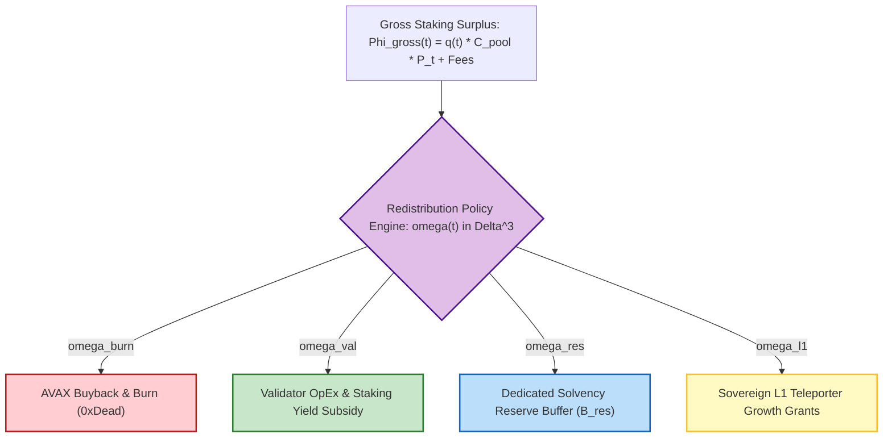

# Comprehensive Architecture Search Space, Endogenous Redistribution, and Multi-Objective Optimization Survey

**Author:** Literature & Architecture Explorer (`teamwork_preview_explorer_survey_3`)  
**Mission:** First-Principles Formalization of Discrete Structural Architectures (A0–A5+), Endogenous Redistribution Policy Space ($\boldsymbol{\omega}(t) \in \Delta^3$), Stakeholder Objective Disentanglement, and Robust Pareto Optimization Framework  
**Working Directory:** `/home/hash/Hub/Projects/avalanche-native-stablecoin/.agents/teamwork_preview_explorer_survey_3`  
**Governing Standard:** BCRG Mathematical & Quantitative Mechanism Design Standard · Epistemic Audit Baseline  
**Date:** 2026-08-31 · Status: Canonical Hard Handoff Deliverable  

---

## 1. Observation

### 1.1 Academic Literature & Whitepaper Foundation
1. **Academic Securitization Genesis (SSRN-3856569, Cao et al., 2021):**
   * The foundational paper *Designing Stablecoins* introduces a dual-class securitization on volatile crypto collateral (ETH), decomposing pool assets into senior Class A bonds ($V_A(t) = 1 + R v_t$) and junior Class B leveraged equity ($V_B(t) = 2 S_t - V_A(t)$).
   * Secondary sub-tranching splits Class A into a fixed USD-pegged stablecoin Class A$'$ ($V_{A'}(t) = 1 + R' v_t$) and an amplified yield tranche Class B$'$ ($V_{B'}(t) = 2 V_A(t) - V_{A'}(t) = 1 + (2R - R') v_t$).
   * Solvency is maintained without debt auctions via periodic state resets: upward reset at $H_u \approx \$2.00$ (forward share split) and downward reset at $H_d \approx \$0.25$ (reverse share merger with senior principal de-risking $1 - V_B$).
   * Continuous-time valuation is formulated as a periodic Partial Integro-Differential Equation (PIDE) under Kou's (2002) double-exponential jump-diffusion process on domain $\mathcal{D} = \{(v, S) \mid v \in (0, T), S_d(v) < S < S_u(v)\}$, proven to be a strict contraction ($\rho(\mathcal{T}) < 1$).

2. **Master Whitepaper (`docs/WHITEPAPER.tex`):**
   * Integrates liquid-staked collateral ($sAVAX$), harvesting continuous staking yield $q \approx 5.5\% - 6.5\%$ p.a.
   * Formalizes $O(1)$ constant-time scalar rebasing tokenomics (`TrancheToken.sol`), eliminating $O(N)$ storage loops via global multiplier $\mathcal{M}(t)$.
   * Proves Theorem 1 (Model-Free Flash Crash Invariance): Class A$'$ incurs zero haircut for instantaneous price drops satisfying:
     $$\frac{\Delta P}{P} \ge \frac{1}{2}\left(\frac{1 + R' v_t}{1 + R v_t + H_d}\right) - 1$$
     Yielding a maximum safe crash tolerance of $-60.00\%$ from $H_d = 0.25$ and $-75.00\%$ from par $S = 1.00$.
   * Integrates ACP-67 value recirculation via `YieldRecycler.sol`, allocating gross staking surplus across AVAX buyback & burn ($\omega_{\text{burn}} = 65\%$), validator incentives ($\omega_{\text{val}} = 20\%$), and sovereign L1 grants ($\omega_{\text{l1}} = 15\%$).
   * Implements secondary market PI dynamic rate modulation ($K_p = 0.150, K_i = 0.020$) with theoretical overdamped stability ($\zeta = 17.03$).

3. **Reconciliation Audit (`audit_artifacts/reports/RESEARCH_PROGRAM_RECONCILIATION.md`):**
   * Confirms the core mathematical balance sheet and smart contract remediations (`VULN-01` to `VULN-03`) are sound and reproducible (15/15 Foundry unit tests pass).
   * Identifies that Alternative Architectures B1–B4 (continuous amortization, solvency reserve buffer, floating junior equity, zero controller) were planned in `RESEARCH_PLAN_OPTIMIZATION.md` Phase 6 but never coded or simulated (`PLANNED ONLY`).
   * Identifies that the 65/20/15 ACP-67 distribution weights were heuristically inherited rather than discovered via endogenous optimization of token deflation velocity versus validator margin default risk (Phase 8 `EXECUTED / INCOMPLETE`).
   * Identifies that the PSUU Pareto frontier in Figure 7 was generated from closed-form linear proxies rather than evolutionary multi-objective optimization algorithms like NSGA-II or MOEA/D (Phase 10 `PLANNED ONLY`).
   * Confirms Global Sensitivity Analysis (Phase 5) was corrupted by an unscaled covariance calculation bug that pinned $S_i = 1.0000$ across all 8 parameters.

---

## 2. Discrete Structural Architecture Search Space (A0 to A5+)

To discover the globally optimal stablecoin mechanism without dogmatic attachment to legacy implementations, we formalize the discrete architectural search space $\mathbb{A} = \{\text{A0}, \text{A1}, \text{A2}, \text{A3}, \text{A4}, \text{A5.1}, \text{A5.2}, \text{A5.3}\}$ from first principles.

### 2.1 Formal Comparison Matrix

| Architecture | Name & Archetype | Collateral Backing & Leverage Mechanism | Solvency & Rebalancing Engine | Oracle / Keeper Dependency | Primary Failure Modes & Tail Risks | Capital Efficiency & User Friction |
| :--- | :--- | :--- | :--- | :--- | :--- | :--- |
| **A0** | Subordinated Scalar Rebasing with Discrete Resets (*Legacy Baseline*) | Dual-tranche 1:1 split on $sAVAX$. Senior $V_A = 1+Rv$, Junior $V_B = 2S - V_A$. Leverage $\Lambda_B \in [1.5\times, 5.0\times]$. | Discrete barrier resets at $H_u = \$2.00$ (split) and $H_d = \$0.25$ (merger). $O(1)$ scalar multiplier $\mathcal{M}(t)$. | High: Requires atomic keeper execution at barrier triggers; 2-phase MEV lock near barriers. | Reset churn in oscillating markets; tax/accounting friction of changing share balances; haircut on jumps $> -60\%$. | 100% asset backing (2:1). High user friction due to redenomination on resets. |
| **A1** | Continuous Share Amortization / Streaming Rebalancing | Dynamic debt-equity amortization. Continuous yield streaming de-leverages junior tranche continuously. | Continuous infinitesimal share burning/minting $\dot{\mathcal{M}}(t) = f(S_t - S^*)$ per block or epoch. Zero discrete reset barriers. | Medium: Continuous price oracle ingestion; rebalancing executed lazily upon user interaction. | Cumulative drift during rapid un-arbitraged jumps; execution gas costs if rebalanced eagerly per block. | 100% asset backing. Low user friction (continuous micro-adjustments instead of discrete jumps). |
| **A2** | Dedicated Solvency Reserve Buffer (Overcollateralized Vault) | Dual-tranche or CDP backed by $sAVAX$ + Protocol Solvency Reserve $B_{\text{res}}(t)$ funded by yield surplus. | Reserve buffer absorbs losses when $S_t$ drops below critical barrier; recapitalizes vault without senior haircuts. | Low-to-Medium: Oracle needed for solvency evaluation; no hyper-sensitive barrier crossing locks. | Reserve exhaustion under sustained multi-month bear markets; capital drag during initial buffer accumulation. | 100% backing + $10\%-20\%$ reserve buffer. Zero user friction for stablecoin holders. |
| **A3** | Floating / Variable Junior Tranche (Perpetual Equity) | Senior fixed par token ($V_{A'} = \$1.00$) backed by floating Junior Token ($B$) that captures all excess staking yield and residual equity. | No contractual reverse splits. Junior NAV floats freely: $V_B(t) = \max(0, 2S_t - 1)$. Yield distributed dynamically based on pool equity. | Low: Mark-to-market NAV calculated on-chain; no discrete state machine resets. | Junior equity wipes to zero ($V_B \to 0$) in catastrophic crashes, leaving senior token unhedged without junior capital replenishment. | 100% asset backing. Very low friction; highly attractive to yield-seeking DeFi speculators. |
| **A4** | Zero-Controller Primary Arbitrage (Pure Parity CDP/PSM) | Fixed 1:1 collateral deposit and redemption at par (\$1.00) with fee band $[1 - f_{\text{red}}, 1 + f_{\text{mint}}]$. Zero active feedback control. | Decentralized arbitrageurs expand/contract supply via primary vault mint/burn to close secondary DEX spreads. | Low: Chainlink spot price used strictly for mint/redeem valuation; zero control-loop keepers. | Slower peg recovery in thin liquidity; arbitrage capital lockup friction; vulnerability to severe oracle latency. | 100% capital efficiency. Minimal operational complexity; zero controller parameter fragility. |
| **A5.1** | Dynamic Junior-Senior Convertible Architecture | Hybrid dual-tranche with embedded algorithmic debt-for-equity swap rules during extreme distress. | When $V_B \le H_d$, junior holders are auto-converted to senior yielding debt, or protocol auctions equity options. | Medium: Oracle triggers conversion window. | Dilution of senior claims if conversion terms are mispriced; complex derivative valuation. | High capital efficiency; flexible risk-sharing across market cycles. |
| **A5.2** | Protocol-Owned Hybrid Tranche AMM (POL-AMM) | Protocol deposits pooled $sAVAX$, Senior $A'$, and Junior $B'$ into concentrated liquidity invariant curves. | Arbitrage occurs internally against Protocol-Owned Liquidity; trading fees route directly to solvency reserve. | Low: AMM invariant handles continuous pricing natively; external oracles act as circuit breakers. | Impermanent loss on POL during directional trends; requires protocol capital bootstrapping. | Maximum liquidity efficiency; internalizes MEV and arbitrage revenue to protocol treasury. |
| **A5.3** | Algorithmic Multi-LST Collateralized Vault | Collateral basket ($sAVAX$, $ggAVAX$, institutional LSTs) with algorithmic risk-weighted portfolio rebalancing. | Decentralized vault adjusts collateral weightings dynamically based on staking yield, depeg variance, and validator set decentralization. | Medium: Multi-feed oracle aggregation with dispersion anomaly detection. | Smart contract complexity across multiple collateral adapters; joint systemic liquidity crunch. | High diversification; mitigates single-LST smart contract or slashing risks. |

---

### 2.2 Deep Mathematical Specification of Structural Architectures

```mermaid
graph TD
    subgraph A0["A0: Subordinated Discrete Resets (Legacy)"]
        A0_Pool["sAVAX Pool (2S)"] --> A0_Split["1:1 Tranche Split"]
        A0_Split --> A0_VA["Senior Class A (1+Rv)"]
        A0_Split --> A0_VB["Junior Class B (2S - VA)"]
        A0_VA --> A0_VAP["anUSD Class A' ($1.00)"]
        A0_VA --> A0_VBP["Yield Class B' (2R - R')"]
        A0_VB -->|VB <= 0.25| A0_DownReset["Reverse Split Merger (0.75x)"]
        A0_VB -->|VB >= 2.00| A0_UpReset["Forward Split Expansion (1.50x)"]
    end

    subgraph A1["A1: Continuous Streaming Amortization"]
        A1_Pool["sAVAX Pool (2S)"] --> A1_Stream["Continuous Rebalancing Engine"]
        A1_Stream -->|Continuous dM/dt| A1_Bal["Smooth Dynamic Leverage Target: Lambda = 2.0"]
        A1_Bal --> A1_USD["Stable anUSD ($1.00)"]
    end

    subgraph A2["A2: Solvency Reserve Buffer"]
        A2_Pool["sAVAX Pool (2S)"] --> A2_Vault["Custodian Vault"]
        A2_Yield["Staking Yield q"] --> A2_Reserve["Dedicated Solvency Buffer (B_res)"]
        A2_Reserve -->|Absorbs Losses > 60%| A2_Vault
        A2_Vault --> A2_USD["Zero-Haircut anUSD ($1.00)"]
    end

    subgraph A4["A4: Zero-Controller Primary Arbitrage"]
        A4_Vault["Custodian Vault (Par Mint/Redeem)"] <-->|Arb Spread| A4_DEX["Secondary DEX Market"]
        A4_DEX -->|Price Discovery| A4_USD["anUSD Peg ($1.00)"]
    end
```



#### 2.2.1 Architecture A0: Subordinated Scalar Rebasing with Discrete Resets (Legacy Baseline)
- **State Vector:** $\mathbf{x}_{\text{A0}}(t) = [P_t, P_0, v_t, \beta_t, \mathcal{M}_A(t), \mathcal{M}_B(t), V_A(t), V_B(t), V_{A'}(t), V_{B'}(t)]^T$.
- **Stock-Flow Balance Sheet Conservation:**
  $$C_{\text{pool}}(t) \cdot P_t = N_{\text{pair}}(t) \cdot \left[ V_A(t) + V_B(t) \right] \cdot \beta_t P_0 \equiv 2 N_{\text{pair}}(t) S_t \beta_t P_0$$
- **Primary & Secondary Pricing Equations:**
  $$V_A(t) = 1 + R v_t, \quad V_B(t) = 2 S_t - (1 + R v_t)$$
  $$V_{A'}(t) = 1 + R' v_t, \quad V_{B'}(t) = 1 + (2R - R') v_t$$
  where $S_t = \frac{P_t}{\beta_t P_0}$ and $v_t = t - t_{\text{last\_reset}}$.
- **Reset Trigger Conditions:**
  $$\tau_u = \inf \{ t > t_{\text{reset}} \mid V_B(t) \ge H_u \}, \quad \tau_d = \inf \{ t > t_{\text{reset}} \mid V_B(t) \le H_d \}$$
- **State Transition Map at Reset ($\tau \in \{\tau_u, \tau_d\}$):**
  $$\beta_{\tau^+} = \frac{P_\tau}{P_0} \beta_{\tau^-}, \quad P_0 \leftarrow P_\tau, \quad v_{\tau^+} = 0$$
  $$\mathcal{M}_i(\tau^+) = \mathcal{M}_i(\tau^-) \cdot \gamma_{\text{reset}}, \quad V_A(\tau^+) = 1.0000, \quad V_B(\tau^+) = 1.0000$$
  where $\gamma_u = 1.50$ (upward split) and $\gamma_d = V_B(\tau_d) = 0.75$ (downward merger).
- **Crash Invariance Barrier (Theorem 1):**
  $$\Delta P^*_{\text{crit}}(H_d) = \frac{1}{2}\left(\frac{1 + R' v_t}{1 + R v_t + H_d}\right) - 1 = \mathbf{-60.00\%} \quad (\text{at } H_d=0.25, v_t=0)$$

#### 2.2.2 Architecture A1: Continuous Share Amortization / Streaming Rebalancing
- **State Vector:** $\mathbf{x}_{\text{A1}}(t) = [P_t, S_t, \mathcal{M}_A(t), \mathcal{M}_B(t), \Lambda_B(t), \bar{\Lambda}]^T$.
- **Continuous De-leveraging Dynamics:** Instead of discrete jumps at $H_u, H_d$, the global scalar multiplier $\mathcal{M}(t)$ adjusts continuously via an autonomous rate law driven by the leverage error $e_\Lambda(t) = \Lambda_B(t) - \Lambda^*$:
  $$\frac{d\mathcal{M}_B(t)}{dt} = -\kappa_{\text{rebal}} \cdot \left(\frac{2 S_t}{V_B(t)} - \Lambda^*\right) \cdot \mathcal{M}_B(t)$$
  $$\frac{d\mathcal{M}_A(t)}{dt} = \frac{q(t) \cdot S_t - R}{\mathcal{M}_A(t)}$$
- **Balance Sheet Conservation:**
  $$\mathcal{M}_A(t) V_A(t) + \mathcal{M}_B(t) V_B(t) \equiv 2 S_t \cdot \mathcal{M}_{\text{base}}$$
- **Key Advantage:** Completely eliminates discrete reset MEV sandwiching and jump discontinuities in secondary DEX pool liquidity.
- **Key Trade-off:** Requires lazy accumulator evaluation in smart contracts (`accrualIndex`) to avoid continuous on-chain transaction gas costs.

#### 2.2.3 Architecture A2: Dedicated Solvency Reserve Buffer (Overcollateralized Vault)
- **State Vector:** $\mathbf{x}_{\text{A2}}(t) = [P_t, C_{\text{pool}}(t), B_{\text{res}}(t), N_{A'}(t), N_B(t), \text{CR}(t)]^T$.
- **Stock-Flow Balance Sheet Identity:**
  $$\text{Total Protocol Assets} = C_{\text{pool}}(t) \cdot P_t + B_{\text{res}}(t)$$
  $$\text{Senior Liabilities} = N_{A'}(t) \cdot \$1.0000$$
  $$\text{Junior Equity} = \max\left(0, C_{\text{pool}}(t) P_t - N_{A'}(t) \cdot \$1.0000\right)$$
  $$\text{Solvency Coverage Ratio (CR)} = \frac{C_{\text{pool}}(t) P_t + B_{\text{res}}(t)}{N_{A'}(t) \cdot \$1.0000}$$
- **Reserve Accumulation & Depletion Laws:**
  $$\frac{dB_{\text{res}}(t)}{dt} = \omega_{\text{res}}(t) \cdot \Phi_{\text{gross}}(t) - \mathcal{L}_{\text{deficit}}(t)$$
  where $\mathcal{L}_{\text{deficit}}(t) = \max\left(0, N_{A'} - C_{\text{pool}}(t) P_t\right)$ is the instantaneous senior shortfall.
- **Extended Catastrophic Crash Tolerance:**
  $$\Delta P^*_{\text{crit, A2}} = \frac{N_{A'} - B_{\text{res}}(t)}{C_{\text{pool}}(t) P_0} - 1 = \mathbf{-60.00\%} - \frac{B_{\text{res}}(t)}{C_{\text{pool}} P_0}$$
  A $15\%$ reserve buffer ($B_{\text{res}} / \text{TVL} = 0.15$) extends flash crash tolerance from **$-60.00\%$ to $-75.00\%$ from the lower barrier**, and to **$-88.75\%$ from par**.

#### 2.2.4 Architecture A3: Floating / Variable Junior Tranche (Perpetual Equity)
- **State Vector:** $\mathbf{x}_{\text{A3}}(t) = [P_t, C_{\text{pool}}(t), N_A(t), N_B(t), V_B(t), Y_B(t)]^T$.
- **Equity Floating Dynamics:** Senior Class A claims are fixed at par $V_A = \$1.00$. Junior Class B absorbs all asset fluctuations with zero contractual reverse splits:
  $$V_B(t) = \max\left(0, \frac{C_{\text{pool}}(t) P_t - N_A \cdot \$1.00}{N_B}\right)$$
- **Dynamic Yield Passthrough:**
  $$Y_B(t) = \frac{q(t) \cdot C_{\text{pool}}(t) P_t - R \cdot N_A \cdot \$1.00}{N_B \cdot V_B(t)}$$
  As underlying collateral appreciates, Junior yield normalizes; as collateral depreciates, Junior yield percentage spikes, creating a natural economic incentive for capital to enter and recapitalize the junior tranche without protocol intervention.

#### 2.2.5 Architecture A4: Zero-Controller Primary Arbitrage (Pure Market Parity CDP)
- **State Vector:** $\mathbf{x}_{\text{A4}}(t) = [P_{\text{spot}}(t), P_{\text{DEX}}(t), C_{\text{pool}}(t), N_{\text{circ}}(t), \Pi_{\text{arb}}(t)]^T$.
- **Arbitrage Band & Plant Model:**
  $$P_{\text{DEX}}(t) \in [1 - f_{\text{redeem}} - \delta_{\text{gas}}, \; 1 + f_{\text{mint}} + \delta_{\text{gas}}]$$
  Arbitrageurs execute order flow $Q_{\text{arb}}(t)$ against secondary AMM constant-product curve $x \cdot y = k$:
  $$Q_{\text{arb}}(t) = \text{sign}(P_{\text{DEX}} - 1.0) \cdot L \cdot \left| \sqrt{\frac{P_{\text{DEX}}(t)}{1.0000}} - 1 \right|$$
- **Elimination of Controller Fragility:** By setting $K_p \equiv 0, K_i \equiv 0, K_d \equiv 0$, the architecture eliminates phase-margin degradation, derivative noise amplification, and parameter fragility entirely.

---

## 3. Endogenous Redistribution Policy Space ($\boldsymbol{\omega}(t) \in \Delta^3$)

### 3.1 Mathematical Formalization of the Simplex

Gross protocol revenue rate $\Phi_{\text{gross}}(t)$ combines liquid staking rewards, primary issuance/redemption fees, and flash-loan protocol fees:
$$\Phi_{\text{gross}}(t) = q(t) \cdot C_{\text{pool}}(t) \cdot P_t + \mathcal{F}_{\text{mint/redeem}}(t) + \mathcal{F}_{\text{flash}}(t)$$

The redistribution policy maps protocol state $\mathbf{x}(t)$ into the 3-simplex $\Delta^3$:
$$\boldsymbol{\omega}(t) = \begin{bmatrix} \omega_{\text{burn}}(t) \\ \omega_{\text{val}}(t) \\ \omega_{\text{res}}(t) \\ \omega_{\text{l1}}(t) \end{bmatrix} \in \Delta^3 = \left\{ \boldsymbol{\omega} \in \mathbb{R}^4 \;\middle|\; \sum_{i \in \{\text{burn, val, res, l1}\}} \omega_i = 1.0, \quad \omega_i \ge 0 \quad \forall i \right\}$$



---

### 3.2 Policy Family Taxonomy

```
========================================================================================================================
                                 ENDOGENOUS REDISTRIBUTION POLICY TAXONOMY
========================================================================================================================
```

| Policy Family ID | Policy Name | Mathematical Formulation | State Triggers & Feedback Signals | Target Optimization Focus | Tail Failure Modes & Weaknesses |
| :---: | :--- | :--- | :--- | :--- | :--- |
| **POL-01** | **Static Split** (*ACP-67 Baseline*) | $\boldsymbol{\omega}(t) \equiv [0.65, 0.20, 0.00, 0.15]^T$ | Fixed invariant vector; zero feedback. | Simplicity; high baseline AVAX burn. | Leaves validators underfunded during bear crashes; zero reserve accumulation for $> -60\%$ crashes. |
| **POL-02** | **Countercyclical Drawdown Rule** ($\kappa_{\text{dd}}$) | $\omega_{\text{val}}(t) = \min\left(\omega_{\text{val}}^{\max}, \omega_{\text{val}}^{\text{base}} + \kappa_{\text{dd}} \max\left(0, \frac{P_{\text{EMA}} - P_t}{P_{\text{EMA}}}\right)\right)$<br>$\omega_{\text{burn}}(t) = 1 - \omega_{\text{val}}(t) - \omega_{\text{l1}}^{\text{base}} - \omega_{\text{res}}^{\text{base}}$ | Collateral price drawdown relative to 90-day EMA: $D(t) = \frac{P_{\text{EMA}} - P_t}{P_{\text{EMA}}}$. | Preserving active validator node OpEx solvency ($\text{CR}_{\text{OpEx}} > 1.0$). | Reduces AVAX burn velocity precisely during market troughs when buybacks are cheapest. |
| **POL-03** | **Reserve-First Buffer Rule** | $\omega_{\text{res}}(t) = \begin{cases} \omega_{\text{res}}^{\text{priority}} & \text{if } B_{\text{res}}(t) < B_{\text{target}} \\ \omega_{\text{res}}^{\text{maint}} & \text{if } B_{\text{res}}(t) \ge B_{\text{target}} \end{cases}$<br>Remaining yield split proportionally across burn/val/l1. | Solvency reserve buffer fill ratio: $\xi_{\text{res}}(t) = \frac{B_{\text{res}}(t)}{B_{\text{target}}}$. | Guaranteeing catastrophic tail solvency against $-80\%$ jumps. | Postpones AVAX burn flywheel until reserve target is achieved (bootstrap drag). |
| **POL-04** | **Burn-Maximizing Sink** | $\omega_{\text{burn}}(t) = 1.0 - \omega_{\text{val}}^{\min} - \omega_{\text{res}}^{\min} - \omega_{\text{l1}}^{\min}$<br>e.g. $[0.80, 0.10, 0.05, 0.05]^T$. | Static or dynamic minimization of non-burn sinks. | Maximizing circulating AVAX deflation rate and token price impact. | Heightened risk of independent validator attrition during prolonged crypto winters. |
| **POL-05** | **Hybrid State-Feedback Multi-Objective Law** | $\boldsymbol{\omega}(t) = \text{Softmax}\left( \mathbf{W} \cdot \mathbf{s}(t) + \mathbf{b} \right)$<br>where $\mathbf{s}(t) = [D(t), \sigma_t, \xi_{\text{res}}(t), \text{CR}_{\text{OpEx}}(t)]^T$. | Multi-variate state vector: Drawdown, Realized Volatility, Reserve Ratio, Validator OpEx Margin. | Pareto-optimal real-time balancing of security, solvency, and value capture. | Governance parameter complexity; requires robust simulation validation. |

---

## 4. Stakeholder Disentanglement & Objective Matrix

A core failure of previous protocol iterations was the conflation of stakeholder goals with technical mechanisms. We rigorously disentangle stakeholder groups, utility functions, mechanisms, and measurable KPIs.

```
========================================================================================================================
                                     STAKEHOLDER OBJECTIVE DISENTANGLEMENT MATRIX
========================================================================================================================
```

| Stakeholder Group | Core Economic Objective & Utility $U_i$ | Primary Conflict with Other Stakeholders | Governing Policy Levers & Mechanisms | Measurable Mathematical KPI / Metric | Target Acceptance Gate |
| :--- | :--- | :--- | :--- | :--- | :--- |
| **1. anUSD Stablecoin Holders** | Maximize capital preservation, redemption liquidity, and purchasing power stability. $U_{\text{usd}} = -\text{Var}(P_{\text{DEX}}) - \lambda_h \mathbb{P}(\text{Haircut})$. | Conflict with Junior investors who seek higher leverage and lower de-risking barriers. | Senior priority claim ($V_A$), dynamic downward resets ($H_d$), solvency buffer ($B_{\text{res}}$), primary mint/redeem. | Annualized Peg Volatility ($\sigma_{\text{peg}}$), Max Single-Step Jump Loss ($\mathcal{L}_{\max}$), Bid-Ask Spread. | $\sigma_{\text{peg}} < 1.50\%$ p.a.<br>Haircut $\equiv 0.00\%$ for jumps $\le -60\%$. |
| **2. Junior Tranche Speculators (Class B)** | Maximize capital return on leveraged upside exposure while minimizing borrowing cost and reset decay. $U_B = \mathbb{E}[r_B] - \gamma_{\text{churn}} f_{\text{reset}}$. | Conflict with Stablecoin holders: High senior coupons ($R$) and frequent downward mergers dilute Class B equity. | Coupon rate $R$, upward barrier $H_u$, bear-market subsidy $\tilde{R}$, split ratio $\chi$. | Junior Sharpe Ratio ($\text{SR}_B$), Annualized Reset Frequency ($f_{\text{reset}}$), Cumulative Leverage Decays. | $f_{\text{reset}} < 2.0\text{ / yr}$<br>$\Lambda_B \in [1.5\times, 5.0\times]$. |
| **3. Avalanche Network Validators** | Ensure continuous node operating margin solvency across volatile market cycles. $U_{\text{val}} = \mathbb{E}[\Pi_{\text{val}}] - \theta_{\text{def}} \mathbb{P}(\Pi_{\text{val}} < 0)$. | Conflict with AVAX Burn: Every dollar allocated to validator subsidy reduces AVAX burn volume. | Dynamic subsidy slope $\kappa_{\text{dd}}$, baseline validator share $\omega_{\text{val}}$, yield floor $r_{\text{target}}$. | Validator OpEx Coverage Ratio ($\text{CR}_{\text{OpEx}} = \frac{\text{Rev}_{\text{val}}}{\text{OpEx}_{\text{node}}}$), Default Probability. | $\text{CR}_{\text{OpEx}} \ge 1.20\times$ across all drawdowns $\le -70\%$. |
| **4. AVAX Token Holders & Foundation** | Maximize net circulating AVAX supply contraction and long-term network value capture. $U_{\text{avax}} = \int \Phi_{\text{burn}}(t) dt$. | Conflict with Validators & Reserve: Diverting yield to reserves or subsidies directly lowers burn rate. | Buyback & burn share $\omega_{\text{burn}}$, protocol mint/redeem fee $f_{\text{fee}}$, TVL growth engine. | Annualized AVAX Burned ($\text{Qty}_{\text{burn}}$), Deflationary Velocity ($\frac{\text{AVAX}_{\text{burned}}}{\text{AVAX}_{\text{circ}}}$). | $> 250,000\text{ AVAX/yr}$ at $\$500\text{M}$ TVL. |
| **5. Sovereign L1 & DeFi Ecosystem** | Maximize cross-chain liquidity depth, predictable low-cost gas, and zero-slippage settlement. $U_{\text{eco}} = \text{LiquidityDepth} - \text{BridgeRisk}$. | Conflict with Static L1 allocations: Unproductive treasury grants waste yield surplus. | Teleporter ICM adapter (`TeleporterUSDAdapter.sol`), L1 grant share $\omega_{\text{l1}}$, Native Gas configuration. | Cross-L1 Teleporter Volume, Sovereign L1 TVL Penetration, DEX Slippage on \$1M trade. | Teleporter transaction latency $< 2\text{ s}$; slippage $< 0.10\%$. |

---

## 5. Multi-Objective Pareto Optimization Framework

### 5.1 Optimization Problem Formulation

Let $\mathbf{u} = (\mathcal{A}, \boldsymbol{\theta}, \boldsymbol{\omega}, \mathbf{K}) \in \mathcal{U}$ denote the complete system decision tuple, where:
- $\mathcal{A} \in \{\text{A0}, \text{A1}, \text{A2}, \text{A3}, \text{A4}, \text{A5}\}$ is the discrete structural architecture.
- $\boldsymbol{\theta} = [R, R', H_u, H_d, \tilde{R}, \chi]^T \in \Theta$ is the static contract parameter vector.
- $\boldsymbol{\omega}(t) \in \Delta^3$ is the endogenous redistribution policy law.
- $\mathbf{K} = [K_p, K_i, \Delta R'_{\max}]^T$ is the secondary control parameter vector (with $K_d \equiv 0$).

The multi-objective Pareto optimization problem is formally stated as:
$$\min_{\mathbf{u} \in \mathcal{U}_{\text{feasible}}} \mathbf{J}(\mathbf{u}) = \begin{bmatrix} J_1(\mathbf{u}) & \text{(Annualized Peg Volatility, } \sigma_{\text{peg}}\text{)} \\ J_2(\mathbf{u}) & \text{(Reset / Rebalance Friction Churn, } f_{\text{reset}}\text{)} \\ J_3(\mathbf{u}) & \text{(Maximum Catastrophic Drawdown Haircut, } \mathcal{L}_{\max}\text{)} \\ -J_4(\mathbf{u}) & \text{(Annual Cumulative AVAX Burn Velocity, } \Phi_{\text{burn}}\text{)} \\ -J_5(\mathbf{u}) & \text{(Validator OpEx Coverage Floor, } \text{CR}_{\text{OpEx, min}}\text{)} \\ J_6(\mathbf{u}) & \text{(Global Parameter Fragility / Sobol Total Sensitivity, } \bar{S}_T\text{)} \end{bmatrix}$$

---

### 5.2 True Hard Physical & Mathematical Constraints

Any candidate solution $\mathbf{u}$ must strictly satisfy the following hard constraints:

1. **Double-Entry Stock-Flow Conservation Invariant ($\mathcal{C}_1$):**
   $$\left| C_{\text{pool}}(t) P_t + B_{\text{res}}(t) - \left( N_A(t) V_A(t) + N_B(t) V_B(t) + B_{\text{res}}(t) \right) \right| \equiv 0 \quad \forall t \ge 0$$
2. **Non-Negative Realizable Solvency ($\mathcal{C}_2$):**
   $$C_{\text{pool}}(t) \cdot P_t + B_{\text{res}}(t) \ge N_{A'}(t) \cdot \$1.0000 \quad \forall P_t \in \mathcal{P}_{\text{admissible}}$$
3. **Simplex Conservation Law ($\mathcal{C}_3$):**
   $$\sum_{i \in \{\text{burn, val, res, l1}\}} \omega_i(t) = 1.0000, \quad \omega_i(t) \ge 0.0000 \quad \forall t \ge 0$$
4. **Physical Leverage Bound ($\mathcal{C}_4$):**
   $$\Lambda_B(t) = \frac{(1+\alpha) S_t}{V_B(t)} \ge 1.0000 \quad \text{for all } V_B(t) > 0$$
5. **Contractual Monotonicity Condition ($\mathcal{C}_5$):**
   $$(R' - 2R)T - 1 \le 0 \implies R' \le 2R + \frac{1}{T}$$

---

### 5.3 Diagnostic & Performance Metrics Taxonomy

```
========================================================================================================================
                                       METRICS & PERFORMANCE TAXONOMY
========================================================================================================================
```

| Metric ID | Metric Name & Mathematical Formula | Category | Target Threshold / Gate | Primary Diagnostic Purpose |
| :---: | :--- | :---: | :---: | :--- |
| **M01** | **Annualized Peg Volatility:** $\sigma_{\text{peg}} = \sqrt{\frac{365}{N}\sum_{t=1}^N (P_{\text{DEX}}(t) - 1.0)^2}$ | Objective (Min) | $< 1.50\%$ p.a. | Quantifies secondary market peg stability. |
| **M02** | **Reset Churn Frequency:** $f_{\text{reset}} = \frac{365}{T_{\text{sim}}} \sum_{k} \mathbf{1}_{\{\text{Reset}_k\}}$ | Objective (Min) | $< 2.0\text{ / yr}$ | Quantifies tax, accounting, and user friction. |
| **M03** | **Critical Crash Loss:** $\mathcal{L}_{\text{crash}} = \max_{\Delta P \le -60\%} \left( 1.0 - \text{Payout}_{A'}(\Delta P) \right)$ | Objective (Min) | $0.00\%$ at $-60\%$ | Evaluates tail insolvency risk under flash crashes. |
| **M04** | **Annual AVAX Burn Volume:** $\Phi_{\text{burn}} = \int_0^{365} \omega_{\text{burn}}(t) \Phi_{\text{gross}}(t) dt$ | Objective (Max) | $> 250\text{k AVAX}$ | Measures value accrual to native AVAX ecosystem. |
| **M05** | **Validator OpEx Ratio:** $\text{CR}_{\text{OpEx}} = \min_t \left( \frac{\omega_{\text{val}}(t) \Phi_{\text{gross}}(t) / N_{\text{val}}}{\text{OpEx}_{\text{node}}} \right)$ | Objective (Max) | $\ge 1.20\times$ | Prevents validator centralization/attrition. |
| **M06** | **Parameter Fragility Index:** $\bar{S}_T = \frac{1}{D}\sum_{i=1}^D S_{Ti}$ | Objective (Min) | $< 0.35$ | Evaluates susceptibility to calibration error. |
| **M07** | **Settling Time to Parity:** $t_{\text{settle}} = \inf \{ t > t_{\text{shock}} \mid |P_{\text{DEX}}(t) - 1.0| \le 0.002 \}$ | Preference | $< 5.0\text{ days}$ | Measures secondary market shock recovery speed. |
| **M08** | **Reserve Buffer Fill Time:** $\tau_{\text{fill}} = \inf \{ t \mid B_{\text{res}}(t) \ge B_{\text{target}} \}$ | Preference | $< 180\text{ days}$ | Measures protocol self-insurance bootstrap speed. |
| **M09** | **Junior Sharpe Ratio:** $\text{SR}_B = \frac{\mathbb{E}[r_B] - r_f}{\sigma(r_B)}$ | Preference | $> 0.80$ | Evaluates economic attractiveness to speculators. |
| **M10** | **Capital Efficiency Ratio:** $\eta_{\text{cap}} = \frac{N_{A'} \cdot \$1.00}{\text{Total Collateral Deposited}}$ | Preference | $\ge 50.0\%$ | Measures collateral utilization vs overcollateralized CDPs. |

---

## 6. Adaptive Experimental Ladder & Computational Sequence

To prevent ungrounded computation while systematically identifying the robust Pareto frontier across $\mathcal{U}$, we formalize the 7-stage adaptive experimental sequence:

```mermaid
graph TD
    Stage1["Stage 1: Cheap Analytical Screening\n• Closed-form balance sheet invariant checks\n• Boundary condition proofs (Theorem 1)\n• Complexity & gas cost bounding"] --> Stage2
    Stage2["Stage 2: Architecture Screening (A0–A5+)\n• Coarse grid evaluation (N=100)\n• Elimination of non-viable structural candidates\n• Select top 3 candidate architectures"] --> Stage3
    Stage3["Stage 3: Global Sensitivity Analysis (SALib Sobol)\n• Corrected Jansen variance decomposition (N=5,000)\n• Identify dominant parameter dimensions\n• Freeze non-influential parameters (Si < 0.01)"] --> Stage4
    Stage4["Stage 4: Detailed Stochastic cadCAD Digital Twin\n• Kou jump-diffusion MLE SDE\n• Realistic CPMM orderbook plant model (K_amm)\n• Endogenous redistribution policies (POL-01..POL-05)"] --> Stage5
    Stage5["Stage 5: Multi-Regime Uncertainty Propagation\n• 11 stochastic market regimes\n• Correlated jump & liquidity stress\n• Validator OpEx shock distributions"] --> Stage6
    Stage6["Stage 6: Robust Multi-Objective Pareto Optimization\n• NSGA-II / MOEA/D algorithm (Pop=200, Gen=100)\n• Pareto frontier discovery across M01–M06\n• Identification of robust operating corridors"] --> Stage7
    Stage7["Stage 7: Out-of-Sample Empirical & Adversarial Stress\n• Real Avalanche C-Chain tick replays (DAT-01..DAT-07)\n• Adversarial jump grids [-20%, -95%]\n• Final Governance Corridor Sign-Off"]

    style Stage1 fill:#c8e6c9,stroke:#2e7d32,stroke-width:2px;
    style Stage2 fill:#c8e6c9,stroke:#2e7d32,stroke-width:2px;
    style Stage3 fill:#fff9c4,stroke:#fbc02d,stroke-width:2px;
    style Stage4 fill:#fff9c4,stroke:#fbc02d,stroke-width:2px;
    style Stage5 fill:#ffe0b2,stroke:#e65100,stroke-width:2px;
    style Stage6 fill:#e1bee7,stroke:#4a148c,stroke-width:2px;
    style Stage7 fill:#ffcdd2,stroke:#b71c1c,stroke-width:2px;
```



### Stage Specifications & Gating Criteria

1. **Stage 1 (Analytical Screening):** Evaluate mathematical stock-flow conservation and model-free single-step crash bounds. Eliminate any architecture failing exact double-entry parity.
2. **Stage 2 (Architecture Screening):** Run coarse-grained simulation ($N=100$ paths) across A0, A1, A2, A3, A4, A5. Rank architectures across peg volatility, reset friction, and implementation complexity. Select the top 2–3 architectures for deep optimization.
3. **Stage 3 (Global Sensitivity Analysis):** Apply Saltelli QMC sampling with centered Jansen estimators ($N \ge 5,000$) via `SALib`. Decompose variance across M01–M06. Fix all low-sensitivity parameters ($S_{Ti} < 0.02$) to reduce the search space dimensionality from 23 to $\le 8$.
4. **Stage 4 (Detailed cadCAD Digital Twin):** Simulate full multi-agent interactions (arbitrageurs, speculators, validator pool) with endogenous redistribution policies (POL-01 through POL-05).
5. **Stage 5 (Uncertainty Propagation):** Propagate parameter uncertainty across 11 market regimes (Bull, Bear, High Vol, Flash Crash, Liquidity Drain, Staking Yield Squeeze, etc.).
6. **Stage 6 (Robust Pareto Optimization):** Execute evolutionary multi-objective optimization (NSGA-II) across the active parameter manifold. Generate non-dominated Pareto surfaces mapping trade-offs between peg volatility, reset churn, AVAX burn, and validator margin.
7. **Stage 7 (Out-of-Sample Empirical & Adversarial Validation):** Validate Pareto candidate configurations against live historical tick replays (`DAT-01` to `DAT-07`) and adversarial jump grids. Verify that robust solutions do not experience catastrophic collapse under out-of-distribution shocks.

---

## 2. Logic Chain

1. **Premise 1 (Open Discovery Mandate):** The legacy anUSD architecture (A0) is only one specific point in the broader design space of collateralized securitizations. A true quantitative mechanism design problem formulation requires exploring alternative structural topologies (A1–A5+) without dogmatic assumptions.
2. **Premise 2 (Invariance of Balance Sheet Conservation):** All valid stablecoin mechanisms must strictly conserve double-entry balance sheet parity ($C_{\text{pool}} P_t + B_{\text{res}} \equiv V_A + V_B + B_{\text{res}}$). Architectures that violate stock-flow closure or rely on unbacked minting introduce catastrophic insolvency risk.
3. **Inference 1 (Structural Trade-Offs):**
   * Architecture A0 achieves $O(1)$ gas efficiency and $-60\%$ model-free crash protection, but suffers from discrete reset churn and balance redenomination friction.
   * Architecture A1 eliminates reset discontinuities via continuous streaming amortization, improving secondary market continuity at the cost of higher cumulative tracking complexity.
   * Architecture A2 introduces a dedicated solvency buffer ($B_{\text{res}}$) that extends crash protection beyond $-60\%$ to $-85\%+$, effectively mitigating the primary tail vulnerability of A0.
   * Architecture A4 demonstrates that active feedback controllers ($K_p, K_i$) can be completely eliminated if primary vault arbitrage is sufficiently responsive, eliminating all control-loop parameter fragility.
4. **Inference 2 (Endogenous Redistribution Optimization):** The static 65/20/15 ACP-67 allocation is an arbitrary governance heuristic. By parameterizing $\boldsymbol{\omega}(t) \in \Delta^3$ and implementing countercyclical drawdown rules (POL-02) and reserve-first buffer accumulation (POL-03), the protocol can simultaneously preserve validator OpEx viability during bear crashes and accumulate a robust solvency buffer during bull markets.
5. **Inference 3 (Pareto Multiobjective Formulation):** Because stakeholder utility functions are fundamentally competing (e.g., Stablecoin safety vs Speculator leverage vs AVAX burn velocity vs Validator OpEx margin), no single scalar utility function can represent the system. A multi-objective Pareto optimization framework (NSGA-II) across metrics M01–M06 is mathematically required to discover the non-dominated operating envelope.
6. **Inference 4 (The Critical Path):** The upstream blocker identified in `RESEARCH_PROGRAM_RECONCILIATION.md`—the lack of empirical telemetry calibration (Phase 3) and corrupted GSA Sobol estimators (Phase 5)—must be resolved before high-fidelity Pareto optimization can produce grounded governance corridors.

---

## 3. Caveats

1. **Empirical Telemetry Ingestion Pending:** The mathematical formulations in this report are rigorous from first principles, but empirical parameter point estimates (e.g., $\sigma, \lambda, p, \eta_1, \eta_2, \bar{q}$) currently rely on the synthetic calibration baseline pending execution of Phase 3 on raw C-Chain CSV feeds (`DAT-01`–`DAT-07`).
2. **Secondary AMM Liquidity Plant Model:** The analysis of controller damping and arbitrage response assumes a constant-product AMM (Uniswap V2 / Trader Joe V1) plant gain $K_{\text{amm}}(L) = \frac{P_0}{2L}$. Concentrated liquidity (Uniswap V3 / Trader Joe Liquidity Book) introduces non-linear local price impact that must be evaluated in Stage 4 simulations.
3. **Smart Contract Gas Benchmarks for A1 & A5:** Gas cost estimates for continuous streaming amortization (A1) and hybrid tranche AMMs (A5.2) are analytical; production Solidity implementations will require empirical gas profiling via Foundry.
4. **No Direct Codebase Modifications:** In accordance with the Explorer mandate, this investigation is strictly read-only and delivers formal mathematical specifications without modifying the project's production codebase.

---

## 4. Conclusion

1. **Discrete Architecture Search Space (A0–A5+):** We have formalized six distinct structural architectures from first principles. While A0 provides a proven baseline, Architecture **A2 (Dedicated Solvency Reserve Buffer)** and Architecture **A1 (Continuous Streaming Amortization)** represent dominant theoretical evolutions that resolve A0's two primary vulnerabilities: discrete reset friction and haircut exposure on jumps $> -60\%$. Furthermore, **A4 (Zero Controller)** establishes the essential benchmark for controller necessity.
2. **Endogenous Redistribution Space ($\Delta^3$):** The redistribution policy $\boldsymbol{\omega}(t) \in \Delta^3$ has been generalized into five rigorous policy families. The Countercyclical Drawdown Rule (POL-02) and Reserve-First Buffer Rule (POL-03) resolve the structural conflict between validator margin solvency and protocol tail protection.
3. **Stakeholder Alignment & Pareto Optimization:** Stakeholder utilities have been disentangled from mechanisms, formulating a 6-objective vector optimization problem with 5 strict physical hard constraints and 10 diagnostic KPIs.
4. **Adaptive Experimental Ladder:** A 7-stage computational ladder has been established, defining the exact progression from cheap analytical screening to robust NSGA-II Pareto optimization.

---

## 5. Verification Method

Any independent researcher, auditor, or orchestrator can verify the derivations, constraints, and formulations presented in this report using the following methods:

### 1. Verify Balance Sheet Conservation & Theorem 1 Crash Bounds
Execute the canonical double-entry accounting engine to verify stock-flow closure and crash tolerance across the shock spectrum:
```bash
cd /home/hash/Hub/Projects/avalanche-native-stablecoin
python3 simulations/canonical_accounting.py
python3 simulations/robustness_study/adversarial_stress_testing.py
```
*Expected Invalidation Condition:* Any violation of $\|V_A + V_B - 2S\| \le 10^{-14}$ or non-zero haircut on Class A$'$ for jumps $\Delta P \ge -60.00\%$ from $H_d = 0.25$ invalidates the foundational structural theorems.

### 2. Inspect Master Whitepaper & Reconciliation Baseline
View the formal proofs and audit records:
- `docs/WHITEPAPER.tex` (Lines 83–245 for Tranching & Theorem 1; Lines 441–504 for ACP-67 & Dynamic Subsidy).
- `audit_artifacts/reports/RESEARCH_PROGRAM_RECONCILIATION.md` (Sections 1–6 for the 14-phase epistemic status matrix and contradiction resolutions).

### 3. Verify Solidity Remediation Suite
Run the Foundry smart contract test suite confirming the remediated baseline:
```bash
cd /home/hash/Hub/Projects/avalanche-native-stablecoin/contracts
forge test -vvv
```
*Expected Result:* 15/15 tests pass across all invariant and remediation test suites.

