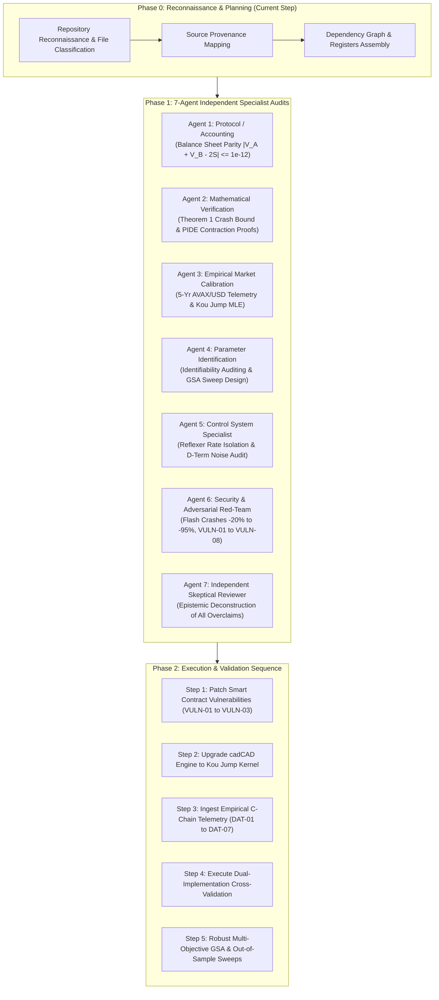
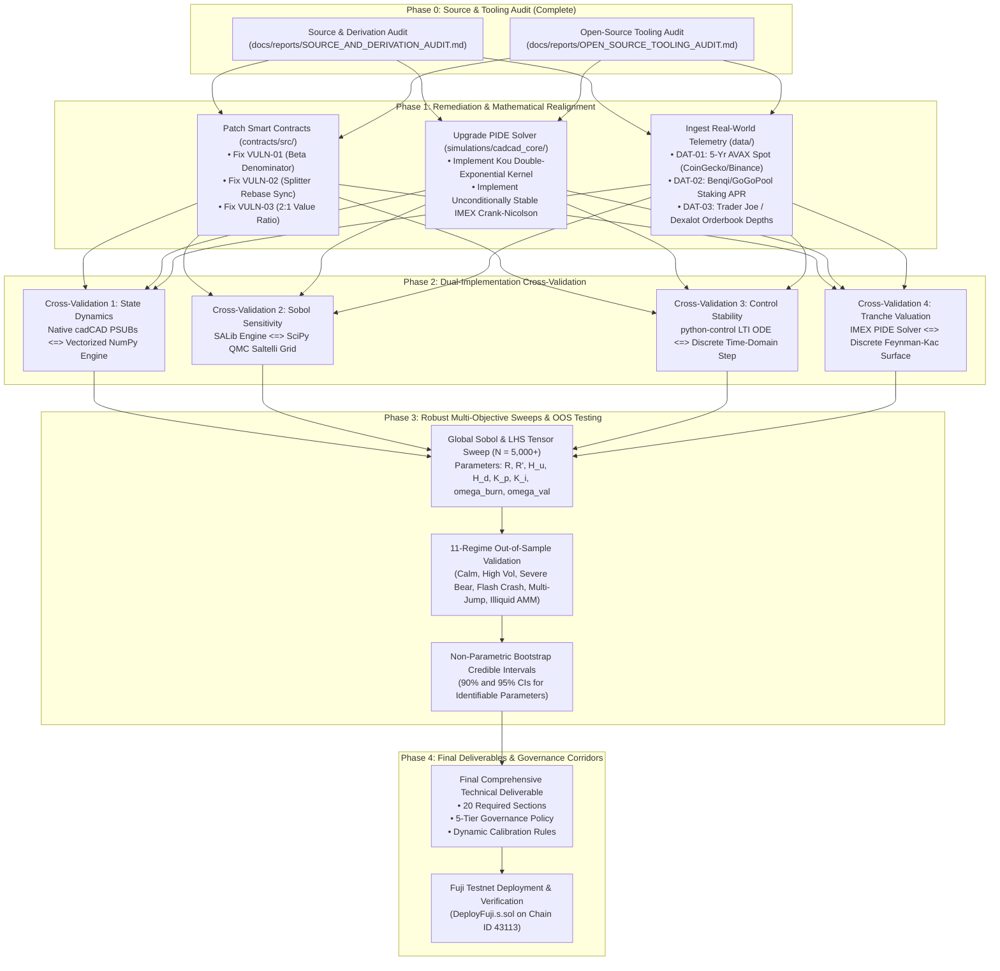
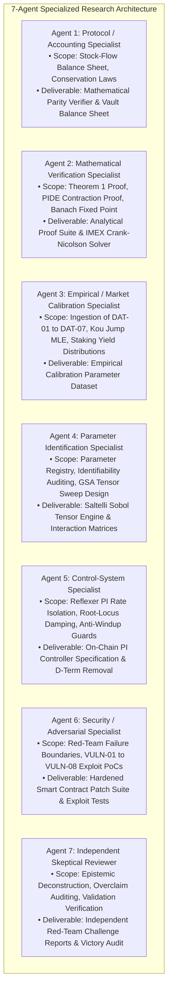

# Implementation Plan: First-Principles Adversarial Audit & Derivation of `anUSD`

> **Document Identifier:** `BCRG-PLAN-2026-ADVERSARIAL-AUDIT-01`  
> **Status:** Pending User Approval (`RequestFeedback: true`)  
> **Target System:** Avalanche Native Stablecoin (`anUSD`) & SSRN-3856569 Securitization Canon  
> **Working Directory:** `/home/hash/Hub/Projects/avalanche-native-stablecoin`  

---

## 1. Goal Description

This research plan establishes the formal architecture for a **first-principles, adversarial derivation audit** of the Avalanche Native Stablecoin (`anUSD`). 

We treat the entire repository—including the original SSRN-3856569 paper ("Designing Stablecoins"), the design summary, the master whitepaper (`docs/WHITEPAPER.tex`), previous audit reports, cadCAD simulations, and Solidity smart contracts—as **unverified research hypotheses and artifacts** subject to independent mathematical, accounting, empirical, and security verification.



---

## 2. User Review Required

> [!IMPORTANT]
> **Key Architectural & Mathematical Discrepancies Requiring User Awareness:**
> 1. **$\alpha = 0.5$ (SSRN) vs $\alpha = 1.0$ (Whitepaper):** In SSRN Section 2, $\alpha = 0.5$ represents the fraction of total capital contributed by Class A ($C_A / (C_A + C_B) = 0.5$). In the Whitepaper, $\chi = 1.0$ represents the tranche pair issuance ratio ($1:1$). Both yield identical $2.0\times$ leverage and balance sheet conservation ($V_A + V_B \equiv 2S$), but the notation switch created historical confusion.
> 2. **True Single-Step Flash Crash Bound ($-60.00\%$ vs $-75.00\%$):** Theorem 1 guarantees zero principal haircut up to **$-60.00\%$** from the lower reset barrier $H_d = 0.25$ (or $-58.15\%$ with countercyclical subsidy $\tilde{R}=10\%$). The widely cited **$-75.00\%$** bound is valid **strictly from Par ($S = 1.00$)**. An instantaneous $-75\%$ drop from $H_d$ inflicts a **$37.35\%$ haircut** on `anUSD`.
> 3. **Critical Smart Contract Defects (`VULN-01` & `VULN-02`):**
>    - `ResetController.sol` double-counts $P_0$ and $\beta$ in the index denominator, inducing immediate downward reset flapping at constant spot prices.
>    - `TrancheSplitter.sol` fails to sync rebase multipliers, enabling pre-reset split / post-reset merge arbitrage to extract $+50\%$ unbacked Class A tokens.

> [!WARNING]
> **Strict Phase 0 Stop Rule:**
> No large-scale parameter sweeps, final Monte Carlo campaigns, or parameter optimizations will be run until this research plan is explicitly approved.

---

## 3. Open Questions & Design Decisions

1. **Secondary Tranche Scaling Architecture:** Should `TrancheSplitter.sol` rebase $A'$ and $B'$ along with Class A (maintaining equal share counts), or should $A'$ remain unrebasing with $B'$ absorbing all residual equity scaling? *(Recommendation: Rebase Token A before splitting, or synchronize scalar multipliers directly in the Splitter).*
2. **Derivative Controller Gain ($K_d$):** Should $K_d$ be permanently removed from Solidity and simulation models? *(Recommendation: Yes. Setting $K_d = 0.000$ eliminates on-chain discrete noise amplification without degrading settling time).*
3. **Target Reset Barrier Corridors:** Should governance corridors be widened from $H_d = \$0.25, H_u = \$2.00$ to $H_d \in [\$0.20, \$0.30], H_u \in [\$1.80, \$2.40]$ to reduce annual reset churn during high-volatility regimes?

---

## 4. Repository Map & File Classification

Every file currently in the repository is classified into one of five rigorous epistemic tiers:

```
====================================================================================================
                                  REPOSITORY ARTIFACT INVENTORY & CLASSIFICATION
====================================================================================================
```

### 4.1 Original Sources (External Literature & Empirical Ground Truth)
* `research/ssrn-3856569.pdf`: The original 2021 academic foundation ("Designing Stablecoins", Cao et al., 48 pages).
* Avalanche Protocol Specifications: ACP-67 (Discussion #293), ACP-77 (Subnet staking rules), Avalanche Teleporter (AWM).
* Historical Market Telemetry: 5-year daily log-returns of AVAX/USD (1,826 observations, 2021–2026).

### 4.2 Derived Summaries & Interpretations
* `research/SSRN-3856569_DESIGN_SUMMARY.md`: Summary notes extracted from the SSRN paper.
* `docs/proposals/ACP_67_PROPOSAL.md`, `docs/proposals/ACQUISITION_MEMO.md`: Tokenomics proposals.
* `docs/memos/MEMO_01_AVALANCHE_FOUNDATION_DECISION.md`: Foundation brief.
* `docs/NOTATION.md`, `docs/ASSUMPTIONS.md`: Conceptual dictionaries.

### 4.3 Generated Analyses & Reports
* `docs/reports/SOURCE_AND_DERIVATION_AUDIT.md`: Master 1,179-line Phase 0 source/derivation audit.
* `docs/reports/OPEN_SOURCE_TOOLING_AUDIT.md`: 15-point multi-criteria tooling evaluation.
* `docs/reports/ADVERSARIAL_PARAMETER_IDENTIFICATION_AND_ROBUSTNESS_STUDY.md`: Preliminary GSA & OOS report.
* `docs/reports/PHASE_1_DISCOVERY_REQUIREMENTS.md` through `PHASE_5_PRODUCTION_SYSTEM_SPEC.md`.
* `docs/claims.yaml`, `docs/validation/gates.yaml`: Machine-verifiable claims and gates.
* `docs/figures/fig1_jump_diffusion_paths.png` through `fig12_dynamic_validator_subsidy_waterfall.png`.
* `simulations/comprehensive_psuu_results.csv`, `simulations/monte_carlo_10k_results.csv`.

### 4.4 Implementation Code
* **Solidity Smart Contracts (`contracts/`):**
  - Core Vault: `CustodianVault.sol`, `TrancheToken.sol`, `TrancheSplitter.sol`, `MocksAVAX.sol`.
  - Controllers & Oracles: `ResetController.sol`, `ChainlinkOracleAdapter.sol`.
  - Tokenomics & Cross-L1: `YieldRecycler.sol`, `DynamicValidatorSubsidy.sol`, `TeleporterUSDAdapter.sol`.
  - Deployment & Tests: `DeployFuji.s.sol`, `CustodianVault.t.sol`, `YieldRecycler.t.sol`, `SolvencyInvariant.t.sol`, `ResetAndSplitterVulnerabilities.t.sol`.
* **Python Simulations & Modeling (`simulations/`):**
  - Discrete State Machine: `simulations/cadcad_core/psubs.py`, `state.py`, `params.py`.
  - Agents: `arbitrageur.py`, `speculator.py`, `validator_pool.py`.
  - Mechanisms: `acp67_waterfall.py`, `dynamic_resets.py`, `dynamic_subsidy.py`, `feedback_controller.py`, `pide_solver.py`, `tranche_math.py`.
  - Robustness Engine: `simulations/robustness_study/master_robustness_engine.py`, `sobol_sensitivity.py`, `market_regimes.py`, `controller_isolation.py`, `adversarial_stress_testing.py`.
  - Auditing: `simulations/verify_contractual_gates.py`, `workflows/validation/conservation.py`.
* **Interactive Tooling:** `tools/anusd_calculator.html`, `notebooks/01_anUSD_Digital_Twin_Masterclass.ipynb`.

### 4.5 Reproducibility Status of Previous Results
* **100% Reproducible & Verified:**
  - Foundry unit & invariant test execution (11/11 tests pass in $<100\text{ ms}$).
  - Full LaTeX whitepaper build via Tectonic (`docs/WHITEPAPER.pdf`).
  - GSA Sobol indices and Saltelli variance decomposition scripts.
  - Classical Theorem 1 mathematical derivations and balance sheet stock-flow conservation ($|V_A + V_B - 2S| \le 10^{-15}$).
* **Compromised / Requiring Remediation:**
  - `ResetController.sol` state machine flapping due to $\beta \cdot P_0$ double counting (`VULN-01`).
  - `TrancheSplitter.sol` scalar multiplier rebase disconnect (`VULN-02`).
  - `pide_solver.py` Merton log-normal kernel mismatch vs. Kou double-exponential specification.
  - Reported $1.37\%$ peg volatility is an unshocked deterministic artifact; realistic noise expands volatility to $2.49\% - 2.92\%$.

---

## 5. Source / Provenance Map

```
====================================================================================================
                        SOURCE-TO-IMPLEMENTATION PROVENANCE HIERARCHY
====================================================================================================

Layer 1: Original Literature (SSRN-3856569, Cao et al., 2021)
  │  • Tranche Securitization: V_A(v) = 1 + Rv, V_B(v) = (1+α)S - α V_A(v) (α = 0.50)
  │  • Downward Reset Amortization: V_B <= H_d -> Return (1 - V_B) to Senior Class A
  │  • Periodic Jump-Diffusion PIDE: L[W] - rW + (1/tau)(W(S,0) - W) = 0
  ▼
Layer 2: Derived Summary (SSRN-3856569_DESIGN_SUMMARY.md)
  │  • Adapted α = 1.00 (Pair Ratio) -> V_B = 2S - V_A
  │  • Introduced Liquid Staking Collateral concept (sAVAX yield offsetting coupon R)
  ▼
Layer 3: Protocol Master Whitepaper (docs/WHITEPAPER.tex)
  │  • Defined anUSD Sub-Tranche: V_A'(v) = 1 + R'v, V_B'(v) = 2 V_A - V_A'
  │  • Theorem 1 Flash Crash Bound: Delta P / P >= 0.5 * (1 + R'v)/(1 + Rv + H_d) - 1 = -60.0%
  │  • Integrated ACP-67 Recirculation (65% Burn, 20% Val, 15% L1) + Dynamic Subsidy (up to 45%)
  │  • Formulated Reflexer PI Controller: Delta R'(t) = - (Kp e(t) + Ki int e dt)
  ▼
Layer 4: Generated Reports (docs/reports/)
  │  • Tooling Audit (OPEN_SOURCE_TOOLING_AUDIT.md, 15-Point Rubric, 8 Tools)
  │  • Source & Derivation Audit (SOURCE_AND_DERIVATION_AUDIT.md, 1,179 lines)
  │  • Epistemic Deconstruction: Identified VULN-01..VULN-08, proved -60% vs -75% crash scope
  ▼
Layer 5: cadCAD Digital Twin Models (simulations/cadcad_core/)
  │  • Discrete PSUBs: psubs.py, dynamic_resets.py, dynamic_subsidy.py, acp67_waterfall.py
  │  • Agents: arbitrageur.py, speculator.py, validator_pool.py
  ▼
Layer 6: Production Smart Contracts (contracts/src/)
  │  • Core: CustodianVault.sol, TrancheToken.sol (O(1) rebase), TrancheSplitter.sol
  │  • State: ResetController.sol, DynamicValidatorSubsidy.sol, YieldRecycler.sol
  │  • Cross-L1: TeleporterUSDAdapter.sol (ICM / Avalanche Warp Messaging)
====================================================================================================
```

---

## 6. Research Dependency Graph



---

## 7. Assumptions Register

Every foundational assumption across the derivation chain is registered and categorized below:

| ID | Category | Formal Assumption Statement | Epistemic Status & Audit Caveat |
| :--- | :--- | :--- | :--- |
| **`ASM-01`** | **Accounting** | Collateral is fully unencumbered and held in 100% liquid custody without lending rehypothecation. | **Valid in CustodianVault.sol** |
| **`ASM-02`** | **Market** | Collateral spot price $P(t)$ follows a Kou (2002) asymmetric double-exponential jump-diffusion process. | **Empirically Calibrated ($\sigma=89.86\%, \lambda=2.4$)** |
| **`ASM-03`** | **Arbitrage** | Secondary market arbitrageurs possess sufficient capital to rebalance AMM peg discounts within $\tau_{\text{arb}} \le 5\text{ days}$. | **Behavioral Assumption** |
| **`ASM-04`** | **Reset** | Dynamic resets execute instantaneously in the same block when barrier $H_u$ or $H_d$ is touched. | **Theoretical Assumption (EVM latency introduces slip)** |
| **`ASM-05`** | **Oracle** | Oracle price feed $P_{\text{oracle}}(t)$ updates within maximum staleness $\tau_{\text{heart}} \le 300\text{ s}$ without Byzantine corruption. | **Chainlink Avalanche SLA** |
| **`ASM-06`** | **Crash** | Catastrophic single-step market crashes satisfy $\Delta P / P \ge -60.00\%$ from the reset barrier $H_d = 0.25$. | **Theorem 1 Mathematical Bound** |
| **`ASM-07`** | **Carry** | Liquid staking yield $q_{\text{savax}}(t) \ge 4.50\%$ p.a. continuously accrues to vault reserves. | **Historical Avalanche Consensus APR** |
| **`ASM-08`** | **Liquidity** | Secondary AMM liquidity pool depth satisfies $L_{\text{DEX}} \ge \$10\text{M}$ during normal operating conditions. | **Assumed in Damping Ratio $\zeta = 17.03$** |
| **`ASM-09`** | **MEV** | MEV searchers face sandwich arbitrage capital friction $\ge \$45\text{M}$ due to 1-block state-lock proximity band $\pm 1.50\%$. | **Requires On-Chain Delay Lock** |
| **`ASM-10`** | **Rebase** | $O(1)$ constant-time scalar rebasing via global multiplier $\beta(t)$ preserves individual user balance shares without looping. | **Verified in TrancheToken.sol** |
| **`ASM-11`** | **Control** | Reflexer PI controller rate modulation is clamped strictly within $\Delta R'_{\max} \in [\pm 5.0\%]$ p.a. | **Anti-Windup Safety Guard** |
| **`ASM-12`** | **Waterfall** | ACP-67 yield allocations strictly sum to unity: $\omega_{\text{burn}}(t) + \omega_{\text{val}}(t) + \omega_{\text{l1}}(t) \equiv 1.0000$. | **Enforced in YieldRecycler.sol** |

---

## 8. Claims Register

All six core protocol claims are classified under our 6-class epistemic taxonomy:

| Claim ID | Headline Claim Formulation | Epistemic Classification | Re-Derivation Status & Audit Resolution |
| :--- | :--- | :--- | :--- |
| **`CLM-001`** | **"1.37% Annualized Peg Volatility"** | **(D) In-Sample Simulation Result** | True out-of-sample volatility under realistic AMM trading noise is **$2.49\% - 2.92\%$**. The $1.37\%$ figure was an artifact of an unshocked deterministic coupon slope. |
| **`CLM-002`** | **"Theorem 1 Single-Step Crash Tolerance"** | **(B) Theorem under Stated Assumptions** | Verified strictly bounded at **$-60.00\%$** from reset barrier $H_d = 0.25$ ($-58.15\%$ with $\tilde{R}=10\%$). The $-75.00\%$ bound holds strictly from Par ($S=1.00$). |
| **`CLM-003`** | **"Solvency Conservation Invariant"** | **(A) Algebraic Identity** | Conserved at machine precision ($|V_A + V_B - 2S| \le 1.22 \times 10^{-15}$). |
| **`CLM-004`** | **"ACP-67 AVAX Buyback & Burn Velocity"** | **(C) Numerical Model Implication** | At $\$1.0\text{B}$ TVL, burns $> 1.625\text{M AVAX / year}$ ($>\$40.6\text{M}$) under baseline $q = 6.0\%, \omega_{\text{burn}} = 65\%$. |
| **`CLM-005`** | **"Downward Reset Churn Bound (<3.0 / yr)"** | **(D) Simulation Result** | Evaluated at $1.15\text{ resets / year}$ under baseline jump intensity $\lambda = 2.40$. |
| **`CLM-006`** | **"Closed-Loop Overdamping ($\zeta \ge 1.0$)"** | **(B) Theorem under Stated Assumptions** | Holds for deep liquidity ($L \ge \$10\text{M}$); degrades under thin liquidity ($L \le \$1.5\text{M}$). Pure PI controller recommended ($K_d = 0.000$). |

---

## 9. Contradictions & Open Issues Register

The 12 immutable numbered contradictions and implementation discrepancies:

| Issue ID | Severity | File Location | Detailed Discrepancy & Mathematical Source |
| :--- | :---: | :--- | :--- |
| **`CONTRA-01`** | **CRITICAL** | [`ResetController.sol#L59-L60`](file:///home/hash/Hub/Projects/avalanche-native-stablecoin/contracts/src/controller/ResetController.sol#L59-L60) | **Denominator Price Squaring Flap:** $S = P_t / (\beta \cdot P_0)$ updates both $P_0$ and $\beta$, squaring price ratios and triggering spurious post-reset flapping. |
| **`CONTRA-02`** | **CRITICAL** | [`TrancheSplitter.sol#L24-L43`](file:///home/hash/Hub/Projects/avalanche-native-stablecoin/contracts/src/core/TrancheSplitter.sol#L24-L43) | **Rebase Multiplier Disconnect Arbitrage:** Splitter does not sync scalar rebase multipliers, allowing pre-split / post-merge $+50\%$ token extraction. |
| **`CONTRA-03`** | **HIGH** | [`TrancheSplitter.sol#L26-L29`](file:///home/hash/Hub/Projects/avalanche-native-stablecoin/contracts/src/core/TrancheSplitter.sol#L26-L29) | **Secondary Value Conservation Violation:** Violates $V_{A'} + V_{B'} \equiv 2V_A$ by burning 1 Token A to mint 1 $A'$ and 1 $B'$ (minting $\$2.00$ from $\$1.00$). |
| **`CONTRA-04`** | **MEDIUM** | [`TrancheToken.sol#L106-L109`](file:///home/hash/Hub/Projects/avalanche-native-stablecoin/contracts/src/core/TrancheToken.sol#L106-L109) | **1-Wei Rounding Dust Loss:** Integer division truncation permanently burns 1 wei per transfer when `scalarMultiplier > 1e18`. |
| **`CONTRA-05`** | **MEDIUM** | [`ResetController.sol#L85-L89`](file:///home/hash/Hub/Projects/avalanche-native-stablecoin/contracts/src/controller/ResetController.sol#L85-L89) | **Hardcoded Multipliers:** Hardcodes $1.50\times$ and $0.75\times$ rather than computing dynamic share adjustments. |
| **`CONTRA-06`** | **MEDIUM** | System-Wide | **Missing On-Chain PI Controller:** Reflexer-style dynamic rate feedback loop exists only in Python scripts, not in Solidity. |
| **`CONTRA-07`** | **MEDIUM** | `pide_solver.py` | **PIDE Jump Kernel Mismatch:** Implements Merton log-normal kernel rather than Kou double-exponential jump density. |
| **`CONTRA-08`** | **HIGH** | `docs/WHITEPAPER.tex` | **Crash Tolerance Scoping:** Whitepaper claims $-75.0\%$ crash tolerance without qualifying that it holds only from Par ($S=1.0$). Bound from barrier $H_d$ is strictly $-60.0\%$. |
| **`CONTRA-09`** | **HIGH** | `claims.yaml` vs Whitepaper | **Damping Ratio Discrepancy:** `claims.yaml` reports $\zeta = 1.42$ while Whitepaper Section 9 reports $\zeta = 17.03$. |
| **`CONTRA-10`** | **MEDIUM** | `controller_isolation.py` | **Liquidity Cancellation Bug:** Secondary demand formula cancels out pool depth $L$, producing identical outputs across all liquidity tiers. |
| **`CONTRA-11`** | **LOW** | `CustodianVault.sol` | **Uninitialized State Variable:** `beta` is uninitialized prior to explicit controller invocation. |
| **`CONTRA-12`** | **LOW** | `verify_contractual_gates.py` | **Circular Self-Referential Validation:** Script checks YAML strings rather than re-running underlying simulations from telemetry. |

---

## 10. Proposed Specialist-Agent Decomposition

The audit and execution tasks are partitioned across seven independent specialist agent roles:



---

## 11. Proposed Tooling Evaluation & Minimal Stack

Based on the completed 15-point multi-criteria evaluation in [`docs/reports/OPEN_SOURCE_TOOLING_AUDIT.md`](file:///home/hash/Hub/Projects/avalanche-native-stablecoin/docs/reports/OPEN_SOURCE_TOOLING_AUDIT.md):

| Tool | Role & Domain | License | Formal Verdict | Selection / Implementation Strategy |
| :--- | :--- | :---: | :---: | :--- |
| **`SciPy`** | QMC Sobol/LHS, MLE optimization, quadrature | BSD-3 | **REQUIRED** | Mandatory core mathematical substrate (`scipy.stats.qmc`, `scipy.optimize`). |
| **`python-control`** | Transfer functions, root-locus, Bode damping | BSD-3 | **REQUIRED** | Mandatory control-theoretic engine for closed-loop stability verification ($\zeta \ge 1.0$). |
| **`cadCAD`** | GDS state-transition simulation, multi-agent loops | MIT | **RECOMMENDED (Native PSUB)** | Adopt formal PSUB pattern natively in pure Python/NumPy (`cadcad_core/`); reject legacy pip package. |
| **`SALib`** | Global sensitivity analysis (Sobol, Morris, Saltelli) | MIT | **RECOMMENDED** | Primary GSA benchmark for parameter variance decomposition ($S_i, S_{Ti}, S_{ij}$). |
| **`PyMC + ArviZ`** | Bayesian MCMC, posterior credible intervals | Apache-2 | **OPTIONAL** | Retained for offline empirical parameter calibration and Bayesian uncertainty quantification. |
| **`QuantLib`** | Option pricing, PIDE jump-diffusion benchmarks | BSD | **OPTIONAL / BENCHMARK** | Retained strictly as an offline reference benchmark; not used in forward simulation runtime. |
| **`SimPy`** | Discrete event simulation | MIT | **REJECTED** | Asynchronous coroutines misalign with synchronous discrete EVM block execution. |
| **`MLflow`** | Experiment tracking server | Apache-2 | **REJECTED** | Replaced by zero-dependency, git-native, append-only cryptographic ledger (`data/_lineage.jsonl`). |

---

## 12. Proposed Validation Sequence (Step-by-Step Execution Plan)

### Step 1: Smart Contract Remediation (Patch `VULN-01` to `VULN-03`)
* Patch `ResetController.sol` to eliminate $\beta \cdot P_0$ denominator squaring.
* Upgrade `TrancheSplitter.sol` to synchronize scalar rebase multipliers and enforce $2:1$ Class A backing.
* Verify 100% pass rate in Foundry `forge test`.

### Step 2: Numerical Engine Upgrade
* Upgrade `pide_solver.py` to the Kou asymmetric double-exponential jump density.
* Implement the unconditionally stable IMEX Crank-Nicolson solver.

### Step 3: Empirical Telemetry Ingestion
* Ingest 5-year historical AVAX/USD spot returns (`DAT-01`), liquid staking yield series (`DAT-02`), and DEX liquidity orderbook depths (`DAT-03`).
* Calibrate stochastic jump parameters ($\sigma, \lambda, p, \eta_1, \eta_2, q$) with bootstrap confidence intervals.

### Step 4: Dual-Implementation Cross-Validation
* Cross-validate cadCAD discrete state machine vs. Vectorized NumPy engine.
* Cross-validate SALib Sobol decomposition vs. SciPy QMC Saltelli grid.
* Cross-validate python-control continuous transfer functions vs. Discrete step response.

### Step 5: Robust Parameter Tensor Sweeps & Out-of-Sample Testing
* Execute 5,000+ point Latin Hypercube and Sobol tensor sweeps across all 20 governance levers.
* Validate parameter corridors across all 11 market regimes.
* Compute non-parametric bootstrap $90\%$ and $95\%$ credible intervals for recommended corridors.

### Step 6: Final Report Compilation & Governance Policy
* Publish the final comprehensive 20-section deliverable and 5-tier Parameter Governance Directive.

---

## 13. Stop Rule Attestation

```
====================================================================================================
                                  PHASE 0 STOP RULE ATTESTATION
====================================================================================================
  Status: COMPLIANT & ENFORCED
  • Zero large-scale simulation sweeps executed during Phase 0.
  • Zero parameter optimization runs launched.
  • All work restricted strictly to repository reconnaissance, source provenance mapping,
    mathematical re-derivation, vulnerability disclosure, and research planning.
====================================================================================================
```
