# Implementation Plan: First-Principles Mechanism Design & Parameter Optimization for `anUSD`

> **Document Identifier:** `BCRG-PLAN-2026-MECHANISM-DESIGN-OPTIMIZATION-01`  
> **Status:** Pending User Approval (`RequestFeedback: true`)  
> **Target Subsystem:** Feasible Design Space ($\Theta_{\text{feasible}}$), Objective Functions, & Multi-Objective Pareto Optimization  
> **Destination Path:** `/home/hash/Hub/Projects/avalanche-native-stablecoin/audit_artifacts/RESEARCH_PLAN_OPTIMIZATION.md`  

---

## 1. Goal Description & Scope

This research plan transitions the `anUSD` research program from **Phase 0 (Source & Derivation Audit)** into **Phase 1 (First-Principles Mechanism Design & Optimization)**. 

### Core Mandate
We treat all existing parameter values, coupon rates, reset boundaries, redistribution percentages, and controller constants as **unverified candidate hypotheses**. No parameter value is inherited simply because it appears in the SSRN paper, the ACP proposal, the whitepaper, or existing smart contracts.

The final protocol parameter vector $\boldsymbol{\theta}^*$, dynamic feedback laws $\mathbf{u}(\mathbf{x}_t)$, and governance operating corridors $[\boldsymbol{\theta}_{\min}, \boldsymbol{\theta}_{\max}]$ must be **rigorous mathematical and empirical outputs of the optimization process**, not arbitrary design inputs.

```mermaid
flowchart TD
    subgraph EvidenceBase["1. Audited First-Principles Foundations"]
        E1["Stock-Flow Invariants\n|V_A + V_B - 2S| <= 1e-12\n|V_A' + V_B' - 2V_A| <= 1e-12"]
        E2["Analytical Safety Boundaries\nTheorem 1 Flash Crash Bound\nBanach PIDE Contraction (rho < 1)"]
        E3["Empirical Avalanche Telemetry\n5-Yr AVAX SDE (DAT-01)\nsAVAX Staking Yield APR (DAT-02)\nDEX Liquidity Elasticity (DAT-03)"]
    end

    subgraph ProblemFormulation["2. Optimization & Identification Formulation"]
        Obj["5 Objective Functions J(theta)\n• Peg Error J_peg\n• Solvency Safety J_solv\n• Churn Friction J_churn\n• Subsidy Efficacy J_sec\n• Capital Efficiency J_carry"]
        Cons["7 Hard Constraints C(theta) <= 0\n• Exact Parity\n• Zero Haircut at -60%\n• Simplex Waterfalls\n• Overdamping zeta >= 1.0\n• Bounded PI Action"]
        Tax["6-Tier Parameter Governance Taxonomy\n(Structural, Calibrated, Optimized, Dynamic, Corridors, Eliminated)"]
    end

    subgraph ExecutionEngine["3. Dual-Implementation Optimization Pipeline"]
        GSA["Global Sensitivity Analysis (GSA)\n• Saltelli QMC Sampling (N = 10,000+)\n• Sobol First/Total Variance Indices"]
        Pareto["Multi-Objective Pareto Optimization\n• Non-Dominated Sorting (NSGA-II / MOEA/D)\n• Pareto Optimal Hypervolume Front"]
        OOS["11-Regime Out-of-Sample Stress\n• Historical Replays (FTX, March 23)\n• Extreme Jumps (-20% to -95%)"]
    end

    subgraph Deliverables["4. Final Verified Outputs (audit_artifacts/)"]
        Out1["Feasible Parameter Region Theta_feasible"]
        Out2["Non-Parametric Bootstrap 95% Credible Intervals"]
        Out3["Dynamic Governance Calibration Policy"]
        Out4["Patched Production Contracts (remediation/)"]
    end

    EvidenceBase --> ProblemFormulation
    ProblemFormulation --> ExecutionEngine
    ExecutionEngine --> Deliverables
```



---

## 2. User Review Required

> [!IMPORTANT]
> **Key Design Decisions for User Review:**
> 1. **Multi-Objective Trade-Off Philosophy:** The protocol faces a fundamental structural trade-off between **Peg Stability** ($J_{\text{peg}}$), **Reset Frequency / Churn** ($J_{\text{churn}}$), and **Junior Speculator Yield / Carry** ($J_{\text{carry}}$). Wallowing reset boundaries ($H_d \to 0.10, H_u \to 3.00$) minimizes annual reset churn but increases junior tranche drawdown risk. Narrowing boundaries ($H_d \to 0.50, H_u \to 1.50$) maximizes junior safety but triples annual reset transactions. Our optimization will produce a **Pareto Frontier** mapping these trade-offs rather than forcing an arbitrary subjective weighting.
> 2. **Reflexer Derivative Gain ($K_d$) Permanent Elimination:** The adversarial audit established that derivative feedback ($K_d$) amplifies discrete EVM oracle quantization noise without improving settling time. We propose formally setting $K_d \equiv 0.000$, simplifying the control law to a pure Proportional-Integral (PI) controller with anti-windup clamping.
> 3. **Dynamic Staking Yield Waterfall Policy:** Rather than fixing static percentages (e.g., $65\%$ burn, $20\%$ validator, $15\%$ L1), we propose modeling the yield distribution as a **state-dependent dynamic policy** $\boldsymbol{\omega}(t) = f(\text{Drawdown}_t, \text{TVL}_t, q_t)$ that automatically surges validator subsidies during macro market crashes and maximizes AVAX deflationary burns during calm bull regimes.

> [!WARNING]
> **Data-Dependency Gate:**
> Empirical parameter calibration will ingest raw historical data (`DAT-01` to `DAT-07`). No parameter values will be declared "optimal" until verified against out-of-sample backtests.

---

## 3. Open Questions & Design Decisions

1. **Secondary Tranche Architecture:** Should the $A'/B'$ tranche split execute on nominal rebasing balances or raw token shares? *(Recommendation: Rebase Token A before splitting to ensure strict preservation of $V_{A'} + V_{B'} \equiv 2V_A$).*
2. **Crash Boundary Buffer:** The theoretical Theorem 1 flash crash boundary is strictly $-60.00\%$ from reset barrier $H_d = 0.25$. Should governance target a higher safety buffer by enforcing $H_d \ge 0.30$ (tolerating single-step crashes up to $-65.00\%$)?
3. **Objective Weighting Strategy:** Should we present the governance committee with:
   - Option A: The raw multi-objective Pareto front with interactive trade-off visualization.
   - Option B: A calibrated Nash-Bargaining solution balancing senior holder safety, junior speculator APR, and validator subsidy efficacy.

---

## 4. Mathematical Formulation: Objectives & Constraints

### 4.1 The 5 Objective Loss Functions

Let $\boldsymbol{\theta} \in \Theta$ represent the candidate parameter vector, and let $\mathbf{x}_t(\boldsymbol{\theta})$ represent the simulated trajectory of the system under environmental realization $\omega \in \Omega$.

$$\min_{\boldsymbol{\theta} \in \Theta_{\text{feasible}}} \mathbf{J}(\boldsymbol{\theta}) = \begin{bmatrix} J_{\text{peg}}(\boldsymbol{\theta}) \\ J_{\text{solv}}(\boldsymbol{\theta}) \\ J_{\text{churn}}(\boldsymbol{\theta}) \\ -J_{\text{sec}}(\boldsymbol{\theta}) \\ -J_{\text{carry}}(\boldsymbol{\theta}) \end{bmatrix}$$

1. **Peg Tracking Error & Tail Depeg Risk ($J_{\text{peg}}$):**
   $$J_{\text{peg}}(\boldsymbol{\theta}) = \mathbb{E}\left[\sqrt{\frac{1}{T}\sum_{t=1}^T (P_{\text{dex}}(t) - 1.00)^2}\right] + \lambda_{\text{tail}} \cdot \mathbb{P}\left(|P_{\text{dex}}(t) - 1.00| > 0.02\right)$$

2. **Solvency Risk & Haircut Probability ($J_{\text{solv}}$):**
   $$J_{\text{solv}}(\boldsymbol{\theta}) = \mathbb{P}\left(\min_{t \in [0,T]} V_{A'}(t) < 1.00\right) + \mathbb{E}\left[\max\left(0, 1.00 - \min_{t \in [0,T]} V_{A'}(t)\right)\right]$$

3. **Reset Churn & Structural Friction ($J_{\text{churn}}$):**
   $$J_{\text{churn}}(\boldsymbol{\theta}) = \mathbb{E}\left[ N_{\text{resets}}(T) \right] + \gamma_{\text{slip}} \cdot \mathbb{E}\left[\sum_{k=1}^{N_{\text{resets}}} \text{SlippageLoss}(k)\right]$$

4. **Validator Network Security Subsidy Efficacy ($J_{\text{sec}}$):**
   $$J_{\text{sec}}(\boldsymbol{\theta}) = \mathbb{E}\left[ \omega_{\text{val}}(t) \cdot q(t) \cdot \text{TVL}(t) \;\Big|\; \text{Drawdown}_{\text{AVAX}}(t) \ge 50\% \right]$$

5. **Junior Capital Attractiveness & Leveraged Carry ($J_{\text{carry}}$):**
   $$J_{\text{carry}}(\boldsymbol{\theta}) = \text{Sharpe}\left( \text{Return}(V_B) \right) = \frac{\mathbb{E}[r_B] - r_f}{\sigma(r_B)}$$

---

### 4.2 The 7 Hard Analytical Constraints ($C_i(\boldsymbol{\theta}) \le 0$)

Every candidate vector $\boldsymbol{\theta}$ must strictly satisfy all 7 constraints; violating any constraint renders $\boldsymbol{\theta}$ infeasible ($\boldsymbol{\theta} \notin \Theta_{\text{feasible}}$):

| ID | Constraint Name | Mathematical Formulation | Physical / Economic Rationale |
| :--- | :--- | :--- | :--- |
| **`C1`** | **Primary Balance Sheet Conservation** | $\max_t |V_A(t) + V_B(t) - 2S(t)| \le 10^{-12}$ | Physical vault solvency without deficit or unbacked minting. |
| **`C2`** | **Secondary Sub-Tranche Conservation** | $\max_t |V_{A'}(t) + V_{B'}(t) - 2V_A(t)| \le 10^{-12}$ | Mathematical consistency of the $1:1$ stablecoin/yield split. |
| **`C3`** | **Theorem 1 Flash Crash Safety** | $\frac{1}{2}\left(\frac{1 + R' v}{1 + R v + H_d}\right) - 1 \le -0.6000$ | Model-free guarantee of zero principal haircut on anUSD up to $-60\%$ drop from $H_d$. |
| **`C4`** | **Yield Waterfall Simplex** | $\omega_{\text{burn}}(t) + \omega_{\text{val}}(t) + \omega_{\text{l1}}(t) \equiv 1.0, \quad \omega_i(t) \ge 0$ | Complete, non-negative allocation of staking yield without cash leakage. |
| **`C5`** | **Closed-Loop Overdamping** | $\zeta(\boldsymbol{\theta}) = \frac{K_p \cdot K_{\text{amm}}}{2 \sqrt{K_i \cdot K_{\text{amm}} \cdot \tau_{\text{arb}}}} \ge 1.00$ | Prevention of resonant peg oscillations in secondary DEX markets. |
| **`C6`** | **Bounded Control Modulation** | $|\Delta R'(t)| \le \Delta R'_{\max} = 5.0\% \text{ p.a.}$ | Anti-windup safety guard preventing extreme negative/positive coupon rates. |
| **`C7`** | **Non-Negative Junior Barrier** | $0.10 \le H_d < 1.00 < H_u \le 3.50$ | Junior tranche retains positive equity value prior to downward reset. |

---

## 5. Epistemic Parameter Taxonomy (The 6 Tiers)

Every protocol parameter is formally classified into its governing research tier:

```
====================================================================================================
                              THE 6-TIER PARAMETER GOVERNANCE TAXONOMY
====================================================================================================
```

### Tier 1: Structural Identities (Hardcoded / Invariant)
*Parameters dictated by mathematical conservation laws; cannot be modified by governance.*
- $\chi = 1.000$ (Tranche pair issuance ratio $1:1$)
- $V_0 = 1.000$ (Par normalization index)
- $V_A(0) = 1.000, V_B(0) = 1.000, V_{A'}(0) = 1.000, V_{B'}(0) = 1.000$

### Tier 2: Empirically Calibrated Parameters
*Parameters identified via statistical estimation from real-world Avalanche telemetry (`DAT-01`–`DAT-07`).*
- Kou Jump-Diffusion parameters: Drift $\mu$, Diffusion volatility $\sigma$, Jump intensity $\lambda$, Up-jump probability $p$, Tail parameters $\eta_1, \eta_2$.
- Staking Yield parameters: Baseline staking APR $\bar{q}$, yield variance $\sigma_q^2$.
- Secondary Market parameters: AMM plant gain $K_{\text{amm}}$, Arbitrage latency $\tau_{\text{arb}}$, Slippage elasticity $\epsilon_{\text{slip}}$.

### Tier 3: Optimized Governance Parameters
*Parameters determined via multi-objective Pareto optimization across the 5 loss functions.*
- Base Senior Coupon $R \in [2.0\%, 6.0\%]$
- Stablecoin Coupon $R' \in [1.0\%, 4.0\%]$
- Downward Reset Barrier $H_d \in [0.15, 0.40]$
- Upward Reset Barrier $H_u \in [1.50, 3.00]$
- Base Waterfall Allocations: $\omega_{\text{burn}} \in [40\%, 80\%], \omega_{\text{val}} \in [10\%, 40\%], \omega_{\text{l1}} \in [5\%, 25\%]$

### Tier 4: Dynamic State-Feedback Control Laws
*Autonomous, on-chain state-dependent feedback functions.*
- Reflexer PI Controller: $\Delta R'(t) = -\text{clamp}\left( K_p e(t) + K_i \int e(t) dt, \pm \Delta R'_{\max} \right)$
- Countercyclical Validator Subsidy: $\omega_{\text{val}}(t) = \text{clamp}\left( \omega_{\text{val,0}} + \kappa_{\text{drawdown}} \cdot \text{Drawdown}_{\text{AVAX}}(t), \omega_{\text{val,min}}, \omega_{\text{val,max}} \right)$

### Tier 5: Governed Operating Corridors
*Safe parameter corridors enforced by smart-contract timelocks ($[\theta_{\min}, \theta_{\max}]$).*
- 95% non-parametric bootstrap credible intervals derived from out-of-sample stress testing.

### Tier 6: Eliminated / Rejected Parameters
*Parameters proven redundant, harmful, or mathematically defective.*
- $K_d \equiv 0.000$ (Derivative gain eliminated to prevent EVM noise amplification).
- Hardcoded scalar multipliers ($150/100, 75/100$) replaced by dynamic conservation-preserving share math.

---

## 6. Execution Plan & Research Milestones

### Phase 1.1: Empirical Telemetry Ingestion & SDE Calibration
* **Inputs:** `DAT-01` (5-Yr AVAX tick data), `DAT-02` (sAVAX staking yields), `DAT-03` (DEX depth).
* **Methods:** Maximum Likelihood Estimation (MLE) for Kou asymmetric double-exponential jump parameters; kernel density estimation for staking yields.
* **Output:** `audit_artifacts/provenance/calibrated_market_parameters.json`.

### Phase 1.2: Dual-Engine Cross-Validation & Remediation Verification
* **Actions:**
  1. Patch `ResetController.sol` ($\beta \cdot P_0$ denominator fix) and `TrancheSplitter.sol` (rebase multiplier sync) in `contracts/src/` with patch diffs and exploit PoCs stored in `audit_artifacts/remediation/`.
  2. Implement the unconditionally stable IMEX Crank-Nicolson PIDE solver with Kou jump density in `simulations/cadcad_core/mechanisms/pide_solver.py`.
  3. Execute 4 dual-implementation cross-validation protocols (cadCAD PSUB vs NumPy engine; SALib vs SciPy Saltelli; continuous LTI control vs discrete step response; PIDE vs Feynman-Kac surface).
* **Output:** `audit_artifacts/cross_validation/DUAL_IMPLEMENTATION_VERIFICATION.md`.

### Phase 1.3: Global Sensitivity Analysis (GSA) & Feasible Space Mapping
* **Actions:**
  1. Generate $N = 10,000$ low-discrepancy Saltelli sampling points via `scipy.stats.qmc.Sobol` across the full parameter tensor $\Theta$.
  2. Evaluate all 7 hard constraints to delineate the feasible manifold $\Theta_{\text{feasible}}$.
  3. Compute first-order ($S_i$) and total-order ($S_{Ti}$) Sobol variance indices across all 5 objective functions.
* **Output:** `audit_artifacts/reports/GLOBAL_SENSITIVITY_ANALYSIS.md` & `audit_artifacts/figures/sobol_variance_heatmaps.png`.

### Phase 1.4: Multi-Objective Pareto Optimization & Credible Corridors
* **Actions:**
  1. Run non-dominated sorting optimization (NSGA-II) over $\Theta_{\text{feasible}}$ to trace the 5-dimensional Pareto surface.
  2. Identify the non-dominated Pareto frontier and compute non-parametric bootstrap 90% and 95% credible intervals.
  3. Derive the 5-Tier Parameter Governance Directive with explicit timelock corridors.
* **Output:** `audit_artifacts/reports/FEASIBLE_PARAMETER_SPACE_AND_OPTIMIZATION.md`.

### Phase 1.5: 11-Regime Out-of-Sample Stress Backtesting
* **Actions:**
  1. Backtest Pareto-optimal parameter vectors across all 11 market regimes (Calm, High Vol, Structural Bear, Flash Crash, Multi-Jump, Illiquid AMM, Oracle Lag, etc.).
  2. Replay historical black swan crashes (May 2021 $-54\%$, Nov 2022 FTX $-42\%$, March 2023 USDC depeg).
* **Output:** `audit_artifacts/reports/OUT_OF_SAMPLE_STRESS_REPORT.md`.

---

## 7. Verification Plan & Deliverables

### Automated Verification Pipeline
```bash
# 1. Verify Smart Contract Patches & Exploit Regressions
cd /home/hash/Hub/Projects/avalanche-native-stablecoin/contracts && forge test -vvv

# 2. Verify Dual-Implementation State & Sensitivity Cross-Validation
python3 simulations/verify_cross_validation.py

# 3. Verify Conservation Invariants Across All Regimes
python3 workflows/validation/conservation.py

# 4. Verify Append-Only Lineage Ledger Integrity
python3 -c "import json; [json.loads(l) for l in open('audit_artifacts/provenance/_lineage.jsonl')]; print('Lineage valid')"
```

### Final Artifact Structure in `audit_artifacts/`
```
audit_artifacts/
├── README.md                                           ← Master directory index
├── RESEARCH_PLAN_OPTIMIZATION.md                       ← This master plan
├── reports/
│   ├── SOURCE_AND_DERIVATION_AUDIT.md                 ← Phase 0 Deliverable (Complete)
│   ├── OPEN_SOURCE_TOOLING_AUDIT.md                   ← Phase 0 Deliverable (Complete)
│   ├── GLOBAL_SENSITIVITY_ANALYSIS.md                 ← Phase 1 GSA Sobol Decomposition
│   ├── FEASIBLE_PARAMETER_SPACE_AND_OPTIMIZATION.md   ← Phase 1 Pareto Front & Corridors
│   └── OUT_OF_SAMPLE_STRESS_REPORT.md                 ← Phase 1 11-Regime Backtest
├── registers/
│   ├── ASSUMPTIONS.md                                 ← Updated ASM-01 to ASM-12
│   ├── CLAIMS_REGISTER.md                             ← Epistemic audit of CLM-001 to CLM-006
│   ├── CONTRADICTIONS.md                              ← CONTRA-01 to CONTRA-12 (with patch refs)
│   ├── DATA_REQUIREMENTS.md                           ← Ingestion status of DAT-01 to DAT-07
│   └── PARAMETER_GOVERNANCE_REGISTRY.md               ← Final 23-parameter 5-tier policy
├── provenance/
│   ├── calibrated_market_parameters.json              ← MLE Kou & Staking yield posteriors
│   ├── pareto_frontier_points.csv                     ← Non-dominated optimal vectors
│   └── _lineage.jsonl                                 ← Cryptographic hash-chained run ledger
├── cross_validation/
│   └── DUAL_IMPLEMENTATION_VERIFICATION.md            ← cadCAD vs NumPy parity proofs
├── figures/
│   ├── pareto_frontier_3d.png                         ← 3D Interactive Pareto surface
│   └── sobol_variance_heatmaps.png                    ← First & Total order sensitivity matrices
└── remediation/
    ├── ResetController_Patch.sol.diff                 ← VULN-01 fix
    └── TrancheSplitter_Patch.sol.diff                 ← VULN-02 & VULN-03 fix
```

---

## 8. Stop Rule Attestation

```
====================================================================================================
                            PHASE 1 PLANNING STOP RULE ATTESTATION
====================================================================================================
  Status: COMPLIANT & ENFORCED
  • All existing parameters treated strictly as candidate hypotheses.
  • Zero unauthorized simulations or optimization sweeps executed during planning.
  • Awaiting user approval of BCRG-PLAN-2026-MECHANISM-DESIGN-OPTIMIZATION-01 before execution.
====================================================================================================
```
