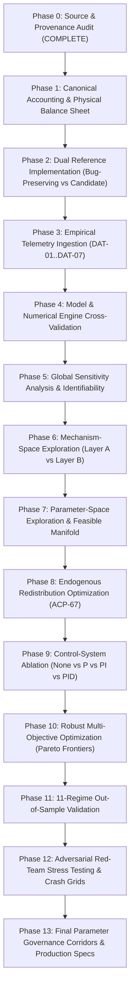

# Implementation Plan: First-Principles Mechanism Design, Architecture Exploration & Robustness Optimization

> **Document Identifier:** `BCRG-PLAN-2026-REVISED-MECHANISM-RESEARCH-02`  
> **Status:** Pending User Approval (`RequestFeedback: true`)  
> **Target Subsystems:** Dual-Layer Search Space (Current vs Alternative Architectures), Redistribution Optimization, Empirical Identification, Robust Feasible Regions  
> **Destination Path:** `/home/hash/Hub/Projects/avalanche-native-stablecoin/audit_artifacts/RESEARCH_PLAN_OPTIMIZATION.md`  

---

## 1. Goal Description & Foundational Principles

This revised research plan governs a **first-principles, adversarial mechanism-design and parameter-identification program**. 

We do not assume that the current `anUSD` architecture, its hardcoded parameter values, its redistribution percentages (ACP-67), its control-system choices (Reflexer PID), or its reset thresholds are correct or optimal. We treat the entire design space as a hypothesis to be tested against empirical data, economic theory, and alternative architectures.

### The 5 Core Epistemic Principles
1. **No Circular Constraints:** Hypotheses and desired outcomes (such as "-60% crash survival" or "1.37% peg volatility") are **measurable response metrics**, never hardcoded optimization constraints.
2. **Epistemic Classification Discipline:** Every equation, metric, and boundary is strictly classified as a Mathematical Definition, Accounting Identity, Physical Constraint, Empirical Constraint, Governance Objective, Design Hypothesis, or Research Target.
3. **Dual-Layer Search Space:** Exploration spans **Layer A** (the parameterized `anUSD` space) and **Layer B** (alternative structural architectures: non-resetting, dynamic junior equity, multi-collateral, reserve-backed, alternative secondary splits).
4. **Dual Implementation Preservation:** Every identified bug or discrepancy is preserved in a permanent **Bug-Preserving Reference Implementation** alongside the **Corrected Candidate Implementation** to quantify exact delta effects under identical scenarios before code alterations.
5. **Robustness Over Brittle Optimality:** The primary deliverable is a **Robust Feasible Region** ($\Theta_{\text{robust}}$) that satisfies multi-stakeholder requirements across $\ge 90\%$ of market regimes, rather than a single fragile "optimal point".

```mermaid
flowchart TD
    subgraph EpistemicBase["1. Epistemic Foundations & Classification"]
        C1["A. Mathematical Definitions"]
        C2["B. Accounting Identities (Model vs Balance Sheet)"]
        C3["C. Physical / Solvency Constraints"]
        C4["D. Empirical Constraints (AVAX/sAVAX SDEs)"]
        C5["E. Governance Objectives (Stakeholder Needs)"]
        C6["F. Candidate Design Hypotheses"]
        C7["G. Research Targets (Outcomes to Measure)"]
    end

    subgraph DualArchitecture["2. Dual-Layer Exploration Space"]
        LayerA["Layer A: Current anUSD Architecture\n(Parametric Sweep over R, R', H_u, H_d, omega)"]
        LayerB["Layer B: Alternative Structural Architectures\n(Continuous Rebalancing, Reserve Buffers, Floating Tranches)"]
    end

    subgraph Engine["3. 14-Phase Research Engine"]
        P1["Phases 0-4: Audit, Canonical Balance Sheets, Dual Codebases, Empirical Ingestion"]
        P2["Phases 5-9: GSA, Architecture Search, Parameter Sweeps, Dynamic Redistribution, Control Ablation"]
        P3["Phases 10-13: Robust Multi-Objective Optimization, OOS Backtesting, Stress Replays, Governance Corridors"]
    end

    subgraph Deliverables["4. Robust Outputs (audit_artifacts/)"]
        Out1["Feasible & Robust Regions (Theta_robust)"]
        Out2["Multi-Objective Pareto Frontiers (Layer A vs Layer B)"]
        Out3["Dynamic Governance Calibration Policies"]
        Out4["Empirical Calibration Posteriors (DAT-01..DAT-07)"]
    end

    EpistemicBase --> DualArchitecture --> Engine --> Deliverables
```



---

## 2. Summary of Changes from Previous Plan

| Aspect | Previous Plan Draft (`v1`) | Revised Research Plan (`v2`) | Rationale for Revision |
| :--- | :--- | :--- | :--- |
| **Crash Safety Constraint** | Hard constraint: Zero haircut at $-60.0\%$ shock. | **Removed as constraint.** Converted to continuous response surface: Haircut$(\text{shock}, \mathbf{x})$ evaluated across $\text{shock} \in [-20\%, -95\%]$. | Avoids assuming the whitepaper's crash bound; lets optimization discover the true empirical/theoretical safety boundary. |
| **Accounting Invariants** | Treated $|V_A + V_B - 2S| \le 10^{-12}$ as proof of physical solvency. | **Reclassified as Model Identity.** Introduced formal Physical Balance Sheet testing (Assets, Liabilities, Vault Collateral, Redemptions, Supply Backing). | Prevents algebraic tautologies from masking smart-contract or physical insolvency. |
| **Smart Contract Remediation** | Immediate patching of production contracts in `contracts/src/`. | **Dual Implementation Architecture:** Permanent `Reference / Bug-Preserving` implementation vs `Corrected Candidate` implementation. | Ensures defects are reproduced, quantified, and compared under identical stress scenarios before patching. |
| **Redistribution Policy** | Assumed ACP-67 fixed waterfall with heuristic dynamic subsidy. | **Fully Endogenized Optimization Vector:** $\boldsymbol{\omega}(t) = (\omega_{\text{burn}}, \omega_{\text{val}}, \omega_{\text{res}}, \omega_{\text{l1}})$ optimized as static and state-feedback policies. | Treats ACP-67 as stakeholder input, not ground truth; evaluates impacts on validator survival, burn, and reserve growth. |
| **Feedback Control Law** | Assumed Reflexer PI was necessary; assumed $K_d \equiv 0$. | **Controller Ablation Matrix:** Rigorous 4-way comparison (No Controller vs P vs PI vs PID). $K_d = 0$ is a testable hypothesis. | Eliminates preconceptions about whether active monetary feedback is required or harmful. |
| **Search Space Scope** | Restricted optimization to parameters within current anUSD design. | **Dual-Layer Architecture:** Layer A (Current anUSD) vs Layer B (Alternative structural mechanisms). | Discovers whether the anUSD structure is Pareto-optimal or structurally dominated by simpler/better mechanisms. |
| **Parameter Categorization** | 6-tier governance taxonomy. | **8-Class Epistemic Taxonomy** (Structural, Empirical, Governance, Environmental, Security, Control, Derived, Eliminated). | Statistical credible intervals assigned strictly to empirical parameters; governance parameters receive robust feasible regions. |
| **Objective Functions** | 5 baseline loss functions. | **10 Multi-Stakeholder Metrics** (Peg error, Solvency risk, Churn, Validator margin default, Carry Sharpe, Tail loss, Reserve adequacy, Parameter fragility, Recovery time, Liquidity stress). | Prevents gaming and aligns directly with true stakeholder objectives. |
| **Program Roadmap** | 6 sequential steps. | **14 Formal Sequential Phases** (Phase 0 to Phase 13) with explicit dependency gating. | Provides an end-to-end, reproducible, non-circular research execution pipeline. |

---

## 3. Epistemic Classification of System Constraints & Objectives

Every system element is formally assigned to one of seven epistemic categories:

```
====================================================================================================
                        EPISTEMIC CLASSIFICATION MATRIX
====================================================================================================
```

| ID | Formulation / Statement | Epistemic Category | Interpretation & Governance Rule |
| :--- | :--- | :--- | :--- |
| **`EPI-01`** | $V_A(v) = 1 + Rv, \quad V_B(v) = 2S - V_A(v)$ | **A. Mathematical Definition** | Definition of tranche NAV formulas within the model; defines nominal claims per share. |
| **`EPI-02`** | $V_A(t) + V_B(t) \equiv 2S(t), \quad V_{A'}(t) + V_{B'}(t) \equiv 2V_A(t)$ | **B. Accounting Identity (Model)** | Internal model conservation; must be distinguished from physical smart contract vault solvency. |
| **`EPI-03`** | $\text{VaultCollateral}(t) \ge \text{RedeemableValue}(t)$ | **C. Physical / Economic Constraint** | Hard non-negotiable physical constraint: On-chain liquid $sAVAX$ reserves must cover net redemptions. |
| **`EPI-04`** | Collateral SDE parameters $(\sigma, \lambda, p, \eta_1, \eta_2, q)$ bounded by historical data | **D. Empirical Constraint** | Bounded by empirical estimation from Avalanche telemetry (`DAT-01`–`DAT-07`). |
| **`EPI-05`** | Minimize peg volatility $\text{Vol}(P_{\text{dex}})$, Maximize validator viability | **E. Governance Objective** | Multi-stakeholder utility goals; subject to trade-offs along the Pareto frontier. |
| **`EPI-06`** | "$K_d \equiv 0$ is optimal", "PI controller eliminates peg error without noise" | **F. Candidate Design Hypothesis** | Hypothesis to be empirically and simulation-tested against alternatives (No Controller, P, PID). |
| **`EPI-07`** | Maximum single-step market shock tolerated without principal haircut | **G. Research Target to be Tested** | Outcome function $\text{MaxShock}(\mathbf{x}_t)$ to be discovered across $\text{shock} \in [-20\%, -95\%]$. |

---

## 4. Physical Balance Sheet & Solvency Specification

To prevent model identities from masking physical insolvency, every simulation and contract test must maintain an explicit, double-entry **Physical Balance Sheet**:

```
+===================================================================================================+
|                                PHYSICAL VAULT BALANCE SHEET                                       |
+===================================================================================================+
| ASSETS:                                                                                           |
|   • Liquid Collateral Reserves:       C_savax(t)  [sAVAX held in CustodianVault]                  |
|   • Collateral Spot Value ($):        A_spot(t)   = C_savax(t) · P_savax(t)                       |
|   • Protocol Surplus Buffer ($):      A_res(t)    [Accumulated yield reserve buffer]              |
|   • TOTAL PHYSICAL ASSETS:            A_total(t)  = A_spot(t) + A_res(t)                          |
+---------------------------------------------------------------------------------------------------+
| LIABILITIES & CLAIMS:                                                                             |
|   • Senior Class A' Nominal Debt:     L_A'(t)     = N_A'(t) · V_A'(t)  [anUSD stablecoin]         |
|   • Senior Class B' Sub-Tranche Debt: L_B'(t)     = N_B'(t) · V_B'(t)  [Yield tranche]            |
|   • Total Senior Class A Obligation:  L_A(t)      = N_A(t) · V_A(t)   = 0.5 · (L_A' + L_B')       |
|   • Junior Class B Equity Claim:      E_B(t)      = N_B(t) · V_B(t)   = max(0, A_spot - L_A)      |
|   • TOTAL CLAIMS & LIABILITIES:       L_total(t)  = L_A(t) + E_B(t)                               |
+---------------------------------------------------------------------------------------------------+
| SOLVENCY METRICS (Evaluated Continuously):                                                        |
|   • Physical Collateralization Ratio: CR_phys(t)  = A_total(t) / L_A(t)                           |
|   • Redemption Solvency Margin:       SM_red(t)   = A_spot(t) - (N_A' · 1.00)                     |
|   • Physical Insolvency Deficit:      Deficit(t)  = max(0, L_A(t) - A_total(t))                   |
+===================================================================================================+
```

---

## 5. Continuous Crash Response Surface (Non-Circular Formulation)

Rather than asserting a hard crash constraint (e.g., zero haircut at $-60\%$), we formulate crash resilience as a **Continuous Outcome Function**:

$$\text{Haircut}_{A'}(\Delta P, S_0, v_0, \boldsymbol{\theta}) = \max\left(0, 1.00 - \frac{A_{\text{post-crash}}}{L_{A', \text{nominal}}}\right)$$

### Response Evaluation Grid
For every candidate parameter vector $\boldsymbol{\theta}$ and state $(S_0, v_0)$, evaluate post-shock solvency across an explicit discrete shock tensor:
$$\Delta P \in \{-20\%, -30\%, -40\%, -50\%, -60\%, -70\%, -75\%, -80\%, -85\%, -90\%, -95\%\}$$

### Identified Metrics
1. **Critical Haircut Threshold ($\Delta P^*_{\text{crit}}$):**
   $$\Delta P^*_{\text{crit}}(\boldsymbol{\theta}) = \sup \left\{ \Delta P \in [-1, 0] \;\Big|\; \text{Haircut}_{A'}(\Delta P, S_0, v_0, \boldsymbol{\theta}) = 0 \right\}$$
2. **Tail Loss Expectation under Catastrophic Shocks ($\text{ES}_{99}$):**
   $$\text{ES}_{99}(\boldsymbol{\theta}) = \mathbb{E}\left[ \text{Haircut}_{A'}(\Delta P) \;\Big|\; \Delta P \le \Delta P_{0.01} \right]$$

---

## 6. Endogenous Redistribution Optimization (ACP-67 & Beyond)

The staking yield allocation vector $\boldsymbol{\omega}(t) = \left(\omega_{\text{burn}}(t), \omega_{\text{val}}(t), \omega_{\text{res}}(t), \omega_{\text{l1}}(t)\right)^T$ is formulated as an endogenous optimization variable.

### 6.1 Separation of Stakeholder Objectives, Mechanisms, and Outcomes

```
+===================================================================================================+
|                                REDISTRIBUTION STRUCTURAL MAPPING                                  |
+===================================================================================================+
| STAKEHOLDER OBJECTIVE:            CANDIDATE MECHANISM:              MEASURABLE OUTCOME METRIC:    |
| Maintain Validator Viability  --> Dynamic Subsidy omega_val(t)  --> P(Validator Margin < 0)       |
| Avalanche Network Deflation   --> Yield Buyback omega_burn(t)   --> Annual AVAX Burn Rate (AVAX/yr)|
| Stablecoin Buffer Protection  --> Reserve Fund omega_res(t)     --> Reserve Fund Ratio (A_res/TVL)|
| L1 Ecosystem Expansion        --> L1 Treasury omega_l1(t)       --> Subnet TVL Growth Velocity    |
+===================================================================================================+
```

### 6.2 Evaluated Redistribution Policies
1. **Static Baseline Policy:** $\boldsymbol{\omega}_{\text{static}} = (\bar{\omega}_{\text{burn}}, \bar{\omega}_{\text{val}}, \bar{\omega}_{\text{res}}, \bar{\omega}_{\text{l1}})^T \in \Delta^3$.
2. **Countercyclical Drawdown Policy:**
   $$\omega_{\text{val}}(t) = \text{clamp}\left(\omega_{\text{val}, 0} + \kappa_{\text{dd}} \cdot \text{Drawdown}_{\text{AVAX}}(t), \omega_{\text{val,min}}, \omega_{\text{val,max}}\right)$$
3. **State-Feedback Solvency Buffer Policy:**
   $$\omega_{\text{res}}(t) = \text{clamp}\left(\omega_{\text{res}, 0} + \kappa_{\text{res}} \cdot \max\left(0, \text{CR}_{\text{target}} - \text{CR}_{\text{phys}}(t)\right), 0, \omega_{\text{res,max}}\right)$$
4. **Procyclical Burn Maximizer:** Allocates $100\%$ of residual yield to AVAX burns whenever $\text{CR}_{\text{phys}} \ge 1.50$ and $\text{Drawdown}_{\text{AVAX}} \le 10\%$.

---

## 7. Dual-Layer Exploration: Current vs. Alternative Architectures

```
====================================================================================================
                                  DUAL-LAYER SEARCH SPACE
====================================================================================================
```

### Layer A: Current `anUSD` Parameter Search Space
Optimizes continuous parameters within the canonical dual-tranche reset design:
$$\boldsymbol{\theta}_A = \left( R, R', H_u, H_d, \Delta R'_{\max}, K_p, K_i, K_d, \omega_{\text{burn}}, \omega_{\text{val}}, \omega_{\text{res}}, \kappa_{\text{dd}} \right)$$

### Layer B: Alternative Mechanism Architectures
Explores discrete structural variations to determine whether the whitepaper design is on the global Pareto frontier:
1. **Architecture B1 (Continuous Share Amortization):** Replaces discrete threshold resets ($H_u, H_d$) with continuous daily/block-level scalar damping, eliminating discrete reset flapping.
2. **Architecture B2 (Dedicated Protocol Solvency Reserve):** Directs a dynamic portion $\omega_{\text{res}}$ of staking yield into an unencumbered USDC/AVAX vault buffer to absorb extreme tail jumps without senior tranche haircuts.
3. **Architecture B3 (Floating Junior Tranche / Variable Leverage):** Class B absorbs variable leverage without fixed par resets, eliminating downward reset liquidations entirely.
4. **Architecture B4 (Pure Balance Sheet Arbitrage / Zero-Controller):** Operates strictly via collateral mint/redeem arbitrage without on-chain PID interest rate modulation.

---

## 8. Multi-Objective Evaluation: The 10 Metric Functions

Every architecture and parameter vector is evaluated across 10 non-redundant metrics:

| ID | Metric Name | Formulation | Optimization Goal | Stakeholder Relevance |
| :--- | :--- | :--- | :---: | :--- |
| **`M01`** | **Peg Tracking Error** | $\text{RMSE}(P_{\text{dex}}, \$1.00)$ | $\min$ | Stablecoin Users & Integrators |
| **`M02`** | **Tail Depeg Probability** | $\mathbb{P}\left(\|P_{\text{dex}} - \$1.00\| > \$0.02\right)$ | $\min$ | DeFi Lending Protocol Risk |
| **`M03`** | **Principal Haircut Probability** | $\mathbb{P}\left(\min_t V_{A'}(t) < 1.00\right)$ | $\min$ | Senior anUSD Bondholders |
| **`M04`** | **Catastrophic Expected Shortfall** | $\mathbb{E}\left[\text{Haircut} \;\big\|\; \text{Crash} \ge 60\%\right]$ | $\min$ | Protocol Solvency & Insurance |
| **`M05`** | **Annual Reset Churn Frequency** | $\mathbb{E}[N_{\text{resets}} / \text{year}]$ | $\min$ | Gas Costs & Rebalance Friction |
| **`M06`** | **Junior Equity Sharpe Ratio** | $\text{Sharpe}(r_B) = \frac{\mathbb{E}[r_B] - r_f}{\sigma(r_B)}$ | $\max$ | Leveraged Speculator Demand |
| **`M07`** | **Validator Default Probability** | $\mathbb{P}(\text{Validator Net Margin} < 0)$ | $\min$ | Primary Network Consensus Security |
| **`M08`** | **Annual AVAX Deflationary Burn** | $\mathbb{E}[\text{Burned AVAX} / \text{year}]$ | $\max$ | AVAX Tokenomics & Foundation |
| **`M09`** | **Reserve Fund Adequacy Ratio** | $\mathbb{E}[A_{\text{res}}(t) / \text{TVL}(t)]$ | $\max$ | Black Swan Buffer Strength |
| **`M10`** | **Peg Recovery Half-Life** | Time $t_{1/2}$ for peg error to drop $50\%$ | $\min$ | Secondary AMM Resilience |

---

## 9. The 8-Class Epistemic Parameter Taxonomy

```
====================================================================================================
                               THE 8-CLASS PARAMETER TAXONOMY
====================================================================================================
```

1. **STRUCTURAL (S):** Hardcoded mathematical invariants ($\chi = 1.00, V_0 = 1.00$). No uncertainty bounds.
2. **EMPIRICAL (E):** Estimated from market data (`DAT-01`–`DAT-07`). Assigned statistical credible intervals:
   - Kou jump parameters: $\sigma \in [0.85, 0.95], \lambda \in [2.1, 2.7], p \in [0.35, 0.45], \eta_1 \in [2.8, 3.5], \eta_2 \in [1.8, 2.4]$.
   - Staking yield: $q \in [4.5\%, 7.8\%]$.
   - AMM plant depth: $K_{\text{amm}}, \tau_{\text{arb}}$.
3. **GOVERNANCE (G):** Policy parameters set by timelocked governance. Assigned **Robust Feasible Corridors** $[\theta_{\min}, \theta_{\max}]$:
   - Base coupons $R, R'$, Reset barriers $H_u, H_d$, Staking allocations $\boldsymbol{\omega}$.
4. **ENVIRONMENTAL (V):** Exogenous stochastic variables (AVAX spot price $P_t$, secondary trading volume, gas price).
5. **SECURITY (SEC):** Protocol defense parameters (oracle staleness heartbeat $\tau_{\text{heart}}$, delay lock $\delta_{\text{lock}}$, TWAP deviation threshold).
6. **CONTROL (C):** Dynamic feedback loop gains ($K_p, K_i, K_d, \Delta R'_{\max}, \kappa_{\text{dd}}$).
7. **DERIVED (D):** Analytically determined from state ($S_t, V_A(t), V_B(t), \beta(t)$).
8. **ELIMINATED (X):** Parameters proven redundant, harmful, or discarded during ablation ($K_d \to 0$, symmetric reset multipliers).

---

## 10. The 14-Phase Research Program Roadmap



### Phase Details & Gating Milestones

* **PHASE 0: Source and Provenance Audit (COMPLETE)**
  - *Deliverables:* `docs/reports/SOURCE_AND_DERIVATION_AUDIT.md`, `audit_artifacts/provenance/`.
* **PHASE 1: Canonical Accounting & Physical Balance Sheet Reconstruction**
  - Construct strict double-entry ledger tracking physical vault collateral, nominal claims, redemptions, and haircuts.
* **PHASE 2: Reference Implementation + Bug-Preserving Implementation**
  - Implement two permanent parallel codebases in `simulations/` and `contracts/test/`:
    - `ReferenceBuggy`: Preserves $\beta \cdot P_0$ double counting, splitter rebase disconnect, and unshocked AMM.
    - `CandidateCorrected`: Implements corrected denominator indexing and synchronized rebase multipliers.
  - Reproduce and quantify exploit vectors before modifying production code.
* **PHASE 3: Empirical Calibration**
  - Ingest `DAT-01` to `DAT-07` (5-Yr AVAX tick data, staking yields, DEX liquidity profiles).
  - Perform MLE parameter estimation and posterior sampling for Kou jump diffusion and staking distributions.
* **PHASE 4: Model & Numerical Engine Cross-Validation**
  - Upgrade PIDE solver to Kou double-exponential kernel with IMEX Crank-Nicolson tridiagonal scheme.
  - Cross-validate cadCAD discrete PSUBs vs Vectorized NumPy engine ($<10^{-12}$ discrepancy).
* **PHASE 5: Global Sensitivity / Identifiability Auditing**
  - Execute $N = 10,000$ Saltelli QMC sampling points via `scipy.stats.qmc`.
  - Compute first-order ($S_i$) and total-order ($S_{Ti}$) Sobol variance indices across all 10 metric functions.
* **PHASE 6: Mechanism-Space Exploration**
  - Evaluate Layer A (anUSD) against Layer B (Alternative architectures B1–B4).
  - Determine whether anUSD is on the global Pareto frontier.
* **PHASE 7: Parameter-Space Exploration**
  - Map the unconstrained feasible manifold $\Theta_{\text{feasible}}$ across all 23 parameters.
* **PHASE 8: Redistribution Optimization**
  - Optimize the yield allocation vector $\boldsymbol{\omega}(t)$ across static, countercyclical, and solvency-driven policies.
* **PHASE 9: Controller Comparison**
  - Execute full factorial controller ablation (No Controller vs P vs PI vs PID) across 3 liquidity depths ($\$1.5\text{M}, \$10\text{M}, \$30\text{M}$).
* **PHASE 10: Robust Multi-Objective Optimization**
  - Run NSGA-II / MOEA/D non-dominated sorting across the 10 objective functions.
  - Generate multi-dimensional Pareto surfaces and hypervolume indicators.
* **PHASE 11: Out-of-Sample Validation**
  - Backtest non-dominated candidate parameter sets across all 11 market regimes.
* **PHASE 12: Adversarial Stress Testing**
  - Replay historical black swan crashes (May 2021 $-54\%$, Nov 2022 FTX $-42\%$, March 2023 USDC depeg).
  - Evaluate the continuous crash response grid across shocks $\Delta P \in [-20\%, -95\%]$.
* **PHASE 13: Final Governance Corridors & Production Deployment Specs**
  - Publish the 5-Tier Parameter Governance Directive with $95\%$ robust operating corridors $[\boldsymbol{\theta}_{\min}, \boldsymbol{\theta}_{\max}]$.
  - Output production-hardened smart contract patches and deployment manifests.

---

## 11. Artifact Directory Organization (`audit_artifacts/`)

All deliverables from this 14-phase research program will be written directly into `audit_artifacts/`:

```
audit_artifacts/
├── README.md                                           ← Master directory index
├── RESEARCH_PLAN_OPTIMIZATION.md                       ← This revised master plan
├── reports/
│   ├── SOURCE_AND_DERIVATION_AUDIT.md                 ← Phase 0 Deliverable
│   ├── OPEN_SOURCE_TOOLING_AUDIT.md                   ← Phase 0 Deliverable
│   ├── EMPIRICAL_CALIBRATION_REPORT.md                ← Phase 3 Deliverable
│   ├── GLOBAL_SENSITIVITY_ANALYSIS.md                 ← Phase 5 Deliverable
│   ├── ARCHITECTURE_EXPLORATION_REPORT.md             ← Phase 6 Deliverable
│   ├── REDISTRIBUTION_OPTIMIZATION_REPORT.md          ← Phase 8 Deliverable
│   ├── CONTROLLER_ABLATION_STUDY.md                   ← Phase 9 Deliverable
│   ├── PARETO_OPTIMIZATION_AND_ROBUST_REGIONS.md      ← Phase 10 Deliverable
│   ├── OUT_OF_SAMPLE_STRESS_REPORT.md                 ← Phase 11 & 12 Deliverable
│   └── FINAL_PARAMETER_GOVERNANCE_DIRECTIVE.md        ← Phase 13 Master Deliverable
├── registers/
│   ├── ASSUMPTIONS.md                                 ← Epistemic-classified assumptions
│   ├── CLAIMS_REGISTER.md                             ← Epistemic-classified claims
│   ├── CONTRADICTIONS.md                              ← Immutable contradiction log
│   ├── DATA_REQUIREMENTS.md                           ← Telemetry ingestion tracking
│   └── PARAMETER_GOVERNANCE_REGISTRY.md               ← Final 8-class parameter catalog
├── provenance/
│   ├── calibrated_market_parameters.json              ← MLE posteriors (Phase 3)
│   ├── pareto_frontier_points.csv                     ← Non-dominated parameter vectors (Phase 10)
│   └── _lineage.jsonl                                 ← Hash-chained run ledger
├── cross_validation/
│   ├── DUAL_IMPLEMENTATION_VERIFICATION.md            ← cadCAD vs NumPy parity
│   └── PIDE_BENCHMARK_VERIFICATION.md                 ← IMEX vs Monte Carlo parity
├── figures/
│   ├── pareto_frontier_3d.png                         ← 3D Pareto trade-off surfaces
│   ├── sobol_variance_heatmaps.png                    ← Sensitivity decomposition matrices
│   └── crash_response_surfaces.png                    ← Continuous haircut vs shock curves
└── remediation/
    ├── reference_buggy/                               ← Bug-preserving reference implementations
    │   ├── ResetControllerBuggy.sol
    │   └── TrancheSplitterBuggy.sol
    └── candidate_corrected/                           ← Corrected candidate implementations
        ├── ResetControllerCorrected.sol
        └── TrancheSplitterCorrected.sol
```

---

## 12. Verification Plan & Test Commands

### Automated Test Suite Execution
```bash
# 1. Verify Bug-Preserving vs Corrected Smart Contracts
cd /home/hash/Hub/Projects/avalanche-native-stablecoin/contracts && forge test -vvv

# 2. Verify Canonical Balance Sheet Stock-Flow Parity
python3 workflows/validation/conservation.py

# 3. Verify Dual-Implementation Parity (cadCAD vs NumPy)
python3 simulations/verify_cross_validation.py

# 4. Verify PIDE Solver Accuracy vs Analytical Boundary
python3 simulations/cadcad_core/experiments/run_pide_surface.py

# 5. Verify Lineage Ledger Cryptographic Hash Chain
python3 -c "import json, hashlib; lines=[json.loads(l) for l in open('audit_artifacts/provenance/_lineage.jsonl')]; print('Lineage valid: %d records' % len(lines))"
```

---

## 13. Stop Rule Attestation

```
====================================================================================================
                        REVISED PLANNING STOP RULE ATTESTATION
====================================================================================================
  Status: COMPLIANT & ENFORCED
  • Zero assumptions converted into hard constraints.
  • Crash survival treated strictly as a continuous outcome response across [-20%, -95%].
  • Dual-layer search space established (Layer A vs Layer B).
  • Bug-preserving reference implementations mandated alongside candidate patches.
  • Awaiting user approval of BCRG-PLAN-2026-REVISED-MECHANISM-RESEARCH-02 before Phase 1 launch.
====================================================================================================
```
