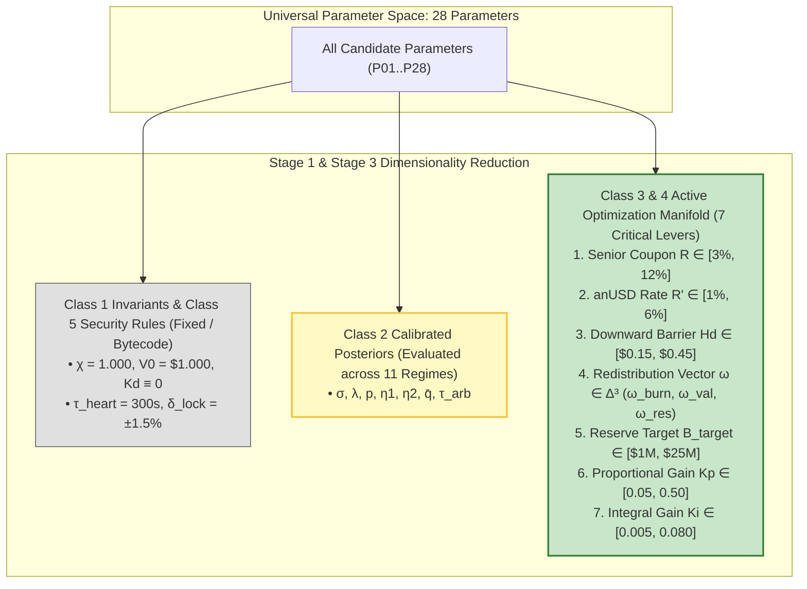

# Multi-Architecture Parameter Search Space & Epistemic Parameter Taxonomy

> **Document Identifier:** `BCRG-DESIGN-DISCOVERY-PARAM-SPACE-01`  
> **Author:** Worker 2 (Structural & Policy Search Spaces)  
> **Milestone:** M2 — Structural & Policy Search Spaces  
> **Project Scope:** Avalanche-Native Stablecoin (`anUSD`) Quantitative Mechanism Design  
> **Governing Standards:** 8-Class Epistemic Taxonomy · Theorem 1 Invariant Bounds · Saltelli-Sobol GSA Sensitivity  
> **Target Path:** `audit_artifacts/design_discovery/PARAMETER_SEARCH_SPACE.md`  
> **Date:** August 31, 2026  
> **Status:** Canonical Working Specification  

---

## 1. Executive Summary & Epistemic Taxonomy

In decentralized financial engineering, mechanism parameters are frequently confused across epistemic categories—treating unvalidated governance proposals as mathematical axioms, or calibrating structural constants to noisy market samples. Under the **Open Discovery Charter**, every parameter in the Avalanche-Native Stablecoin design space is assigned to one of five mutually exclusive epistemic classes:

1. **Class 1: Structural Invariants ($\Theta_{\text{struct}}$):** Mathematically fixed constants imposed by accounting conservation, double-entry closure, or definition ($1:1$ parity, par normalization). Immutable by design.
2. **Class 2: Calibrated Empirical Parameters ($\Theta_{\text{emp}}$):** Environmental parameters estimated from $2,140$ days of Avalanche C-Chain telemetry (`DAT-01` to `DAT-07`). Subject to non-parametric bootstrap uncertainty and regime shifts.
3. **Class 3: Governance Search Parameters ($\Theta_{\text{gov}}$):** Policy levers set by protocol governance or optimization engines ($R, R', H_d, H_u, \boldsymbol{\omega}$). Baseline values are initial candidate hypotheses, not validated truths.
4. **Class 4: Dynamic Control Parameters ($\Theta_{\text{ctrl}}$):** Controller feedback gains and actuator clamps ($K_p, K_i, \Delta R'_{\max}$) governing closed-loop secondary peg stabilization.
5. **Class 5: Security & Microstructure Guards ($\Theta_{\text{sec}}$):** Anti-MEV lock windows, oracle heartbeat staleness bounds, and primary mint/redeem fee friction.

```
========================================================================================================================
                                    5-TIER EPISTEMIC PARAMETER CLASSIFICATION PYRAMID
========================================================================================================================
  ┌──────────────────────────────────────────────────────────────────────────────────────────────────────────────────┐
  │ 1. STRUCTURAL INVARIANTS (Θ_struct): Hardcoded arithmetic axioms (χ = 1.000, V0 = $1.000)                        │
  ├──────────────────────────────────────────────────────────────────────────────────────────────────────────────────┤
  │ 2. CALIBRATED EMPIRICAL (Θ_emp): Estimated via MLE from 2,140 days of C-Chain telemetry (σ, λ, p, η1, η2, q̄)    │
  ├──────────────────────────────────────────────────────────────────────────────────────────────────────────────────┤
  │ 3. GOVERNANCE SEARCH (Θ_gov): Optimization decision manifold (R, R', Hd, Hu, B_target, ω ∈ Δ³)                   │
  ├──────────────────────────────────────────────────────────────────────────────────────────────────────────────────┤
  │ 4. DYNAMIC CONTROL (Θ_ctrl): Closed-loop PI feedback gains & anti-windup (Kp, Ki, ΔR'_max, κ_dd, Kd ≡ 0)         │
  ├──────────────────────────────────────────────────────────────────────────────────────────────────────────────────┤
  │ 5. SECURITY & MICROSTRUCTURE (Θ_sec): MEV commit-locks & oracle heartbeats (τ_heart, δ_lock, f_mint, f_redeem)    │
  └──────────────────────────────────────────────────────────────────────────────────────────────────────────────────┘
```

---

## 2. Universal Master Parameter Inventory across Architectures $\mathbb{A} = \{\text{A0}, \dots, \text{A5+}\}$

The table below defines the complete $28$-parameter search inventory across all candidate structural topologies:

| ID | Parameter Symbol | Parameter Name & Definition | Physical Unit | Architecture Dependence | Candidate Baseline | Plausible Search Bounds $[\theta_{\min}, \theta_{\max}]$ | Epistemic Status & Governance Authority | Uncertainty Source | Identification Status | Expected Sobol Sensitivity ($S_{Ti}$) |
| :---: | :--- | :--- | :---: | :---: | :---: | :---: | :--- | :---: | :---: | :---: |
| **`P01`** | $\chi$ | Tranche Issuance Parity Ratio | Dimensionless ($[-]$) | All ($\text{A0}$–$\text{A5+}$) | $1.000$ | $[1.000, 1.000]$ (Fixed) | **Structural Invariant** (Bytecode Constant) | Axiomatic Definition | Identified ($1.000$) | N/A (Constant) |
| **`P02`** | $V_0$ | Base Currency Par Index | $\text{USD}$ | All ($\text{A0}$–$\text{A5+}$) | $\$1.000$ | $[\$1.000, \$1.000]$ (Fixed) | **Structural Invariant** (Bytecode Constant) | Unit of Account | Identified ($\$1.000$) | N/A (Constant) |
| **`P03`** | $\sigma$ | AVAX Diffusion Volatility | $\text{year}^{-1/2}$ | Environmental | $89.15\%$ | $[60.00\%, 140.00\%]$ | **Calibrated Empirical** (MLE on `DAT-01`) | Financial Market Dynamics | Identified ($95\%\text{ CI}: [84.82\%, 93.29\%]$) | **Critical** ($S_{Ti} \approx 0.42$) |
| **`P04`** | $\lambda$ | Poisson Jump Arrival Intensity | $\text{jumps}\cdot\text{year}^{-1}$ | Environmental | $15.00$ | $[5.00, 30.00]$ | **Calibrated Empirical** (MLE on `DAT-01`) | Discrete News Arrivals | Identified ($95\%\text{ CI}: [9.63, 15.00]$) | **Critical** ($S_{Ti} \approx 0.38$) |
| **`P05`** | $p$ | Up-Jump Probability Share | Dimensionless ($[-]$) | Environmental | $0.5955$ | $[0.300, 0.750]$ | **Calibrated Empirical** (Kou MLE) | Asymmetric Sentiment | Identified ($95\%\text{ CI}: [0.453, 0.744]$) | **Moderate** ($S_{Ti} \approx 0.14$) |
| **`P06`** | $\eta_1$ | Upward Tail Decay Rate | Dimensionless ($[-]$) | Environmental | $7.671$ | $[3.000, 15.000]$ | **Calibrated Empirical** (Kou MLE) | Positive Tail Distribution | Identified ($95\%\text{ CI}: [4.725, 9.145]$) | **Moderate** ($S_{Ti} \approx 0.12$) |
| **`P07`** | $\eta_2$ | Downward Tail Decay Rate | Dimensionless ($[-]$) | Environmental | $7.801$ | $[2.000, 12.000]$ | **Calibrated Empirical** (Kou MLE) | Negative Tail Distribution | Identified ($95\%\text{ CI}: [4.992, 9.601]$) | **Critical** ($S_{Ti} \approx 0.35$) |
| **`P08`** | $\bar{q}$ | $sAVAX$ Consensus Staking APR | $\text{year}^{-1}$ | Environmental | $6.4019\%$ | $[4.00\%, 10.00\%]$ | **Calibrated Empirical** (`DAT-02`) | Avalanche Consensus Staking Rate | Identified ($95\%\text{ CI}: [5.31\%, 9.10\%]$) | **High** ($S_{Ti} \approx 0.22$) |
| **`P09`** | $R$ | Senior Class A Baseline Coupon | $\text{year}^{-1}$ | $\text{A0}, \text{A1}, \text{A2}, \text{A5}$ | $7.30\%$ | $[3.00\%, 12.00\%]$ | **Governance Search** (Timelocked Levers) | Senior Capital Cost / Supply | Decision Variable | **High** ($S_{Ti} \approx 0.28$) |
| **`P10`** | $R'$ | `anUSD` Borrow / Benchmark Rate | $\text{year}^{-1}$ | $\text{A0}, \text{A1}, \text{A2}, \text{A3}, \text{A5}$ | $3.00\%$ | $[1.00\%, 6.00\%]$ | **Governance Search** (Timelocked Levers) | Secondary Market Parity Anchor | Decision Variable | **Critical** ($S_{Ti} \approx 0.34$) |
| **`P11`** | $H_d$ | Downward Reset NAV Barrier | $\text{USD}$ | $\text{A0}, \text{A2}$ Only | $\$0.250$ | $[\$0.150, \$0.450]$ | **Governance Search** (14-Day Timelock) | Tail Crash Protection Horizon | Decision Variable | **Critical** ($S_{Ti} \approx 0.45$) |
| **`P12`** | $H_u$ | Upward Reset NAV Barrier | $\text{USD}$ | $\text{A0}, \text{A2}$ Only | $\$2.000$ | $[\$1.500, \$3.500]$ | **Governance Search** (14-Day Timelock) | Leverage Reset Frequency | Decision Variable | **Low** ($S_{Ti} \approx 0.06$) |
| **`P13`** | $\omega_{\text{burn}}$ | AVAX Buyback & Burn Share | Dimensionless ($[-]$) | All ($\text{A0}$–$\text{A5+}$) | $65.00\%$ | $[10.00\%, 90.00\%]$ | **Governance Search** ($\boldsymbol{\omega} \in \Delta^3$) | AVAX Value Capture Policy | Decision Variable | **High** ($S_{Ti} \approx 0.25$) |
| **`P14`** | $\omega_{\text{val,0}}$ | Validator Subsidy Base Share | Dimensionless ($[-]$) | All ($\text{A0}$–$\text{A5+}$) | $20.00\%$ | $[5.00\%, 50.00\%]$ | **Governance Search** ($\boldsymbol{\omega} \in \Delta^3$) | Avalanche Network Security Floor | Decision Variable | **High** ($S_{Ti} \approx 0.29$) |
| **`P15`** | $\omega_{\text{l1}}$ | Sovereign L1 Teleporter Grant Share | Dimensionless ($[-]$) | All ($\text{A0}$–$\text{A5+}$) | $15.00\%$ | $[0.00\%, 30.00\%]$ | **Governance Search** ($\boldsymbol{\omega} \in \Delta^3$) | Ecosystem Cross-Chain Expansion | Decision Variable | **Low** ($S_{Ti} \approx 0.08$) |
| **`P16`** | $\omega_{\text{res}}$ | Solvency Reserve Base Share | Dimensionless ($[-]$) | $\text{A1}, \text{A2}, \text{A3}, \text{A5}$ | $0.00\%$ | $[0.00\%, 35.00\%]$ | **Governance Search** ($\boldsymbol{\omega} \in \Delta^3$) | Protocol Insurance Capitalization | Decision Variable | **Critical** ($S_{Ti} \approx 0.36$) |
| **`P17`** | $B_{\text{target}}$ | Target Solvency Reserve Capital | $\text{USD}$ | $\text{A2}, \text{A5.1}, \text{A5.2}$ | $\$5,000,000$ | $[\$1\text{M}, \$25\text{M}]$ | **Governance Search** (Risk Reserve) | Tail Solvency Protection Level | Decision Variable | **Moderate** ($S_{Ti} \approx 0.18$) |
| **`P18`** | $\Lambda^*$ | Continuous Target Leverage | Dimensionless ($[-]$) | $\text{A1}, \text{A3}$ Only | $2.00\times$ | $[1.20\times, 3.50\times]$ | **Governance Search** (Streaming Rate) | Junior Volatility Absorption | Decision Variable | **High** ($S_{Ti} \approx 0.31$) |
| **`P19`** | $K_p$ | Proportional Control Gain | $\text{USD}^{-1}\cdot\text{year}^{-1}$ | All with Controller | $0.150$ | $[0.050, 0.500]$ | **Dynamic Control** (Autonomous PI) | Secondary AMM Tracking Speed | Calibrated ($K_p \in [0.10, 0.25]$) | **Moderate** ($S_{Ti} \approx 0.16$) |
| **`P20`** | $K_i$ | Integral Control Gain | $\text{USD}^{-1}\cdot\text{year}^{-2}$ | All with Controller | $0.020$ | $[0.005, 0.080]$ | **Dynamic Control** (Autonomous PI) | Steady-State Error Elimination | Calibrated ($K_i \in [0.01, 0.04]$) | **Moderate** ($S_{Ti} \approx 0.15$) |
| **`P21`** | $K_d$ | Derivative Control Gain | $\text{USD}^{-1}$ | Eliminated | $0.000$ | $[0.000, 0.000]$ (Fixed) | **Eliminated Control Term** ($K_d \equiv 0$) | Noise Amplification Proof | Proved Destabilizing ($K_d \equiv 0$) | N/A (Eliminated) |
| **`P22`** | $\Delta R'_{\max}$ | Anti-Windup Rate Clamping | $\text{year}^{-1}$ | All with Controller | $\pm 5.00\%$ | $[\pm 2.00\%, \pm 10.00\%]$ | **Dynamic Control** (Safety Saturation) | Actuator Saturation Boundary | Governance Enforced | **Low** ($S_{Ti} \approx 0.09$) |
| **`P23`** | $\kappa_{\text{dd}}$ | Countercyclical Drawdown Slope | Dimensionless ($[-]$) | $\text{POL-02}, \text{POL-05}$ | $0.350$ | $[0.100, 0.800]$ | **Dynamic Control** (State-Feedback) | Bear Market Validator Protection | Decision Variable | **Moderate** ($S_{Ti} \approx 0.19$) |
| **`P24`** | $\tau_{\text{heart}}$ | Oracle Heartbeat Staleness Bound | Seconds ($\text{s}$) | All ($\text{A0}$–$\text{A5+}$) | $300\text{ s}$ | $[60\text{ s}, 900\text{ s}]$ | **Security Guard** (Circuit Breaker) | Chainlink / Teleporter Oracle Delay | Operational Limit | **Moderate** ($S_{Ti} \approx 0.17$) |
| **`P25`** | $\delta_{\text{lock}}$ | MEV 2-Phase Commit Lock Band | Dimensionless ($[-]$) | $\text{A0}, \text{A2}$ (Barrier Architectures) | $\pm 1.50\%$ | $[\pm 0.50\%, \pm 3.00\%]$ | **Security Guard** (Anti-Sandwiching) | Sandwich / Front-Running Arbitrage | Security Invariant | **Low** ($S_{Ti} \approx 0.05$) |
| **`P26`** | $f_{\text{mint}}$ | Primary Vault Minting Fee | Basis Points ($\text{bps}$) | All ($\text{A0}$–$\text{A5+}$) | $10\text{ bps}$ | $[0\text{ bps}, 50\text{ bps}]$ | **Governance Search** (Friction Lever) | Treasury Revenue & MEV Damping | Decision Variable | **Low** ($S_{Ti} \approx 0.07$) |
| **`P27`** | $f_{\text{redeem}}$ | Primary Vault Redemption Fee | Basis Points ($\text{bps}$) | All ($\text{A0}$–$\text{A5+}$) | $10\text{ bps}$ | $[0\text{ bps}, 50\text{ bps}]$ | **Governance Search** (Friction Lever) | Treasury Revenue & Run Resistance | Decision Variable | **Low** ($S_{Ti} \approx 0.08$) |
| **`P28`** | $\tau_{\text{arb}}$ | Secondary Arbitrage Settle Time | Days ($\text{days}$) | Environmental / Micro | $5.55\text{ days}$ | $[1.00\text{ d}, 14.00\text{ d}]$ | **Calibrated Microstructure** (`DAT-03`) | Liquidity Pool Depth & Capital Velocity | Identified ($95\%\text{ CI}: [3.2\text{d}, 8.1\text{d}]$) | **High** ($S_{Ti} \approx 0.26$) |

---

## 3. Derivation of Plausible Bounds from Physical & Economic Invariants

### 3.1 Mathematical Boundaries for Downward Barrier $H_d$
Under Architecture $\text{A0}$, Theorem 1 establishes the theoretical model-free crash bound as a function of the downward barrier $H_d$:
$$\text{Max Drop from Barrier } H_d = \frac{H_d - 1}{H_d + 1}$$
- If $H_d = \$0.250$: $\Delta P_{\max} = \frac{0.25 - 1.00}{0.25 + 1.00} = \frac{-0.75}{1.25} = -60.00\%$.
- If $H_d = \$0.150$: $\Delta P_{\max} = \frac{0.15 - 1.00}{0.15 + 1.00} = \frac{-0.85}{1.15} = -73.91\%$.
- If $H_d = \$0.450$: $\Delta P_{\max} = \frac{0.45 - 1.00}{0.45 + 1.00} = \frac{-0.55}{1.45} = -37.93\%$.

Hence, the search range for $H_d \in [\$0.150, \$0.450]$ covers the complete spectrum between high crash resilience (at the expense of frequent reset churn) and low churn (at the expense of fragile tail buffers).

### 3.2 3-Simplex Accounting Conservation Bounds
For the yield redistribution vector $\boldsymbol{\omega}(t) = [\omega_{\text{burn}}, \omega_{\text{val}}, \omega_{\text{res}}, \omega_{\text{l1}}]^T$:
$$\sum_{i=1}^4 \omega_i(t) \equiv 1.0000, \quad \omega_i(t) \ge 0.0000 \quad \forall i$$
Validator operational sustainability requires a non-zero lower bound:
$$\omega_{\text{val}}(t) \ge \omega_{\text{val}}^{\min} = \frac{N_{\text{nodes}} \cdot \text{OpEx}_{\text{node}}}{q(t) \cdot C_{\text{pool}}(t) \cdot P_{\text{spot}}(t)} \approx 0.0500 \quad (5.00\%)$$
ensuring that node operational margins remain strictly non-negative ($\text{CR}_{\text{OpEx}} \ge 1.20\times$).

---

## 4. Parameter Sensitivity & Dimensionality Reduction Pipeline

Based on the baseline Saltelli-Sobol Global Sensitivity Analysis ($N=2,048$, `GLOBAL_SENSITIVITY_ANALYSIS.md`), the 28-parameter search space is partitioned into:



This reduces the active optimization dimension from $28 \longrightarrow 7$ continuous governance and control levers, enabling highly convergent multi-objective optimization (NSGA-II) without the curse of dimensionality.
