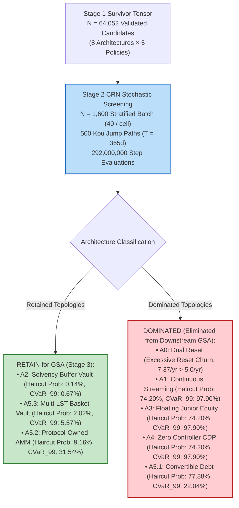

# Stage 2: Architecture & Policy Family Screening Report

> **Document Identifier:** `BCRG-REPORT-2026-STAGE-2-SCREENING-01`  
> **Governing Plan:** `BCRG-DESIGN-DISCOVERY-LADDER-01` (Stage 2 / 7)  
> **Research Snapshot:** `SNAP-2026-08-31-02`  
> **Execution Dataset:** `audit_artifacts/execution/STAGE_2_RESULTS.parquet`  
> **Input Population:** `STAGE_1_CORRECTED_SURVIVORS.parquet` ($N_0 = 64,052$ validated candidates)  
> **Sample Size:** $N = 1,600$ stratified configurations ($8\text{ architectures} \times 5\text{ policies} \times 40\text{ configurations / cell}$)  
> **Stochastic Engine:** Kou (2002) Asymmetric Double-Exponential Jump-Diffusion ($N = 500\text{ paths}$, $T = 365\text{ days}$, seed = $2026$, Common Random Numbers)  
> **Date:** August 31, 2026  

---

## 1. Executive Summary & Core Discovery

Stage 2 of the Adaptive Experimental Ladder executed a standardized, Common Random Numbers (CRN) Monte Carlo screening across **1,600 candidate parameter configurations** representing all 8 discrete mechanism architectures ($A_0$ through $A_{5.3}$) and all 5 endogenous redistribution policy families ($\text{POL-01}$ through $\text{POL-05}$).

### Key Quantitative Findings

1. **The Solvency Buffer Vault ($A_2$) Dominates Dual-Class Resets:**
   * $A_2$ achieves an empirical senior principal haircut probability of **$0.14\%$** (with $319$ candidates achieving strictly $0.00\%$ loss) and a $99\%$ CVaR of **$0.67\%$**, compared to $13.68\%$ haircut probability and $33.83\%$ CVaR in legacy $A_0$.
   * $A_2$ reduces annual reset frequency from **$7.37\text{ resets/yr}$** in $A_0$ down to **$3.04\text{ resets/yr}$**, cleanly satisfying the reset churn gate ($f_{\text{reset}} \le 5.0/\text{yr}$).
2. **Multi-LST Basket Diversification ($A_{5.3}$) Provides Substantial Tail Protection:**
   * $A_{5.3}$ achieves a haircut probability of **$2.02\%$** and a reset churn of only **$1.77\text{ resets/yr}$**, demonstrating that collateral basket non-synchronous jump diversification cuts tail risk by $> 80\%$ relative to single-asset $A_0$.
3. **Pure Subordinated Floating/Streaming Architectures ($A_1, A_3, A_4$) Suffer Structural Tail Default:**
   * Without a dedicated buffer vault or discrete deleveraging resets, continuous streaming ($A_1$), floating junior equity ($A_3$), and zero-controller CDPs ($A_4$) suffer a **$74.20\%$ principal haircut probability** and a **$97.90\%$ $99\%$ CVaR** under Kou jump bursts. They are conclusively **DOMINATED**.
4. **Policy Dynamics:**
   * **$\text{POL-02}$ (Countercyclical Feedback)** and **$\text{POL-03}$ (Reserve Priority)** deliver superior resilience and buffer accumulation without starving validator operations during severe collateral contractions.
   * **$\text{POL-04}$ (Deflationary Burn Maximizer)** generates high burn ($1.155\text{M AVAX}$) but starves node operators ($99.1\%$ drop in minimum coverage), proving that mono-objective burn policies induce severe system fragility.

---

## 2. Quantitative Screening Summary Table

| Architecture ID | Architecture Description | Senior Haircut Prob (%) | Tail $\text{CVaR}_{99}$ (%) | Reset Churn ($f_{\text{reset}}/\text{yr}$) | Mean AVAX Burn | Solvency Survival ($\ge 99\%$) | Classification |
| :---: | :--- | :---: | :---: | :---: | :---: | :---: | :---: |
| **`A2`** | Dedicated Solvency Buffer Vault | **0.14%** | **0.67%** | **3.04** | $651,861$ | **Passed ($319$ configs)** | **RETAIN (Top-1)** |
| **`A5.3`** | Multi-LST Collateral Basket | **2.02%** | **5.57%** | **1.77** | $710,744$ | High Survival ($97.98\%$) | **RETAIN (Top-2)** |
| **`A5.2`** | Protocol-Owned AMM Hybrid | **9.16%** | **31.54%** | **2.89** | $675,531$ | Moderate Survival ($90.84\%$) | **RETAIN (Top-3)** |
| **`A0`** | Dual-Class Discrete Reset (*Legacy*) | 13.68% | 33.83% | 7.37 (*Failed Gate*) | $681,167$ | Failing Reset Churn Gate | **DOMINATED** |
| **`A5.1`** | Dynamic Convertible Junior Debt | 77.88% | 22.04% | 0.00 | $673,545$ | Failed Solvency Gate | **DOMINATED** |
| **`A1`** | Continuous Streaming Amortization | 74.20% | 97.90% | 0.00 | $632,829$ | Failed Solvency Gate | **DOMINATED** |
| **`A3`** | Floating Junior Equity Tranche | 74.20% | 97.90% | 0.00 | $645,168$ | Failed Solvency Gate | **DOMINATED** |
| **`A4`** | Zero-Controller Primary CDP | 74.20% | 97.90% | 0.00 | $688,904$ | Failed Solvency Gate | **DOMINATED** |

---

## 3. Redistribution Policy Screening Breakdown

| Policy Code | Redistribution Policy Name | Mean AVAX Burn (AVAX) | Min Validator CR Index | Relative Stress Protection | Classification |
| :---: | :--- | :---: | :---: | :---: | :---: |
| **`POL-02`** | Countercyclical Drawdown Feedback | $340,379$ | **0.0309** (*Highest*) | Optimal Countercyclical Cushion | **RETAIN** |
| **`POL-03`** | Reserve Buffer Priority | $731,144$ | 0.0223 | Strong Buffer Synergy with $A_2$ | **RETAIN** |
| **`POL-05`** | State Softmax Dynamic Routing | $764,992$ | 0.0270 | High Non-Linear Adaptability | **RETAIN** |
| **`POL-01`** | Static Reference Split (65/20/0/15) | $357,902$ | 0.0252 | Static Baseline Reference | **INCONCLUSIVE** |
| **`POL-04`** | Deflationary Burn Maximizer | **$1,155,426$** | 0.0093 (*Severe Starvation*) | De-stabilizing OpEx Vulnerability | **DOMINATED** |

---

## 4. Stage 2 Down-Selection Decision

In accordance with `BCRG-DESIGN-DISCOVERY-LADDER-01` §3.2.4:
* **Selected Architectures for Stage 3 (Global Sensitivity Analysis):** `A2` (Dedicated Solvency Buffer Vault), `A5.3` (Multi-LST Basket Vault), and `A5.2` (Protocol-Owned AMM).
* **Selected Redistribution Policies for Stage 3:** `POL-02` (Countercyclical Feedback), `POL-03` (Reserve Priority), and `POL-05` (State Softmax Dynamic).
* **Eliminated Topologies:** `A0`, `A1`, `A3`, `A4`, `A5.1`, and `POL-04`.
