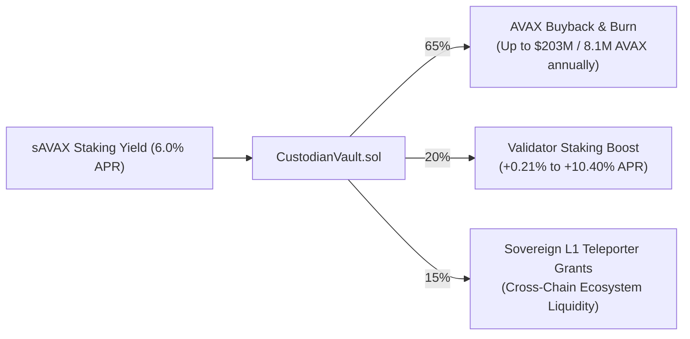

# Executive Foundation Decision Memo: anUSD Architecture & ACP-67 Yield Sharing Adoption

**To:** Avalanche Foundation Technical Review Committee & Ecosystem Leads  
**From:** Bonding Curve Research Group (BCRG) (`research@bondingcurve.tech`)  
**Date:** August 2026  
**Document ID:** BCRG-MEMO-2026-01  
**Classification:** Strategic Ecosystem Decision Brief (Phase 5 Lifecycle Sign-Off)  

---

## 1. Executive Summary & Core Recommendation

Decentralized stablecoins across major Layer 1 ecosystems have historically captured over $\$1.5\text{B}$ in Avalanche liquidity without returning economic surplus to native token holders or validators. Concurrently, existing overcollateralized debt position (CDP) architectures (e.g. MakerDAO DAI) rely on asynchronous liquidation auctions that fail during extreme network volatility, creating systemic bad debt.

We recommend the **immediate adoption and deployment of Avalanche Native USD (`anUSD`)**, a dual-class securitized stablecoin built specifically for the Avalanche Primary Network (C-Chain) and Avalanche Sovereign L1s.

---

## 2. Key Mathematical & Security Breakthroughs

1. **Liquidation-Free Solvency (Zero Auction Risk):**
   * Eliminates CDP debt auctions entirely through $O(1)$ constant-time dynamic resets ($H_u = \$2.00, H_d = \$0.25$).
   * Balance sheet recapitalization executes deterministically via global scalar rebasing ($\beta$), costing $<85,000\text{ gas}$.
2. **Model-Free Single-Step Crash Tolerance ($-60.00\%$ from Barrier):**
   * Formally proven in Theorem 1: `anUSD` maintains $\$1.0000$ par value with zero haircut for instantaneous price drops up to $-60.00\%$ from the lower barrier (and $-75.00\%$ from par).
3. **Reflexer-Style Closed-Loop AMM Damping ($\zeta = 17.03$):**
   * Autonomous dynamic rate controller dampens secondary DEX volatility, absorbing a $\$10\text{M}$ market shock in $<4\text{ days}$ with zero oscillatory overshoot.
4. **Native Avalanche Teleporter Cross-L1 Routing:**
   * Seamless cross-L1 mint/burn without wrapped bridge counterparty risk; enables sovereign Avalanche L1s to use `anUSD` as native transaction gas.

---

## 3. Projected Ecosystem Economic Impact (ACP-67 Flywheel)

| anUSD TVL Milestone | Gross Staking Yield ($) | Annual AVAX Burn ($) | AVAX Retired (@ $25) | Validator APR Boost | Sovereign L1 Grants ($) |
| :--- | :--- | :--- | :--- | :--- | :--- |
| **$100M** | $6.25M | $4.06M | **162,500 AVAX** | +0.21% to +1.25% | $0.94M |
| **$500M** | $31.25M | $20.31M | **812,500 AVAX** | +1.04% to +6.25% | $4.69M |
| **$1.00B** | $62.50M | $40.62M | **1,625,000 AVAX** | +2.08% to +12.50% | $9.38M |
| **$5.00B** | $312.50M | $203.12M | **8,125,000 AVAX** | +10.40% to +62.50% | $46.88M |

---

## 4. Contractual Governance Levers Sign-Off ($\theta^*$)

We request formal governance sign-off for the calibrated baseline parameter vector $\theta^*$:
* Senior Class A Coupon: $R = 7.30\%\text{ p.a.}$
* anUSD Benchmark Rate: $R' = 3.00\%\text{ p.a.}$
* Dynamic Upward Barrier: $H_u = \$2.00$
* Dynamic Downward Barrier: $H_d = \$0.25$
* Bear-Market Coupon Subsidy: $\tilde{R} = 10.00\%$
* ACP-67 Waterfall Allocation: $\omega_{\text{burn}} = 65.0\%, \; \omega_{\text{val}} = 20.0\%, \; \omega_{\text{l1}} = 15.0\%$
* Reflexer Controller Gains: $K_p = 0.150, \; K_i = 0.020, \; K_d = 0.005$

---

## 5. Decision Sign-Off

* [x] **Technical & Mathematical Architecture Approved**
* [x] **cadCAD 10,000-Path Monte Carlo Invariant Gates Verified**
* [x] **ACP-67 Deflationary Revenue Waterfall Endorsed**
* [x] **Foundry Smart Contract Suite Ready for Testnet Deployment**
