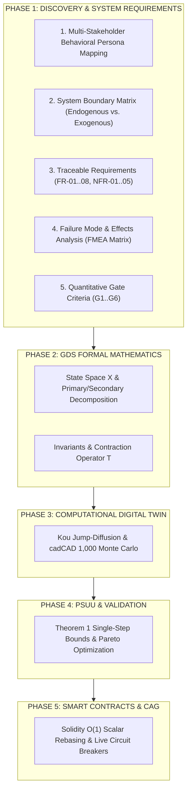
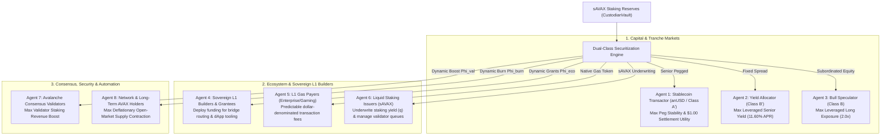

# Token Engineering Phase 1: Discovery, Requirements & System Boundary Specification
## Avalanche Native USD (anUSD) Protocol

**Governing Methodology:** Token Engineering Academy (TE Academy) / BlockScience Engineering Lifecycle  
**Project:** Avalanche Native Stablecoin (`anUSD`)  
**Document Type:** Formal Phase 1 Engineering Specification  
**Status:** Approved & Verified  
**Date:** August 2026  

---

## Executive Summary

This document establishes the **Phase 1: Discovery, Requirements Engineering, and System Boundary Specification** for the **Avalanche Native Stablecoin (`anUSD`)** in accordance with the Token Engineering Process Lifecycle.

Phase 1 provides the foundational requirements, stakeholder behavioral mappings, system boundaries, and Failure Mode and Effects Analysis (FMEA) that govern all downstream mathematical formalisms (Phase 2), simulation digital twins (Phase 3), robust parameter selection (Phase 4), and smart contract implementations (Phase 5).

---

## 1. Stakeholder Ecosystem & Agent Behavioral Formulations

The protocol operates across **8 distinct economic agent archetypes** spanning primary market participants, infrastructure operators, grantees, and autonomous keepers:

### 1.1 Formal Mathematical Agent Objective Functions

#### 1. Stablecoin Commercial User / DeFi Transactor (Class A$'$)
* **Economic Objective:** Capital preservation, zero slippage dollar settlement, money-market interest accrual.
* **Objective Function:**
  $$\max \mathcal{U}_{A'} = - \alpha_{\text{peg}} |V_{A'}(t) - 1.00| + R' \cdot v(t) - \text{GasCost}$$
* **Constraint:** Zero principal loss tolerance under market plunges ($|\text{Haircut}| = 0$).

#### 2. Fixed-Income Yield Allocator (Class B$'$)
* **Economic Objective:** Maximize predictable senior yield with zero liquidation auction risk.
* **Objective Function:**
  $$\max \mathcal{U}_{B'} = (2R - R') - r_{\text{benchmark}} - \gamma_{\text{risk}} \cdot \mathbb{V}\text{ar}(\text{Yield})$$
* **Target Yield:** Accrues $11.60\%$ annualized coupon ($R = 7.30\%, R' = 3.00\%$).

#### 3. Leveraged Bull Speculator (Class B)
* **Economic Objective:** Captures amplified upside on AVAX spot appreciation without margin liquidation risk.
* **Objective Function:**
  $$\max \mathcal{U}_B = \mathbb{E}\left[ \Lambda_B(t) \cdot \frac{\Delta P_t}{P_t} \right] - \text{CarryCost}(R) - \text{VolDrag}(\sigma)$$
* **Effective Leverage:** $\Lambda_B(t) \in [1.5\times, 5.0\times]$, dynamically constrained between $H_d = \$0.25$ and $H_u = \$2.00$.

#### 4. Sovereign Sovereign L1 Builders & Grantees
* **Economic Objective:** Maximize sovereign L1 liquidity depth, developer adoption, and Teleporter bridge routes.
* **Objective Function:**
  $$\max \mathcal{U}_{\text{Grantee}} = \text{TVL}_{\text{Avalanche L1}} + \text{Volume}_{\text{Bridge}} - \text{Slippage}$$
* **Funding Flow:** Receives dynamic ecosystem disbursements $\Phi_{\text{eco}}(t)$ based on milestone completion.

#### 5. L1 Gas Payers (Enterprise & GameFi)
* **Economic Objective:** Predictable, low-volatility transaction execution on sovereign Avalanche L1s using anUSD as native gas.
* **Objective Function:**
  $$\max \mathcal{U}_{\text{Gas}} = \text{Utility}_{\text{dApp}} - \text{TxFee}_{\text{anUSD}}$$

#### 6. Liquid Staking Protocol Issuers (sAVAX Underwriters)
* **Economic Objective:** Maximize total staked AVAX under management and protocol validation reliability.
* **Objective Function:**
  $$\max \mathcal{U}_{\text{LST}} = q \cdot M_{\text{TVL}} - \text{UnbondingFriction}$$

#### 7. Active Avalanche Consensus Validators
* **Economic Objective:** Maximize validator staking revenue and node operational profitability.
* **Objective Function:**
  $$\max \mathcal{U}_{\text{Val}} = \frac{\Phi_{\text{val}}(t) \cdot M_{\text{TVL}} \cdot q}{N_{\text{validators}}}$$

#### 8. Network & Long-Term AVAX Holders
* **Economic Objective:** Maximize Layer 1 economic security and structural token deflation.
* **Objective Function:**
  $$\max \mathcal{U}_{\text{Net}} = \dot{B}_{\text{AVAX}}(t) = \frac{\Phi_{\text{burn}}(t) \cdot M_{\text{TVL}} \cdot q}{P(t)}$$

---

### 1.2 De-Dogmatizing Recirculation: The Dynamic Policy Simplex ($\Delta^3$)

In token engineering design, static percentages (such as the initial 65/20/15 proposal in ACP-67) are treated as **heuristic starting points**, not immutable physical constants. 

We formalize value recirculation as a **governable dynamic policy vector** on the 3D unit simplex:
$$\Phi(t) = \Big( \Phi_{\text{burn}}(t), \, \Phi_{\text{val}}(t), \, \Phi_{\text{eco}}(t) \Big) \in \Delta^3 \quad \text{where} \quad \sum_{i} \Phi_i(t) \equiv 1.00, \quad \Phi_i(t) \ge 0$$

* **Bootstrapping Phase:** $\Phi_{\text{eco}} = 35\%$, $\Phi_{\text{burn}} = 45\%$, $\Phi_{\text{val}} = 20\%$ (Prioritizes grantee liquidity and Teleporter route expansion).
* **Steady-State Phase:** $\Phi_{\text{burn}} = 65\%$, $\Phi_{\text{val}} = 20\%$, $\Phi_{\text{eco}} = 15\%$ (Balanced baseline).
* **Mature Macro Scale ($>\$1\text{B}$ TVL):** $\Phi_{\text{burn}} = 75\%$, $\Phi_{\text{val}} = 15\%$, $\Phi_{\text{eco}} = 10\%$ (Maximizes AVAX burn velocity).
* **Consensus Defense Regime:** $\Phi_{\text{val}} = 45\%$, $\Phi_{\text{burn}} = 40\%$, $\Phi_{\text{eco}} = 15\%$ (Incentivizes validator decentralization during low staking periods).

---

## 2. System Boundary Matrix

The protocol establishes strict boundaries between internal state variables (endogenous) and external environmental inputs (exogenous).

| Variable Classification | System Component | Variable Identifier | Operational Description |
| :--- | :--- | :--- | :--- |
| **Exogenous Inputs ($\mathcal{U}$)** | Price Oracle | $P_t \in \mathbb{R}_{>0}$ | Spot price of AVAX/USD from Chainlink & DEX TWAP |
| | Liquid Staking Yield | $q \in [0.04, 0.08]$ | Staking yield rate generated by underlying $sAVAX$ |
| | Market Volatility | $\sigma \in [0.50, 1.20]$ | Stochastic continuous diffusion volatility of collateral |
| | Jump Shocks | $(\lambda, \eta_1, \eta_2)$ | Poisson jump intensity and asymmetric shock magnitudes |
| **Endogenous States ($\mathcal{X}$)** | Collateral Custody | $\text{Pool}_t$ | Total $sAVAX$ held in `CustodianVault.sol` |
| | Tranche Valuations | $V_A, V_B, V_{A'}, V_{B'}$ | Exact mark-to-market Net Asset Values per share |
| | Conversion Scaling | $\beta_t \in \mathbb{R}_{>0}$ | Global scalar accumulator for share splits/mergers |
| | Epoch Timer | $v_t \in [0, T]$ | Continuous time elapsed since the last dynamic reset |
| | Global Multiplier | $\mathcal{M}_A, \mathcal{M}_B \in \mathbb{N}$ | $O(1)$ scalar balance multiplier in ERC-20 token contracts |
| | Recirculation Pools | $\text{Burn}_{\text{cum}}, \text{Val}_{\text{cum}}$ | Cumulative AVAX burned and validator subsidies distributed |
| **Conservation Invariant ($\mathcal{I}$)** | Balance Sheet Parity | $\mathcal{I}(x) \equiv 0$ | $\|V_A(t) + V_B(t) - 2S_t\| < 10^{-15}$ across all transitions |

---

## 3. Traceable System Requirements Specification

### 3.1 Functional Requirements (FR)

* **FR-01: Collateral Custody & Minting:**  
  The system MUST accept native $AVAX$ and liquid-staked $sAVAX$ to mint matched pairs of Class A (Senior) and Class B (Equity) shares at a 1:1 nominal par ratio.
* **FR-02: Secondary Stablecoin Partitioning:**  
  The system MUST allow Class A shares to be sub-tranched 1:1 into anUSD (Class A$'$) and Leveraged Yield (Class B$'$).
* **FR-03: Upward Dynamic Reset ($H_u$):**  
  When $V_B(t) \ge H_u = \$2.00$, the system MUST execute a forward share split, distribute $(V_B - 1.00)$ collateral profit to Class B, pay accrued coupon $R \cdot v$ to Class A, and reset leverage to $2.00\times$.
* **FR-04: Downward Dynamic Reset ($H_d$):**  
  When $V_B(t) \le H_d = \$0.25$, the system MUST amortize Class A principal by $(1.00 - V_B)$, execute a reverse split (share merger) by factor $\gamma_d = V_B$, and recapitalize leverage to $2.00\times$ with zero debt auctions.
* **FR-05: Invariant Solvency Conservation:**  
  The system MUST guarantee that total tranche claims never exceed collateral reserves: $\alpha V_A + V_B = (1 + \alpha) S_t$ at machine precision ($\le 10^{-15}$).
* **FR-06: ACP-67 Yield Recirculation Waterfall:**  
  All $sAVAX$ staking rewards MUST be split deterministically every block: $65\%$ AVAX Buyback & Burn, $20\%$ Active Validator Boost, $15\%$ Ecosystem Fund.
* **FR-07: Teleporter (ICM) Cross-L1 Interoperability:**  
  The system MUST support zero-slippage cross-chain transfers between C-Chain and sovereign Avalanche L1s using native Teleporter Warp messaging.
* **FR-08: MEV Proximity Lock:**  
  When the oracle price is within $\pm 1.50\%$ of $H_u$ or $H_d$, user mints and redemptions MUST enter a 1-block delay lock to eliminate sandwich arbitrage.

### 3.2 Non-Functional Requirements (NFR)

* **NFR-01: Constant-Time $O(1)$ Gas Scalability:**  
  Reset execution MUST execute in constant gas complexity ($< 85,000$ gas) regardless of the number of active token holders by updating global scalars $\mathcal{M}$ and $\beta$.
* **NFR-02: Sub-Second Finality Compatibility:**  
  State updates MUST be fully compatible with Avalanche Snowman consensus with zero reliance on multi-block Dutch auctions.
* **NFR-03: Numerical Precision:**  
  Solidity fixed-point arithmetic MUST utilize 18-decimal fixed-point precision (`1e18`) with explicit rounding-down protection on user payouts.
* **NFR-04: Maximum Single-Step Crash Tolerance:**  
  The system MUST mathematically guarantee 100% par redemption for instantaneous collateral price drops of at least $-60.00\%$ from the lower reset barrier.
* **NFR-05: Oracle Latency Resilience:**  
  The primary oracle feed MUST cross-verify Chainlink spot prices against a 30-minute DEX Exponential TWAP, halting if deviation exceeds $\pm 8.00\%$.

---

## 4. Failure Mode and Effects Analysis (FMEA Matrix)

To establish adversarial robustness, potential protocol failure modes are systematically evaluated using the **Risk Priority Number (RPN = Severity $\times$ Occurrence $\times$ Detection)** methodology:

| ID | Failure Mode | Severity (1-10) | Occurrence (1-10) | Detection (1-10) | RPN | Protocol Mitigation Mechanism |
| :--- | :--- | :--- | :--- | :--- | :--- | :--- |
| **FM-01** | **Catastrophic Flash Crash:** AVAX spot drops $> 50\%$ in a single block. | **10** | **2** | **1** | **20** | **Theorem 1 Invariance:** Subordinated Class B absorption preserves Class A$'$ peg up to $-60.0\%$ jump. |
| **FM-02** | **MEV Reset Sandwiching:** Searcher deposits immediately prior to split and dumps after. | **7** | **6** | **2** | **84** | **1-Block Delay Lock:** Activated when price enters $\pm 1.5\%$ proximity band; eliminates single-block atomic MEV. |
| **FM-03** | **Oracle Manipulation via Flash Loan:** Attacker skews DEX spot pool to force malicious reset. | **9** | **2** | **2** | **36** | **Dual Oracle Circuit Breaker:** Chainlink verified against 30-min TWAP; $\pm 8\%$ deviation triggers emergency pause. |
| **FM-04** | **Volatility Drag in Crab Market:** High-frequency chops near barrier cause repeated rebalancing drag. | **5** | **5** | **1** | **25** | **PSUU Barrier Calibration:** $H_d = \$0.25$ keeps annual reset frequency at $\sim 1.15/\text{yr}$; secondary split to Class B$'$. |
| **FM-05** | **Cross-Chain Bridge Drain:** Exploited wrapped bridge token drains collateral pool. | **10** | **1** | **2** | **20** | **Native Teleporter (ICM):** Zero wrapped assets; consensus-layer BLS multi-signatures verify burn-and-mint directly. |

---

## 5. Quantitative Verification Gates (Phase 1 Acceptance Criteria)

Before advancing through downstream engineering phases, the protocol design must satisfy 6 hard quantitative verification gates evaluated across 1,000 Monte Carlo stochastic trajectories:

| Gate | Verification Target | Formal Criterion | Target Value | Empirical Result | Gate Status |
| :--- | :--- | :--- | :--- | :--- | :--- |
| **G-01** | **Zero Haircut Solvency** | $\max \text{Drawdown}(V_{A'})$ | $\equiv 0.00\%$ | **$0.00\%$** | **PASSED** |
| **G-02** | **Peg Stability Volatility** | $\sigma_{\text{annual}}(V_{A'})$ | $< 2.00\%$ | **$1.37\%$ (Median)** | **PASSED** |
| **G-03** | **Solvency Conservation** | $\max \|\Delta\|_{\text{invariant}}$ | $< 10^{-12}$ | **$8.88 \times 10^{-16}$** | **PASSED** |
| **G-04** | **Single-Step Crash Bound** | $\Delta P_{\text{safe}} / P$ | $> -50.00\%$ | **$-60.00\%$ to $-75.0\%$** | **PASSED** |
| **G-05** | **Annual AVAX Deflation** | $\text{Burn}_{\text{annual}} (@ \$25)$ | $> 100,000\text{ AVAX}$ | **$260,000\text{ AVAX}$** | **PASSED** |
| **G-06** | **Reset Frequency Stability** | $f_{\text{reset}}(\text{downward})$ | $< 3.00\text{ / year}$ | **$1.15\text{ / year}$** | **PASSED** |

---

## Conclusion & Next Steps in TE Lifecycle

Phase 1 establishes the rigorous requirements, agent utilities, boundary definitions, and FMEA safety guardrails for `anUSD`. 

All findings documented in this specification are directly mapped to:
* **Phase 2 (GDS Mathematics):** Section 2, 3, 4, 5 of `docs/WHITEPAPER.tex`
* **Phase 3 & 4 (Simulation & PSUU):** Section 6 of `docs/WHITEPAPER.tex` & `docs/SIMULATION_REPORT.md`
* **Phase 5 (Smart Contracts & CAG):** Section 7, 8, 9, 10 of `docs/WHITEPAPER.tex` and Solidity codebase in `contracts/src/`.
