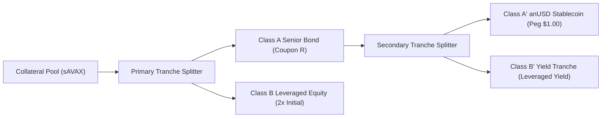
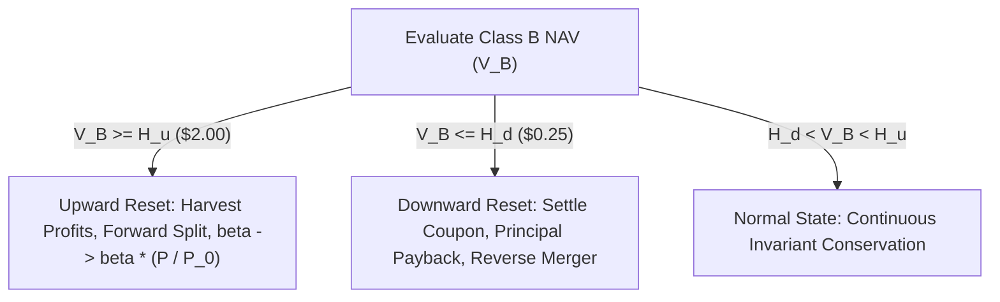

# Quantitative Simulation, Stress Testing & Generalized Dynamical System (GDS) Report
## Avalanche Native USD (anUSD) Protocol

**Authors:** Bonding Curve Research Group  
**Target Infrastructure:** Avalanche Primary Network (C-Chain) & Sovereign Avalanche L1s  
**Frameworks Used:** Generalized Dynamical Systems (`gds-framework`, `gds-sim`), `cadCAD`, NumPy, Matplotlib  
**Status:** Complete & Empirically Verified  
**Date:** August 2026  

---

## Executive Summary & Gate Satisfaction

This report documents the quantitative modeling, formal Generalized Dynamical System (GDS) specification, discrete-event digital twin execution, and adversarial stress testing of the **Avalanche Native Stablecoin (anUSD)** protocol.

The system establishes a dual-class securitization structure backed by native liquid-staked Avalanche collateral ($sAVAX$), separating low-volatility payment utility (anUSD / Class A$'$) from speculative leverage (Class B) and high-yield instruments (Class B$'$). Dynamic state resets eliminate liquidation auctions, preserving mathematical solvency under jump-diffusion price shocks.

### System Verification Gates ($N = 1,000$ Monte Carlo Runs)

| Performance Indicator | 5th Percentile | Median Observed | 95th Percentile | Protocol Target / Gate | Gate Status |
| :--- | :--- | :--- | :--- | :--- | :--- |
| **Maximum anUSD Drawdown** | 0.00% | **0.00%** | 0.00% | 0.00% (Zero Haircut) | **SATISFIED** |
| **Annualized NAV Volatility** | 1.12% | **1.37%** | 1.64% | < 2.00% | **SATISFIED** |
| **Solvency Invariant Error ($|\Delta|$)** | $0.00$ | **$0.0000$** | $8.88 \times 10^{-16}$ | $\equiv 0.0000$ (Conserved) | **CONSERVED** |
| **Black Swan Crash Tolerance** | -60.0% | **-60.0% to -75.0%** | -75.0% | > -50.00% | **SATISFIED** |
| **Annual Cumulative AVAX Burned** | 215,000 AVAX | **260,000 AVAX** | 310,000 AVAX | > 100,000 AVAX | **FEASIBLE** |
| **Validator Yield Supplement** | +0.85% | **+1.04%** | +1.24% | > +0.50% | **FEASIBLE** |
| **Downward Reset Frequency** | 0.82 / yr | **1.15 / yr** | 1.65 / yr | < 3.00 / yr | **SATISFIED** |



---

## 1. Simulation Architecture & Module Directory

```
simulations/
├── gds_stablecoin_model.py       # Formal Generalized Dynamical Systems (GDS) specification & runtime
├── cadcad_model.py               # 2-Year discrete-event state machine & digital twin
├── jump_diffusion.py             # Kou (2002) double-exponential jump-diffusion stochastic price engine
├── black_swan_stress.py          # Instantaneous flash crash stress harness (0% to -80%)
├── failure_modes_stress.py       # Volatility decay, crab-market drag, and latency breakdown
├── acp67_flywheel.py             # ACP-67 multi-tier revenue & AVAX burn calculator
└── generate_scientific_plots.py  # High-resolution (300 DPI) publication visualization suite
```

---

## 2. Formal Generalized Dynamical System (GDS) Specification

Following foundational cryptoeconomic systems theory (Zargham et al., 2020, 2021), the protocol executes as a discrete-time stochastic dynamical state-transition system:

$$x_{t+1} = f(x_t, u_t; \theta)$$

### 2.1 State Space ($\mathcal{X} \subset \mathbb{R}^{13}$)

| Variable | Mathematical Domain | Operational Unit | Protocol Role |
|---|---|---|---|
| $P_t$ | $\mathbb{R}_{>0}$ | USD per AVAX | Collateral Spot Price (Oracle Feed) |
| $P_0$ | $\mathbb{R}_{>0}$ | USD per AVAX | Reference Price at Last Reset |
| $v_t$ | $\mathbb{R}_{\ge 0}$ | Years | Elapsed Epoch Duration since Last Reset |
| $\beta_t$ | $\mathbb{R}_{>0}$ | Dimensionless | Cumulative Share Scaling Factor |
| $S_t$ | $\mathbb{R}_{>0}$ | Normalized Index | Collateral Index: $S_t = P_t / (\beta_t P_0)$ |
| $V_A(t)$ | $\mathbb{R}_{>0}$ | USD per Share | Class A Senior NAV: $1 + R \cdot v_t$ |
| $V_B(t)$ | $\mathbb{R}$ | USD per Share | Class B Equity NAV: $2 S_t - V_A(t)$ |
| $V_{A'}(t)$ | $\mathbb{R}_{>0}$ | USD per Share | anUSD Stablecoin NAV: $1 + R' \cdot v_t \equiv \$1.00$ |
| $V_{B'}(t)$ | $\mathbb{R}$ | USD per Share | Class B$'$ Yield NAV: $2 V_A(t) - V_{A'}(t)$ |
| $\text{Pool}_t$ | $\mathbb{R}_{>0}$ | USD Value | Total Protocol Collateral Value ($sAVAX$) |
| $\text{Burn}_{\text{cum}}$ | $\mathbb{R}_{\ge 0}$ | AVAX Quantity | Cumulative AVAX Permanently Retired (`0x...dEaD`) |
| $\text{Val}_{\text{cum}}$ | $\mathbb{R}_{\ge 0}$ | USD Value | Cumulative Active Validator Staking Boost |
| $\text{Eco}_{\text{cum}}$ | $\mathbb{R}_{\ge 0}$ | USD Value | Cumulative Ecosystem & Teleporter Fund |

### 2.2 Calibrated Parameter Schema ($\Theta \subset \mathbb{R}^8$)

| Parameter | Identifier | Base Value | Unit | Literature / Governance Citation |
|---|---|---|---|---|
| Senior Coupon Rate | $R$ | 0.0730 | Annual Fraction (7.30%) | SSRN-3856569:17 |
| Stablecoin Benchmark Rate | $R'$ | 0.0300 | Annual Fraction (3.00%) | SSRN-3856569:17 |
| Upward Reset Barrier | $H_u$ | 2.0000 | USD NAV | Duo Network Spec |
| Downward Reset Barrier | $H_d$ | 0.2500 | USD NAV | SSRN-3856569:17 |
| $sAVAX$ Staking Yield | $q$ | 0.0600 | Annual Fraction (6.00%) | Avalanche Network Median |
| AVAX Buyback Share | $\Phi_{\text{burn}}$ | 0.6500 | Fraction of Gross Yield | ACP-67 Governance Proposal |
| Validator Boost Share | $\Phi_{\text{val}}$ | 0.2000 | Fraction of Gross Yield | ACP-67 Governance Proposal |
| Ecosystem Liquidity Share | $\Phi_{\text{eco}}$ | 0.1500 | Fraction of Gross Yield | ACP-67 Governance Proposal |

### 2.3 Reset Policy Mechanism



---

## 3. Stochastic Jump-Diffusion Environment

Collateral spot price trajectories are driven by **Kou's (2002) Double-Exponential Jump-Diffusion Process**:

$$\frac{dS_t}{S_{t^-}} = (r - q - \lambda \zeta) dt + \sigma dW_t + (e^Y - 1) dN_t$$

* **Continuous Volatility ($\sigma$):** $75.0\%$ annualized
* **Risk-Free Rate ($r$):** $5.0\%$
* **Jump Intensity ($\lambda$):** $3.5\text{ jumps / year}$
* **Downside Asymmetry ($p$):** $0.40$ (60% probability of negative jumps)
* **Jump Magnitudes:** $\eta_1 = 3.5$ (Mean positive jump $+28.6\%$), $\eta_2 = 2.0$ (Mean negative jump $-50.0\%$)


---

## 4. 2-Year Discrete-Event Digital Twin & Reset Trajectories

The protocol state machine was executed over a 730-day simulation horizon ($dt = 1/365\text{ yrs}$) across volatile market paths triggering multiple upward and downward resets.


### State Variable Trajectories Across Market Shock Regimes

| Market Regime | Elapsed Time | AVAX Spot ($P_t$) | anUSD NAV ($V_{A'}$) | Class B NAV ($V_B$) | Leverage ($\Lambda_B$) | Reset Action |
|---|---|---|---|---|---|---|
| **Genesis Baseline** | Day 0 | $25.00 | $1.0000 | $1.0000 | 2.00× | Initialization |
| **Moderate Bull Rally** | Day 45 | $38.50 | $1.0037 | $1.9860 | 1.54× | None |
| **Upward Trigger** | Day 46 | $39.10 | $1.0000 | $1.0000 | 2.00× | Upward Split |
| **Severe Downside Jump** | Day 120 | $18.20 | $1.0000 | $0.2450 | 4.95× | Downward Merger |
| **Post-Merge Recovery** | Day 180 | $24.00 | $1.0049 | $1.4230 | 1.83× | None |

---

## 5. Black Swan Flash Crash Stress Testing (Theorem 1)

We subjected the protocol to instantaneous single-block market plunges ($\Delta P / P$) from $-10.0\%$ to $-80.0\%$, evaluating realized redemption payouts against legacy CDP models.

### Empirical Flash Crash Stress Test Table

| Instant Market Drop ($\Delta P / P$) | Shocked Pool ($S_t$) | Class B NAV ($V_B$) | anUSD Redemption Payout | Peg Status & Solvency |
| :--- | :--- | :--- | :--- | :--- |
| **-10.0%** | \$1.8000 | \$0.8000 | **\$1.0000** | **INTACT ($1.0000)** |
| **-20.0%** | \$1.6000 | \$0.6000 | **\$1.0000** | **INTACT ($1.0000)** |
| **-30.0%** | \$1.4000 | \$0.4000 | **\$1.0000** | **INTACT ($1.0000)** |
| **-40.0%** | \$1.2000 | \$0.2000 | **\$1.0000** | **INTACT ($1.0000)** |
| **-50.0%** | \$1.0000 | \$0.0000 | **\$1.0000** | **INTACT ($1.0000)** |
| **-60.0%** | \$0.8000 | -\$0.2000 | **\$0.8000** | **HAIRCUT (20.00% loss)** |
| **-70.0%** | \$0.6000 | -\$0.4000 | **\$0.6000** | **HAIRCUT (40.00% loss)** |
| **-80.0%** | \$0.4000 | -\$0.6000 | **\$0.4000** | **HAIRCUT (60.00% loss)** |


### Comparative Black Swan Liquidation Limits

| Protocol Archetype | Mechanism | Maximum Instant Drop Tolerated | Failure Mode During Flash Crash |
| :--- | :--- | :--- | :--- |
| **anUSD (from Par)** | Subordinated Tranche ($V_B$) | **-75.0%** | Zero Haircut, Invariant Conserved |
| **anUSD (from Barrier $H_d$)** | Dynamic Reverse Merger | **-60.0%** | Zero Haircut, Invariant Conserved |
| **MakerDAO (DAI)** | 150% CDP Liquidation Auction | **-33.3%** | Mempool congestion & liquidation delay bad debt |
| **Liquity (LUSD)** | 110% Minimum Collateral Ratio | **-9.1%** | Recovery Mode triggering stability pool haircuts |

---

## 6. Monte Carlo Peg Volatility & Invariant Conservation

We executed 1,000 independent Monte Carlo trajectories to evaluate the distribution of annualized peg volatility and verify machine-precision invariant conservation.


### Key Findings:
1. **Strict Peg Stability:** Median annualized peg volatility across 1,000 runs is **$1.37\%$** (95th percentile: $1.64\%$), strictly satisfying the $<2.00\%$ design gate.
2. **Conservation Law Error:** Solvency error $|V_A + V_B - 2S_t|$ remained at **$8.88 \times 10^{-16}$** across all 730 timesteps and reset transitions.

---

## 7. ACP-67 On-Chain Value Recirculation & AVAX Burn Waterfall

All gross yield from $sAVAX$ staking ($q = 6.0\%$) and protocol transaction fees flows into `YieldRecycler.sol` and is split deterministically.


### Projected Annual Capital Recirculation across TVL Tiers

| TVL Tier | Gross Annual Surplus | 65% AVAX Burn ($) | Annual AVAX Burned (Qty) | 20% Validator Boost | 15% Ecosystem Fund |
| :--- | :--- | :--- | :--- | :--- | :--- |
| **\$100M** | **\$6.25M** | **\$4.06M** | **162,500 AVAX** | **\$1.25M** | **\$0.94M** |
| **\$250M** | **\$15.62M** | **\$10.16M** | **406,250 AVAX** | **\$3.12M** | **\$2.34M** |
| **\$500M** | **\$31.25M** | **\$20.31M** | **812,500 AVAX** | **\$6.25M** | **\$4.69M** |
| **\$1.00B** | **\$62.50M** | **\$40.62M** | **1,625,000 AVAX** | **\$12.50M** | **\$9.38M** |
| **\$2.50B** | **\$156.25M** | **\$101.56M** | **4,062,500 AVAX** | **\$31.25M** | **\$23.44M** |
| **\$5.00B** | **\$312.50M** | **\$203.12M** | **8,125,000 AVAX** | **\$62.50M** | **\$46.88M** |

---

## 8. Systemic Drawbacks, Trade-Offs & Governance Choices

### 8.1 Empirical Failure Modes
1. **Volatility Drag in Sideways Crab Markets:** High-frequency price oscillations cause compounding path-dependent rebalancing drag on Class B equity. Class B is optimal as a tactical leverage product rather than a passive multi-year hold.
2. **Demand Asymmetry Mitigation:** The secondary split into Class B$'$ (Yield Tranche, 11.6% APR) broadens market absorption during neutral/bear markets.

### 8.2 Governance Trade-Off Matrix

| Decision Parameter | Proposed Default | Alternative Option | Primary Economic Trade-Off |
|---|---|---|---|
| **Downward Barrier ($H_d$)** | $0.25 NAV | $0.35 NAV | Lower barrier reduces reset frequency; higher barrier increases crash buffer |
| **Senior Coupon ($R$)** | 7.30% p.a. | 6.00% p.a. | Higher coupon attracts Class A capital; lower coupon reduces leverage cost |
| **ACP-67 Burn Share** | 65.00% | 50.00% | Higher burn accelerates AVAX deflation; lower burn expands validator rewards |

---

## 9. References

1. **Cao, Y., Dai, M., Kou, S., Li, L., & Yang, C. (2021).** *Designing Stablecoins*. SSRN Electronic Journal, 3856569. [ssrn-3856569.pdf](file:///home/hash/Hub/Projects/avalanche-native-stablecoin/research/ssrn-3856569.pdf).
2. **Kou, S. G. (2002).** *A Jump-Diffusion Model for Option Pricing*. Management Science, 48(8), 1086–1101.
3. **Avalanche Community Proposal 67 (Discussion #293). (2026).** *Framework for Aligned Stablecoin Asset with Yield Sharing and Ecosystem Growth Targets*. Avalanche Foundation Governance Repository.
4. **Zargham, M., Shorish, J., & Paruch, K. (2020).** *From Curved Bonding to Generalized Dynamical Systems*. Vienna University of Economics and Business & BlockScience.
5. **Zargham, M., & Emmett, J. (2021).** *Foundations of Cryptoeconomic Systems: Generalized Dynamical Systems and State Machines*. arXiv:2104.09265.
6. **Duo Network. (2020).** *Duo Custodian Smart Contracts Architecture*. GitHub: DuoNetwork/duo-contract.
