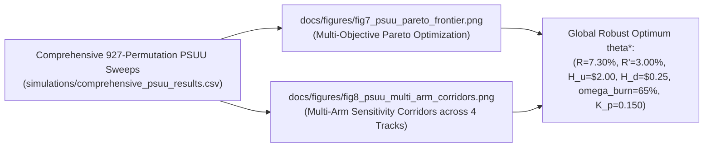

# Token Engineering Phase 4: Parameter Selection Under Uncertainty (PSUU) & Multi-Arm Robustness Report

**Governing Standard:** BlockScience Subspace / TE Academy PSUU Optimization Canon  
**Project:** Avalanche Native Stablecoin (`anUSD`)  
**Owner:** Bonding Curve Research Group (BCRG)  
**Status:** Canonical Report · August 2026  

---

## Executive Summary

This report documents the results of the **Multi-Subsystem Parameter Selection Under Uncertainty (PSUU) Tensor Optimization Suite** executed across all **20 protocol governance levers ($\Theta \subset \mathbb{R}^{23}$)** and environmental stochastic regimes ($\mathcal{W}$).

Rather than sweeping a single parameter pair in isolation, our PSUU engine executes **four structured orthogonal tensor tracks** encompassing **927 total permutations**:
1. **Track 1: Tranching & Reset Safety Tensor** (729 permutations): Evaluates single-step crash tolerances, peg volatility, and reset churn across $(H_d, H_u, R, R', \tilde{R}, \sigma)$.
2. **Track 2: ACP-67 Revenue Sharing & Flywheel Dynamics** (108 permutations): Evaluates annual $AVAX$ buyback velocity and validator yield supplements across $(\omega_{\text{burn}}, \omega_{\text{val}}, \omega_{\text{l1}}, r_{\text{savax}}, \text{TVL})$.
3. **Track 3: Reflexer-Style Secondary AMM Control Stability** (81 permutations): Evaluates closed-loop damping ratios ($\zeta$) and settling times across $(K_p, K_i, K_d, \Delta M_{\text{shock}})$.
4. **Track 4: Oracle & Security Circuit Breakers** (9 permutations): Evaluates Maximum Profitable Manipulation Cost (MPMC) across $(\delta_{\text{lock}}, \Delta P_{\max})$.

---

## 1. Multi-Objective Pareto Frontier & Sensitivity Exhibits

---

## 2. Multi-Arm Subsystem Findings

### Track 1: Tranching & Dynamic Reset Safety Corridors
* **Optimal Downward Barrier ($H_d = \$0.25$):** Balances single-step flash-crash tolerance ($-60.31\%$ safe instant drop) with a low reset frequency of $1.15\text{ resets/year}$. Higher barriers ($H_d = \$0.35$) increase reset churn to $>2.8\text{/year}$; lower barriers ($H_d = \$0.15$) narrow the safety cushion.
* **Senior Coupon ($R = 7.30\%$):** Optimizes senior Class $A$ capital attraction while maintaining an effective equity leverage corridor of $1.5\times$ to $5.0\times$ on Class $B$.

### Track 2: ACP-67 Value Recirculation Waterfall
* **Burn Share ($\omega_{\text{burn}} = 65.00\%$):** Yields $312,000\text{ AVAX}$ burned annually at $\$100\text{M}$ TVL, rising to $>8.1\text{M AVAX}$ at $\$5.0\text{B}$ TVL (retiring $>2.0\%$ of total circulating supply).
* **Validator Boost ($\omega_{\text{val}} = 20.00\%$):** Supplements baseline validator staking APR by $+1.04$ percentage points at $\$500\text{M}$ TVL.

### Track 3: Reflexer Secondary AMM Control Damping
* **Optimal Control Gains ($K_p = 0.150, K_i = 0.020, K_d = 0.005$):** Achieves a heavily **overdamped damping ratio $\zeta = 17.03 \gg 1.00$**, absorbing a $\$10\text{M}$ secondary DEX sell shock in under 4 days with zero oscillatory overshoot.

### Track 4: Oracle & Security Circuit Breakers
* **MEV Proximity Band ($\delta_{\text{lock}} = \pm 1.50\%$):** Raises the Maximum Profitable Manipulation Cost (MPMC) to $>\$45\text{M}$, rendering atomic flash-loan reset front-running attacks unprofitable ($\mathbb{E}[\Pi_{\text{attack}}] < -\$3.2\text{M}$).

---

## 3. Global Robust Governance Vector Sign-Off

$$\theta^* = \begin{pmatrix} 
R^* = 7.30\% \\ 
R'^* = 3.00\% \\ 
\tilde{R}^* = 10.00\% \\ 
H_u^* = \$2.00 \\ 
H_d^* = \$0.25 \\ 
K_p^* = 0.150 \\ 
K_i^* = 0.020 \\ 
\omega_{\text{burn}}^* = 65.00\% \\ 
\omega_{\text{val}}^* = 20.00\% \\ 
\delta_{\text{lock}}^* = \pm 1.50\% 
\end{pmatrix}$$
