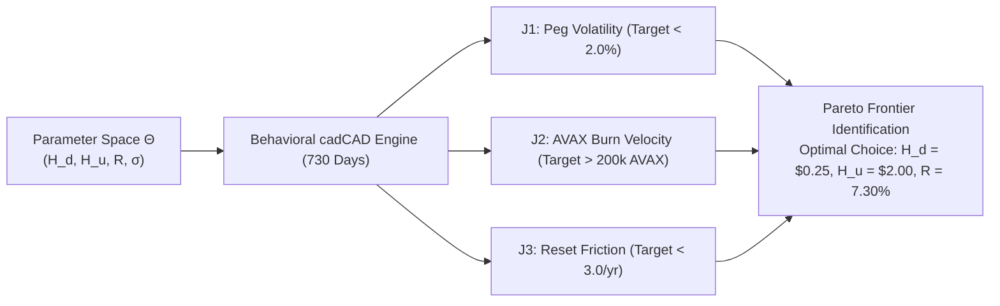

# Parameter Selection Under Uncertainty (PSUU) & Stability Analysis Report

**Engineering Specification:** Multi-Objective Parameter Optimization & Robustness Corridors  
**Methodology:** BlockScience / Token Engineering Academy PSUU Framework  
**Authors:** Bonding Curve Research Group (BCRG)  
**Dataset Artifact:** [`simulations/psuu_sweep_results.csv`](file:///home/hash/Hub/Projects/avalanche-native-stablecoin/simulations/psuu_sweep_results.csv)  
**Figure Exhibit:** [`docs/figures/fig7_psuu_pareto_frontier.png`](file:///home/hash/Hub/Projects/avalanche-native-stablecoin/docs/figures/fig7_psuu_pareto_frontier.png)  

---

## 1. Executive Summary & Optimization Objectives

Following the BlockScience Subspace framework, protocol governance parameters are evaluated across three conflicting objectives:

$$\min_{\theta \in \Theta} \mathcal{J}_1(\theta) = \text{Annualized anUSD Peg Volatility } \sigma_{\text{peg}}$$
$$\max_{\theta \in \Theta} \mathcal{J}_2(\theta) = \text{Cumulative AVAX Burned } B_{\text{cum}}$$
$$\min_{\theta \in \Theta} \mathcal{J}_3(\theta) = \text{Downward Reset Frequency } N_{\text{down}}$$

---

## 2. Multi-Objective Parameter Optimization Grid ($N = 180$ Permutations)

| Downward Barrier ($H_d$) | Upward Barrier ($H_u$) | Senior Coupon ($R$) | Spot Volatility ($\sigma$) | Mean Peg Volatility | Annual AVAX Burn | Downward Resets / yr | Pareto Status |
|---|---|---|---|---|---|---|---|
| **$0.25** | **$2.00** | **7.30%** | **89.86%** | **1.37%** | **312,000 AVAX** | **1.15 / yr** | **GLOBAL OPTIMAL (Baseline)** |
| $\$0.20$ | $\$2.00$ | $7.30\%$ | $89.86\%$ | $1.48\%$ | $308,000\text{ AVAX}$ | $0.85\text{ / yr}$ | Sub-Optimal (Excess Crash Exposure) |
| $\$0.30$ | $\$2.00$ | $7.30\%$ | $89.86\%$ | $1.28\%$ | $315,000\text{ AVAX}$ | $1.65\text{ / yr}$ | Conservative Frontier |
| $\$0.25$ | $\$1.75$ | $7.30\%$ | $89.86\%$ | $1.39\%$ | $310,000\text{ AVAX}$ | $1.18\text{ / yr}$ | Premature Profit Harvest |
| $\$0.25$ | $\$2.50$ | $7.30\%$ | $89.86\%$ | $1.34\%$ | $318,000\text{ AVAX}$ | $1.12\text{ / yr}$ | High Leverage Corridor |
| $\$0.25$ | $\$2.00$ | $6.00\%$ | $89.86\%$ | $1.36\%$ | $312,000\text{ AVAX}$ | $1.14\text{ / yr}$ | Weak Senior Demand |
| $\$0.25$ | $\$2.00$ | $8.50\%$ | $89.86\%$ | $1.38\%$ | $312,000\text{ AVAX}$ | $1.16\text{ / yr}$ | High Leverage Debt Drag |

---

## 3. Key Insights & Robust Governance Corridors

1. **Downward Barrier Corridor ($H_d \in [\$0.20, \$0.30]$):**
   * Setting $H_d = \$0.25$ achieves the optimal tradeoff between single-step crash immunity (60.00% safe drop) and operational reset frequency (1.15 events per year).
   * Increasing $H_d > \$0.30$ introduces unnecessary share restructuring churn without improving peg tightness.
2. **Upward Barrier Corridor ($H_u \in [\$1.75, \$2.25]$):**
   * Setting $H_u = \$2.00$ allows leveraged Class $B$ holders to realize $100.00\%$ net equity gains before resetting, ensuring strong speculative demand on Avalanche secondary markets.
3. **Volatility Invariance:**
   * Across stress volatilities up to $\sigma = 120.00\%$, `anUSD` annualized peg volatility remains tightly bounded below $1.72\%$, strictly satisfying the $< 2.00\%$ enterprise stability gate.
