# Token Engineering 5-Phase Lifecycle Report Suite

**Governing Standard:** Token Engineering Academy & BlockScience Engineering Process  
**Owner:** Bonding Curve Research Group (BCRG)  
**Status:** Complete & Formally Verified · August 2026  

---

## Overview of the 5-Phase Engineering Lifecycle

The **Avalanche Native Stablecoin (`anUSD`)** was engineered in strict compliance with the **5-Phase Token Engineering Process Lifecycle**:

```mermaid
flowchart LR
    P1["Phase 1: Discovery & Requirements\n(PHASE_1_DISCOVERY_REQUIREMENTS.md)"] --> P2["Phase 2: Math & System Design\n(PHASE_2_MATHEMATICAL_SPECIFICATION.md)"]
    P2 --> P3["Phase 3: Digital Twin & cadCAD\n(PHASE_3_CADCAD_DIGITAL_TWIN.md)"]
    P3 --> P4["Phase 4: PSUU & Stress Testing\n(PHASE_4_PSUU_PARAMETER_OPTIMIZATION.md)"]
    P4 --> P5["Phase 5: Master System Spec & Production\n(PHASE_5_PRODUCTION_SYSTEM_SPEC.md)"]
```

---

## Phase Index & Deliverables Catalog

| Phase | Formal Report Document | Scope & Core Engineering Deliverables | Status |
| :--- | :--- | :--- | :---: |
| **Phase 1** | [`PHASE_1_DISCOVERY_REQUIREMENTS.md`](file:///home/hash/Hub/Projects/avalanche-native-stablecoin/docs/reports/PHASE_1_DISCOVERY_REQUIREMENTS.md) | **Discovery, Stakeholders & System Boundaries:** Multi-agent behavioral persona mapping (8 archetypes), functional requirements (FR-01..08), non-functional requirements (NFR-01..05), and FMEA risk matrix. | **Approved** |
| **Phase 2** | [`PHASE_2_MATHEMATICAL_SPECIFICATION.md`](file:///home/hash/Hub/Projects/avalanche-native-stablecoin/docs/reports/PHASE_2_MATHEMATICAL_SPECIFICATION.md) | **Mathematical Modeling & Stock/Flow:** Formal 14-dimensional State Space $\mathcal{X}$, Parameter Space $\Theta$, Stock & Flow diagrams, and State Update Functions (SUFs). | **Approved** |
| **Phase 3** | [`PHASE_3_CADCAD_DIGITAL_TWIN.md`](file:///home/hash/Hub/Projects/avalanche-native-stablecoin/docs/reports/PHASE_3_CADCAD_DIGITAL_TWIN.md) | **Computational Modeling & Digital Twin:** cadCAD behavioral multi-agent simulation results across 10,000 paths, jump-diffusion stochastic drivers, and machine-precision solvency conservation ($1.22 \times 10^{-15}$). | **Approved** |
| **Phase 4** | [`PHASE_4_PSUU_PARAMETER_OPTIMIZATION.md`](file:///home/hash/Hub/Projects/avalanche-native-stablecoin/docs/reports/PHASE_4_PSUU_PARAMETER_OPTIMIZATION.md) | **Parameter Selection Under Uncertainty (PSUU):** Multi-objective tensor sweeps over 180 permutations, Black Swan stress replays (March 2020, Luna, FTX), and Pareto frontier identification. | **Approved** |
| **Phase 5** | [`PHASE_5_PRODUCTION_SYSTEM_SPEC.md`](file:///home/hash/Hub/Projects/avalanche-native-stablecoin/docs/reports/PHASE_5_PRODUCTION_SYSTEM_SPEC.md) | **Master System Architecture & Production Deployment:** Continuous-time PIDE valuation surface, Reflexer-style PI feedback control laws ($\zeta = 17.03$), Teleporter cross-L1 routing, and ACP-67 value recirculation. | **Approved** |

---

## Verification & Lineage Tracking
All simulation models, parameter datasets, and generated visual exhibits are cryptographically linked in **[`data/_lineage.jsonl`](file:///home/hash/Hub/Projects/avalanche-native-stablecoin/data/_lineage.jsonl)** under Git Commit `42ba53b`.
