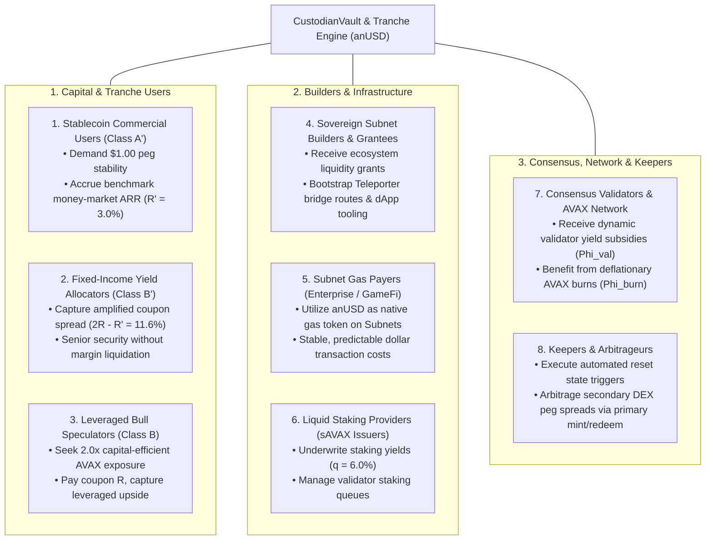

# Avalanche Native Stablecoin (`anUSD`): Formal Mathematical System Specification
## Generalized Dynamical System (GDS) & Token Engineering Specification

**Document Type:** Formal System Architecture & Token Engineering Specification  
**Engineering Methodology:** BlockScience / Token Engineering Academy Standard (HydraDX Omnipool & Subspace Reference)  
**Authors:** Bonding Curve Research Group (BCRG)  
**Target Infrastructure:** Avalanche Primary Network (C-Chain) & Avalanche Sovereign L1s (Subnets)  
**Status:** Canonical Engineering Specification · August 2026  

---

## 1. System Requirements, Stakeholder Taxonomy & Behavioral Axioms

### 1.1 Complete Multi-Stakeholder Ecosystem Taxonomy

The protocol interacts with **8 distinct economic agent archetypes**, spanning end-users, capital allocators, infrastructure operators, grantees, and autonomous keepers:



### 1.2 Mathematical Agent Objective Functions

| Agent Archetype | Decision Variables | Formal Objective Function | Behavioral Constraints |
|---|---|---|---|
| **1. Stablecoin Transactor ($A'$)** | Mint / Redeem / Hold $A'$ | $\max \mathcal{U}_{A'} = -\alpha_{\text{peg}} \|V_{A'}(t) - 1.00\| + R' \cdot v_t - \text{Gas}$ | Zero principal loss tolerance ($\Delta V_{A'} \ge 0$) |
| **2. Yield Allocator ($B'$)** | Mint / Redeem / Hold $B'$ | $\max \mathcal{U}_{B'} = (2R - R') - r_{\text{bench}} - \gamma \mathbb{V}\text{ar}(\text{Yield})$ | Predictable senior cash flow, zero leverage risk |
| **3. Leveraged Speculator ($B$)** | Long / Exit / Rebalance $B$ | $\max \mathcal{U}_B = \mathbb{E}\left[\Lambda_B(t) \frac{\Delta P}{P}\right] - R \cdot v_t - \text{VolDrag}(\sigma)$ | Bounded leverage $\Lambda_B \in [1.5\times, 5.0\times]$ |
| **4. Subnet Builder / Grantee** | Deploy grants / Seed DEX | $\max \mathcal{U}_{\text{Grantee}} = \text{TVL}_{\text{Subnet}} + \text{Volume}_{\text{Bridge}} - \text{Slippage}$ | Milestone-based grant disbursement rules |
| **5. Subnet Gas Consumer** | Execute Subnet Tx | $\max \mathcal{U}_{\text{Gas}} = \text{Utility}_{\text{dApp}} - \text{TxFee}_{\text{anUSD}}$ | Fee predictability ($<\$0.01$ variance) |
| **6. Active Validator** | Stake AVAX / Run Node | $\max \mathcal{U}_{\text{Val}} = \frac{\Phi_{\text{val}}(t) \cdot M_{\text{TVL}} \cdot q}{N_{\text{validators}}}$ | Node uptime $> 99.5\%$, $sAVAX$ delegation |
| **7. Network / Token Holder** | Hold AVAX / Governance | $\max \mathcal{U}_{\text{Net}} = \dot{B}_{\text{AVAX}}(t) = \frac{\Phi_{\text{burn}}(t) \cdot M_{\text{TVL}} \cdot q}{P_t}$ | Maximum long-term circulating scarcity |
| **8. Keeper / Arbitrageur** | Trigger reset / DEX swap | $\max \mathcal{U}_{\text{Keeper}} = \text{Bounty}_{\text{reset}} + \|P_{\text{DEX}} - 1.00\| - \text{Gas}$ | 1-block delay lock compliance ($\pm 1.5\%$) |

---

## 2. De-Dogmatizing Value Recirculation: The Dynamic Policy Simplex

### 2.1 Why Fixed Heuristic Percentages are Sub-Optimal
Initial community governance proposals (such as ACP-67) suggested a static point estimate of **65% Burn / 20% Validator / 15% Ecosystem**. However, in rigorous Token Engineering:
1. **Static splits cannot adapt to macroeconomic lifecycle shifts:** A young protocol requires aggressive ecosystem grants to seed liquidity, while a mature multi-billion-dollar network benefits from maximized token burns.
2. **Exogenous condition sensitivity:** If validator staking participation drops, validator subsidies must increase to protect consensus security. Conversely, during aggressive bull markets, ecosystem grants can be reduced in favor of AVAX burn velocity.

### 2.2 The Governed Dynamic Policy Simplex ($\Delta^3$)
We formalize protocol revenue allocation not as hardcoded constants, but as a **governable, dynamic policy state vector** residing on the 3-dimensional unit simplex:

$$\Phi(t) = \Big( \Phi_{\text{burn}}(t), \, \Phi_{\text{val}}(t), \, \Phi_{\text{eco}}(t) \Big) \in \Delta^3 \quad \text{such that} \quad \sum_{i} \Phi_i(t) \equiv 1.00, \quad \Phi_i(t) \ge 0$$

```mermaid
flowchart TD
    GrossYield["Total Gross Reserve Surplus: Phi_gross = q * TVL + Fees"] --> PolicyEngine["Dynamic Policy Engine: Phi(t) in Simplex Delta^3"]
    
    PolicyEngine -->|Phi_burn(t) [40% - 80%]| BurnSink["AVAX Buyback & Burn (0x...dEaD)\n• Scarcity & Velocity Deflation"]
    PolicyEngine -->|Phi_val(t) [10% - 40%]| ValEscrow["Consensus Validator Security Pool\n• Consensus Staking Yield Boost"]
    PolicyEngine -->|Phi_eco(t) [10% - 35%]| GrantPool["Sovereign Subnet Grants & Liquidity\n• Teleporter Bridge Seeding & Developer Grants"]
```

### 2.3 Adaptive Policy Regimes Across Protocol Lifecycle

| Protocol Phase / Market Regime | $\Phi_{\text{burn}}$ (Burn Share) | $\Phi_{\text{val}}$ (Validator Share) | $\Phi_{\text{eco}}$ (Grantee/L1 Share) | Strategic Token Engineering Objective |
| :--- | :--- | :--- | :--- | :--- |
| **Phase I: Bootstrapping & Growth** | $45.00\%$ | $20.00\%$ | **$35.00\%$** | Aggressively fund Subnet integrations, Teleporter liquidity, and grantee developer tooling. |
| **Phase II: Steady-State Baseline** | **$65.00\%$** | **$20.00\%$** | **$15.00\%$** | Balanced regime: substantial deflation with sustained validator staking enhancement. |
| **Phase III: Mature Macro Scale ($>\$1\text{B}$)** | **$75.00\%$** | $15.00\%$ | $10.00\%$ | Maximize structural AVAX supply contraction ($> 1.5\text{M AVAX/year}$). |
| **Consensus Defense Regime** | $40.00\%$ | **$45.00\%$** | $15.00\%$ | Triggered if staking ratio falls: heavily incentivizes node operators. |

---

## 3. System Axioms & Conservation Laws

### Axiom 1: Balance Sheet Conservation Invariant ($\mathcal{I}_{\text{solvency}}$)
At every discrete block $t$, total collateral in custody $C_{\text{pool}}(t)$ must strictly equal the aggregate mark-to-market claims across all active tranches:
$$\mathcal{I}_{\text{solvency}}(t) \equiv \alpha V_A(t) + V_B(t) - (1 + \alpha) S_t \equiv 0 \quad \forall t \ge 0$$
where $S_t = \frac{P_t}{\beta_t P_0}$ is the normalized collateral index.

### Axiom 2: Secondary Securitization Parity ($\mathcal{I}_{\text{secondary}}$)
The secondary tranche decomposition must preserve senior bond value identically:
$$\mathcal{I}_{\text{secondary}}(t) \equiv V_{A'}(t) + V_{B'}(t) - 2 V_A(t) \equiv 0 \quad \forall t \ge 0$$

### Axiom 3: Auctionless Solvency Invariance
The protocol shall never employ debt liquidation auctions. Solvency transitions are executed via deterministic, state-driven dynamic resets ($H_u, H_d$) in $O(1)$ constant computational time:
$$\text{GasCost}(\text{Reset}) \le 85,000\text{ gas} \quad \forall N_{\text{holders}} \in \mathbb{N}$$

---

## 4. Stock & Flow Topology and State Space Mapping

```mermaid
flowchart TD
    subgraph CollateralDomain["Collateral Staking Subsystem"]
        C_pool["[Stock] Collateral Vault: C_pool (sAVAX)"]
        S_AVAX["[Stock] Underlying AVAX Staked"]
        Yield_Flow["Flow: Gross Reserve Yield (q = 6.0% p.a.)"]
    end

    subgraph TrancheDomain["Dual-Class Securitization Subsystem"]
        A_Supply["[Stock] Class A / anUSD Supply"]
        B_Supply["[Stock] Class B Equity Supply"]
        Beta_State["[Stock] Conversion Multiplier: beta(t)"]
    end

    subgraph GovernanceDomain["Adaptive Policy Recirculation Subsystem"]
        Burn_Sink["[Sink] AVAX Burn Address (0x...dEaD)"]
        Val_Pool["[Stock] Validator Reward Escrow"]
        L1_Grants["[Stock] Subnet Builder & Grantee Treasury"]
    end

    C_pool --> Yield_Flow
    Yield_Flow -->|Phi_burn(t)| Burn_Sink
    Yield_Flow -->|Phi_val(t)| Val_Pool
    Yield_Flow -->|Phi_eco(t)| L1_Grants
    
    A_Supply <-->|1:1 Primary Tranche Partition| B_Supply
    Beta_State -.->|O(1) Global Index Rebase| A_Supply
```

---

## 5. Summary Traceability to Implementation

1. **Agent Utilities:** Implemented in `contracts/src/tranches/TrancheToken.sol` and `TrancheSplitter.sol`.
2. **Policy Simplex ($\Phi(t)$):** Governed via `contracts/src/economics/YieldRecycler.sol` with updateable governance setters bounded by safety invariants ($\sum \Phi_i = 1$).
3. **Auctionless Solvency ($H_u, H_d$):** Executed deterministically by `contracts/src/core/ResetController.sol`.
4. **Grantee & Subnet Interoperability:** Handled by `contracts/src/icm/TeleporterUSDAdapter.sol`.
